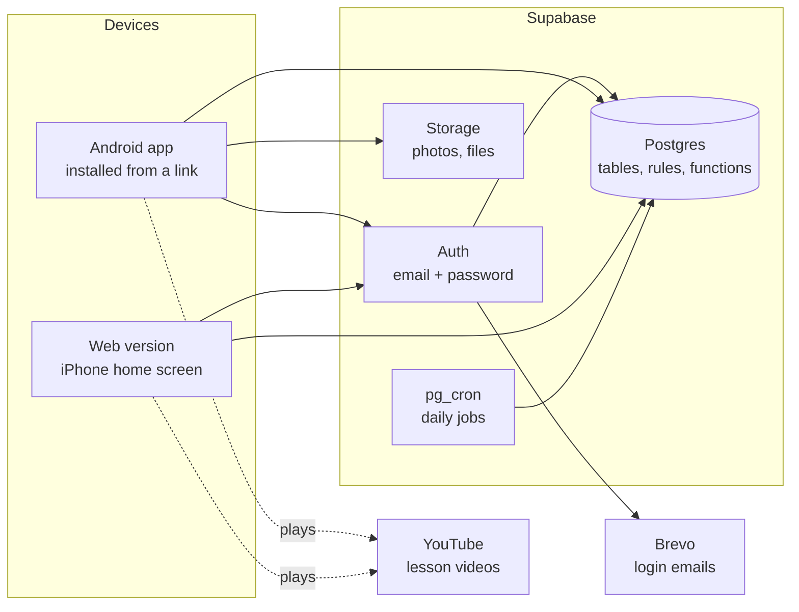

# Architecture

Mridanga Seva is one app (Android, iPhone through the web, and later the app stores) talking to one
Supabase project. Almost all business rules live in the database, so they hold no matter which
screen, device or version of the app is used.

## The pieces

| Piece | What it does | Where |
|---|---|---|
| App | Screens for Guru, Coordinator and Student. Built with Expo (React Native + TypeScript); one code base gives Android, iOS and web | `app/` — screens in `app/src/app/` |
| Auth | Sign-up and login with email + password | Supabase Auth |
| Database | All records, and the rules about them (who may see what, how a student's status changes) | `supabase/migrations/` |
| Storage | Student photos (only with consent) and uploaded files | Supabase Storage |
| Daily jobs | Move quiet students to *Irregular*, create follow-up calls, close check-ins left open | `pg_cron`, defined in the migration |
| Email | Sends sign-up confirmation and password-reset emails | Brevo free plan, plugged into Supabase as SMTP |
| Videos | Lesson videos stay on YouTube; the app only stores links | YouTube |

## Roles

| Role | Who | Can |
|---|---|---|
| `guru` | The Guru / admin | Everything, including giving roles and approving promotions |
| `coordinator` | Teachers who run the daily class | Register students, mark attendance, log follow-up calls, tick syllabus, post announcements |
| `student` | Enrolled learners | See their own record, attendance, progress, materials and announcements |
| `kiosk` | The door tablet (Phase 2) | Only check students in and out |
| `pending` | Anyone who signed up but has no role yet | Nothing until the Guru gives a role |

A new login starts as `pending`. If its email matches a registered student, it is linked to that
student and becomes `student` automatically. Only the Guru can make someone a coordinator.
See [DECISIONS.md #11](DECISIONS.md).

## Security model

- **Row-level security (RLS) is on for every table.** The database itself decides which rows a
  person may read or change; the app cannot get around it. See [DATABASE.md](DATABASE.md#who-can-see-what).
- **The app holds only the public (anon / publishable) key.** It is safe to ship because RLS protects
  the data. The `service_role` key bypasses RLS and must never be in the app or the repository.
- **Actions that change several things at once run as database functions** (`toggle_visit`,
  `scan_qr`, `log_call`), so they either fully happen or not at all, and they check the caller's role.
- **Personal data is kept to a minimum.** Only the area and pincode, not the full address. Only the
  *type* of ID a coordinator checked for consent, never the ID number. See [DECISIONS.md #8](DECISIONS.md).

## How attendance flows (Phase 1)

1. The student opens *My QR* on their phone.
2. The coordinator scans it with their phone (or searches the name and taps).
3. The app calls `scan_qr` / `toggle_visit`: if the student has no open visit, it checks them in;
   otherwise it checks them out.
4. Any check-in makes the student *Active* again and closes their open follow-up tasks.
5. At 21:00 IST a daily job closes any visit left open, at the centre's closing time.

## Phases

| Phase | Adds | Target |
|---|---|---|
| 1 | Registration, consent, QR attendance, follow-up, syllabus, materials, announcements, groups, reports | Live 1 Dec 2026 |
| 2 | Assessments, promotion workflow, practice tools, events, polls, door tablet, inventory, Ishtagoshti, fund | Live 1 Mar 2027 |
| 3 | Face-recognition attendance (only with consent) | Live 30 Apr 2027 |
