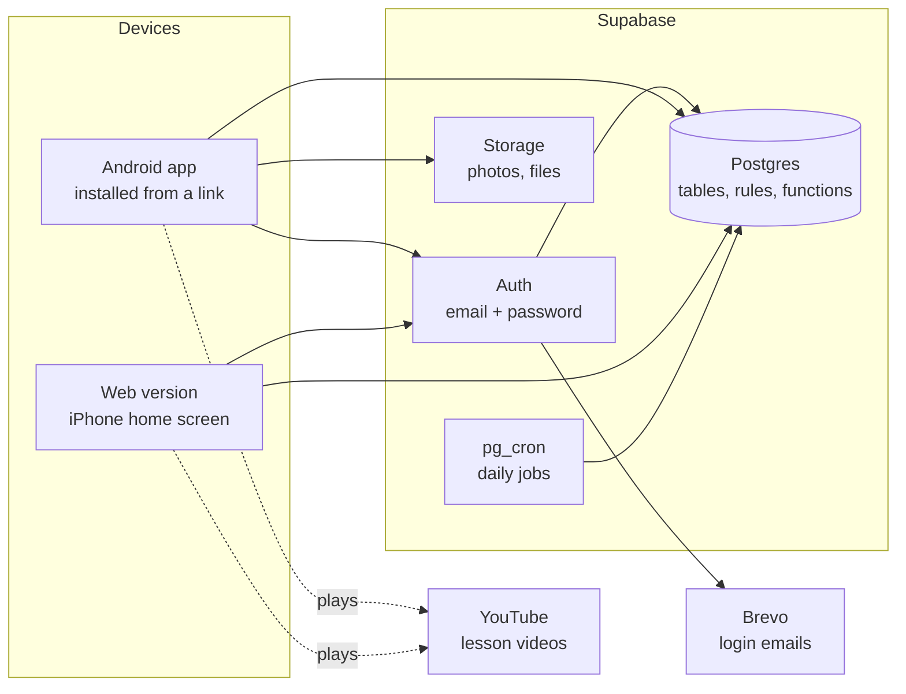

# Architecture

Mridanga Seva is one app (Android, iPhone through the web, and later the app stores) talking to one
Supabase project. Almost all business rules live in the database, so they hold no matter which
screen, device or version of the app is used.



## The pieces

| Piece | What it does | Where |
|---|---|---|
| App | Screens for Guru, Coordinator and Student. Built with Expo (React Native + TypeScript); one code base gives Android, iOS and web | `app/` — screens in `app/src/app/` |
| Auth | Sign-up and login with email + password | Supabase Auth |
| Database | All records, and the rules about them (who may see what, how a student's status changes) | `supabase/migrations/` |
| Storage | Student photos (only with consent) and uploaded files | Supabase Storage |
| Daily jobs | Move quiet students to *Irregular*, create follow-up calls, close check-ins left open | `pg_cron`, defined in the migration |
| Email | Sends sign-up confirmation and password-reset emails | Brevo free plan, plugged into Supabase as SMTP |
| Videos | Lesson videos stay on YouTube; the app only stores links | YouTube |
| Web hosting | Serves the web version that iPhone users add to their home screen | Cloudflare Pages, uploaded from `app/dist` (OPERATIONS.md) |
| Android builds | Builds the APK that Android users install from a link | EAS Build, `app/eas.json` (OPERATIONS.md) |

## Roles

| Role | Who | Can |
|---|---|---|
| `guru` | The Guru / admin | Everything, including giving roles and approving promotions |
| `coordinator` | Teachers who run the daily class | Register students, mark attendance, log follow-up calls, tick syllabus, post announcements |
| `student` | Enrolled learners | See their own record, attendance, progress, materials and announcements |
| `kiosk` | The door tablet (Phase 2) | Only check students in and out |
| `pending` | Anyone who signed up but has no role yet | Nothing until the Guru gives a role |

A new login starts as `pending`. If its email matches a registered student, it is linked to that
student and becomes `student` automatically, once the email is confirmed. Only the Guru can make
someone a coordinator. See [DECISIONS.md #11 and #13](DECISIONS.md) and
[DATABASE.md](DATABASE.md#linking-a-login-to-a-student).

## The app's code

```
app/
  app.json             App name, icons, splash screen, web settings
  .env                 Supabase URL and public key (not in git; copy .env.example)
  scripts/             Helper scripts, e.g. the placeholder icon generator
  src/
    app/               Screens. Every file is a screen (Expo Router); _layout.tsx files arrange them
      guru/  coordinator/  student/    Each role's own screens (home, and later role-only ones)
      staff/           Coordinator screens the Guru uses too: register, attendance, follow-up ...
    auth/              Who is signed in, their role, and the sign-in / sign-up calls
    data/              Reading and saving records: one file per area (students.ts ...), with the
                       form checks. Screens call these, never the database directly
    components/        Building blocks shared by screens: text, buttons, fields, choices, list rows,
                       the QR scanner, the syllabus item card, page frame
    i18n/              Interface text in English, Telugu and Hindi (docs/TRANSLATIONS.md), and
                       labels.ts, which words levels and lengths of time the same on every screen
    lib/               The Supabase client, on-device storage and date helpers (India time)
    theme/             Colours, spacing and text sizes, light and dark
```

Screens use only `components/` and `theme/` for their look, and `t('...')` for every word, so a
change of colour or wording is made in one place.

## Logging in

1. **Create an account** (sign-up screen): name, email, password. The database creates a
   `profiles` row with role `pending`.
2. **Confirm the email:** Supabase sends a link (through Brevo). The link opens the web version.
   On confirmation the database links the login to the student record with the same email, if
   there is one, and the role becomes `student`.
3. **Sign in** with email and password. The login is kept on the device (in `localStorage`,
   which expo-sqlite provides on phones), so people stay signed in.
4. **Forgot password:** the app emails a link; it opens the web version on a *Set a new password*
   screen. Links are *implicit-flow* links, so one asked for on a phone also works in a laptop browser.

Links in emails go to the address set as **Site URL** in Supabase, or to the web address the
request came from (see OPERATIONS.md).

## Navigation by role

The app is split into **areas**: `signedOut` (sign-in screens), `recovery` (set a new password),
`pending` (waiting for a role), `guru`, `coordinator` and `student`, plus `loading` while the
saved login and the profile are being fetched.

- `src/auth/auth-provider.tsx` works out the area from the login and the `profiles` row.
- `src/app/_layout.tsx` opens only that area's screens (Expo Router's `Stack.Protected`).
  A screen of another area cannot be opened, even by typing its address on the web.
- The `staff/` folder is open to both `guru` and `coordinator`, because the Guru sees every
  coordinator screen. Put a new screen there unless only one role may use it.
- `src/app/index.tsx` shows the splash while loading, then sends the person to their area's
  first screen.

Hiding screens makes the app clear to use; it is **not** the security. The database refuses any
read or write the person is not allowed, whatever the app shows.

## Security model

- **Row-level security (RLS) is on for every table.** The database itself decides which rows a
  person may read or change; the app cannot get around it. See [DATABASE.md](DATABASE.md#who-can-see-what).
- **Views read as the person asking.** The one view so far, `student_overview`, is created
  `with (security_invoker = true)`, so the row-level security of the tables under it still
  applies ([DECISIONS.md #20](DECISIONS.md)).
- **The app holds only the public (anon / publishable) key.** It is safe to ship because RLS protects
  the data. The `service_role` key bypasses RLS and must never be in the app or the repository.
- **The app refuses to start with the `service_role` key** in `app/.env` and shows a warning
  instead (`src/lib/supabase.ts`), because everything in `EXPO_PUBLIC_*` ends up in the public web version.
- **Actions that change several things at once run as database functions** (`toggle_visit`,
  `scan_qr`, `log_call`), so they either fully happen or not at all, and they check the caller's role.
  Each function is granted only to the roles that need it ([DECISIONS.md #14](DECISIONS.md)).
- **Personal data is kept to a minimum.** Only the area and pincode, not the full address. Only the
  *type* of ID a coordinator checked for consent, never the ID number. See [DECISIONS.md #8](DECISIONS.md).

## How attendance flows (Phase 1)

1. The student opens *My QR* (S3) on their phone. The code holds `MS1:` and the student's secret
   QR token ([DECISIONS.md #17](DECISIONS.md)). It is drawn on the phone, and the last one loaded
   is kept there, so it shows even without internet ([DECISIONS.md #21](DECISIONS.md)).
2. The coordinator opens *Mark attendance* (C5) and scans it with their phone's camera
   (expo-camera). Without a camera, or on a laptop, they search the name and tap instead.
3. A scan calls `scan_qr`, which toggles: in if the student has no open visit, otherwise out.
   A tap calls `mark_visit` with *in* or *out*, and changes nothing if the student already is
   ([DECISIONS.md #18](DECISIONS.md)).
4. Any check-in makes the student *Active* again and closes their open follow-up tasks.
5. *Who is here now* (C6) lists open visits. At closing time the coordinator taps *Check out all*
   (`check_out_all`).
6. At 21:00 IST a daily job closes any visit still open, at the centre's closing time.

The camera also works in the web version (on `https` only). Browsers without built-in QR reading,
such as Safari on iPhone, use a reader that expo-camera downloads from a public CDN; see
OPERATIONS.md "Publishing the web version".

## How follow-up flows (Phase 1)

1. Each morning a daily job moves a student with no visit for 14 days to *Irregular* and gives
   their mentor a *call* task, due in 3 days (the day limits are in `settings`).
2. The coordinator opens *Follow-up calls* (C10). Students are grouped: *needs the Guru*
   (escalated), *call due*, *call later*, and Irregular or Inactive students with *no call planned*.
3. Tapping a student opens the call screen (C11), with buttons that open the phone's dialler for
   the student or, for a minor, the parent. After the call the coordinator records the outcome, a
   reason from the list, a comment and, for *coming back* or *taking a break*, the date.
4. `log_call` saves it and applies the outcome: *taking a break* sets *Paused* until the date;
   *stopped coming* sets *Left* (the screen asks once more); *coming back* sets a new call for the
   day after the date; *not reachable* sets a retry, handed to the Guru after several tries.
   This is the only way to reach Paused or Left ([DECISIONS.md #4](DECISIONS.md)).
5. The next visit makes the student *Active* again and closes their open tasks.

## Phases

| Phase | Adds | Target |
|---|---|---|
| 1 | Registration, consent, QR attendance, follow-up, syllabus, materials, announcements, groups, reports | Live 1 Dec 2026 |
| 2 | Assessments, promotion workflow, practice tools, events, polls, door tablet, inventory, Ishtagoshti, fund | Live 1 Mar 2027 |
| 3 | Face-recognition attendance (only with consent) | Live 30 Apr 2027 |
