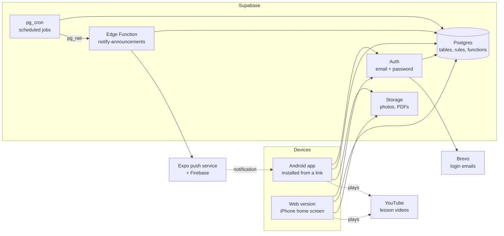

# Architecture

Mridanga Seva is one app (Android, iPhone through the web, and later the app stores) talking to one
Supabase project. Almost all business rules live in the database, so they hold no matter which
screen, device or version of the app is used.



## The pieces

| Piece | What it does | Where |
|---|---|---|
| App | Screens for Guru, Coordinator and Student. Built with Expo (React Native + TypeScript); one code base gives Android, iOS and web | `app/` — screens in `app/src/app/` |
| Auth | Sign-up and login with email + password | Supabase Auth |
| Database | All records, and the rules about them (who may see what, how a student's status changes) | `supabase/migrations/` |
| Storage | Photos and PDFs on announcements, in the private bucket `announcement-files`; later student photos (only with consent). Phase 2: assessment files and students' recordings in `assessment-files` (50 MB a file, deleted 30 days after review) | Supabase Storage, rules in `supabase/migrations/0010_announcement_files.sql` and `0016_assessments.sql` |
| Scheduled jobs | Move quiet students to *Irregular*, create follow-up calls, close check-ins left open (daily); send push notifications for new announcements (every minute) | `pg_cron`, defined in the migrations |
| Push notifications | Tell Android phones about a new announcement; in Phase 2 also about assessments (given, reminded, reviewed, a recording sent), queued in `push_outbox` | Edge Function `supabase/functions/notify-announcements/` → Expo's push service → Firebase Cloud Messaging (OPERATIONS.md "Push notifications"). Since 0031 every push is a row per phone in `push_queue`, sent, retried or given up on its own ([DECISIONS.md #112-#115](DECISIONS.md)) |
| Email | Sends sign-up confirmation and password-reset emails | Brevo free plan, plugged into Supabase as SMTP |
| Videos | Lesson videos stay on YouTube; the app only stores links | YouTube |
| Web hosting | Serves the web version that iPhone users add to their home screen | Cloudflare Pages, uploaded from `app/dist` (OPERATIONS.md) |
| Public website | mridangaseva.com: what the seva is, classes, how to join, get the app, privacy notice, contact; English, Telugu, Hindi. Plain HTML, no JavaScript, no cookies (see "The public website" below) | `website/`, Cloudflare Pages project `mridangaseva-site` |
| Android builds | Builds the APK that Android users install from a link | EAS Build, `app/eas.json` (OPERATIONS.md) |
| Android updates | Sends new screens and text to installed APKs without a reinstall; the home screens offer Restart once one is downloaded | EAS Update, channels `preview` and `production`, published with `npm run update:preview` / `update:production` (`app/scripts/publish-update.mjs`, OPERATIONS.md "Updating the Android app") |

## Roles

| Role | Who | Can |
|---|---|---|
| `guru` | The Guru / admin | Everything, including giving roles and approving promotions |
| `coordinator` | Teachers who run the daily class | Register students, mark attendance, log follow-up calls, tick syllabus, post announcements |
| `student` | Enrolled learners (a login linked to a student record) | See their own record, attendance, progress, materials and announcements; study Ishtagoshti slokas. A `student` login with no record counts as `pending` ([DECISIONS.md #96](DECISIONS.md)) |
| `kiosk` | The door tablet (Phase 2) | Only check students in and out |
| `pending` | Anyone who signed up but has no role yet | Nothing until the Guru gives a role; may join Ishtagoshti for free (below) |

A new login starts as `pending`. If its email matches a registered student, it is linked to that
student and becomes `student` automatically, once the email is confirmed. Only the Guru can make
someone a coordinator, or link a login to a student record by hand, on screen G2; the database
keeps the Guru role a dashboard matter and stops anyone changing their own role ([DECISIONS.md #45](DECISIONS.md)). The Guru can also mark a coordinator as an **Ishtagoshti editor** (`profiles.ig_editor`), who then adds and edits slokas and themes ([DECISIONS.md #57](DECISIONS.md)); it is a permission on a coordinator, not a role. See [DECISIONS.md #11 and #13](DECISIONS.md) and
[DATABASE.md](DATABASE.md#linking-a-login-to-a-student).

A **public Ishtagoshti subscriber** is not a role: a `pending` login that joined Ishtagoshti (I14) has
a row in `ig_subscribers`, and `ig_reader()` lets it read the published slokas and themes and keep its
own notes and ticks; every other rule still refuses it as `pending`. Under 18 it reads only after the
parent typed in the code emailed to them; the Guru may block it ([DECISIONS.md #88](DECISIONS.md)).

## The app's code

```
app/
  app.json             App name, icons, splash screen, web settings
  .env.development     Supabase URL and public key of the TEST project for `expo start`; .env.test
                       (test site) and .env.live (live site only) beside it (not in git; app/README.md)
  public/_headers      CSP and security headers of the web version, a template export-web fills in
  scripts/             Helper scripts: the web export, publishing an Android update (both check
                       the bundle holds the right Supabase project and no secret: bundle-checks.mjs),
                       lib/env-file.mjs (reads .env files with Expo's parser), the placeholder icon generator
  tests/               node:test checks of the scripts (release-scripts.test.mjs)
  src/
    app/               Screens. Every file is a screen (Expo Router); _layout.tsx files arrange them
      student/         The student's screens; (tabs)/ holds Home, My QR and Announcements; one
                       announcement, progress.tsx (S4), visits.tsx (S9), profile.tsx (A3),
                       notifications.tsx (A2), assessments/ (S7), practice.tsx (S5) and
                       practice-log.tsx (S6) (Phase 2), ishtagoshti/ (I2, I3; the I1 tab is in
                       (tabs)/), and coming-soon.tsx open on top
      staff/           The Guru's and coordinators' screens: register, attendance, follow-up ...,
                       levels/ (G4 syllabus editor), materials/ (G5), visits/ (S9 of one student),
                       profile.tsx (A3), the Guru's coordinators/ (G2), database/ (G3 and the
                       import), settings.tsx (G10), audit-log.tsx (G11), notifications.tsx (A2),
                       reports.tsx (C21 and G8) and centres/ (G9), and coming-soon.tsx
                       for the modules not built yet; (tabs)/
                       holds Home (G1 or C1 by role) and the four used most. Phase 2:
                       assessments/ holds G6, C12-C14, promotion/ holds C22, C23, G7,
                       practice.tsx (S5) and taals/ (the Guru's taal editor), ishtagoshti/ (I2, I3,
                       and the editors' edit-sloka/ I12 and edit-theme/ I11); slice 8:
                       suggestions.tsx (C18), inventory/ (C19: labels, scan, label/[token], stocktake/), duty/ (C20 roster)
    auth/              Who is signed in, their role, and the sign-in / sign-up calls
    screens/           The two staff homes, G1 and C1 (shown by staff/(tabs)/index.tsx), and the
                       pages both areas show: Coming soon, Attendance history (S9), My profile (A3),
                       Notifications (A2); Phase 2: Practice tools (S5), the lesson player (V3), and
                       Ishtagoshti I1-I3 (ishtagoshti-*.tsx, with an `area` of student or staff)
    data/              Reading and saving records: one file per area (students.ts ...), with the
                       form checks. Screens call these, never the database directly
    components/        Building blocks shared by screens: text, buttons, fields, choices, list rows,
                       the QR scanner, the syllabus item card, the announcement card, form and
                       detail card (announcement-detail.tsx),
                       the file picker and file list of an announcement, the reply box and reply
                       card, a progress bar, the number tiles of the home screens, the
                       ring of modules of the home screens (module-ring.tsx, staff-shortcuts.tsx;
                       DECISIONS.md #39, #41), the "new version is ready" notice, the page frame (with
                       pull to refresh on phones), columns.tsx (two columns of cards on a laptop),
                       detail-grid.tsx (label-over-value cells on C8);
                       the look of rounds 1 and 2 (DECISIONS.md #36): icon.tsx (the icon set),
                       saffron-band.tsx (the gradient band), home-header.tsx (the band with the
                       greeting), brand.tsx (the band on the sign-in screens), mridanga-mark.tsx
                       (the drum mark), person-header.tsx (initials and name on C8, C11),
                       status-chip.tsx (coloured level and status labels on lists and C8),
                       loading-cards.tsx (grey shapes while loading), empty-state.tsx,
                       account-footer.tsx (language, My profile, Sign out, version),
                       material-row.tsx (a lesson with Open, on G4/G5 and S4; DECISIONS.md #44),
                       admin-links.tsx ("Running the class" on G1, "My reports" on C1) and
                       guru-only.tsx (round 8); inbox-bell.tsx (the bell on the home header) and
                       data-table.tsx (tables of the reports on a laptop) (round 9)
    i18n/              Interface text in English, Telugu and Hindi (docs/TRANSLATIONS.md), and
                       labels.ts, which words levels, file sizes and lengths of time the same on
                       every screen
    lib/               The Supabase client, on-device storage, the class's time zone and country
                       (class-locale.ts, from my_centre_locale; India until known), date helpers in
                       that zone (dates.ts), money as text (money.ts), search text without accents
                       (search-text.ts; docs/I18N.md), the website's privacy-notice address and
                       version (privacy-notice.ts, #150), reads that go through the logging
                       functions with a fallback before 0034 (logged-read.ts, #146), the
                       Excel/CSV reader of the student import (sheet-reader.ts, with fflate), push
                       notifications and app updates (push.ts and app-update.ts on Android; the
                       .web.ts copies do nothing), the report's CSV (csv.ts; save-csv.ts saves it to a
                       folder or shares it on Android, save-csv.web.ts downloads it) and the reader of
                       a Google Maps link for G9 (map-link.ts)
    theme/             Colours, spacing and text sizes, light and dark; the card look, the header
                       bars and the tab bar (use-theme.ts)
supabase/
  migrations/          The database, in number order (docs/DATABASE.md)
  functions/           Edge Functions: notify-announcements sends the push notifications
                        (index.ts wires send.ts; messages.ts words them)
  tests/               The database smoke test and the push message test
```

Screens use only `components/` and `theme/` for their look, and `t('...')` for every word, so a
change of colour or wording is made in one place.

## Logging in

1. **Create an account** (sign-up screen): name, email, password. The database creates a
   `profiles` row with role `pending`.
2. **Confirm the email:** Supabase sends a link (through Brevo). The link opens the web version.
   On confirmation the database links the login to the student record with the same email, if
   there is one, and the role becomes `student`.
3. **Sign in** with email and password. The login is kept on the device (in `localStorage`,
   which expo-sqlite provides on phones), so people stay signed in.
4. **Forgot password:** the app emails a link; it opens the web version on a *Set a new password*
   screen. Links are *implicit-flow* links, so one asked for on a phone also works in a laptop browser.

5. **Next start:** the app keeps a copy of the person's own profile on the device
   (`src/auth/saved-profile.ts`) and opens their home from it at once, while the login is
   restored and the profile fetched behind it; without internet the copy keeps their screens
   ([DECISIONS.md #37](DECISIONS.md)). Sign-out forgets it. With no internet and an expired
   token, Supabase reports no session although the login is still saved; the app then keeps the
   person's screens from that copy until the login is refreshed, and Sign out still works
   ([DECISIONS.md #42](DECISIONS.md)).

Links in emails go to the address set as **Site URL** in Supabase, or to the web address the
request came from (see OPERATIONS.md).

## Navigation by role

The app is split into **areas**: `signedOut` (sign-in screens), `recovery` (set a new password),
`pending` (waiting for a role; also the Ishtagoshti join screen I14), `guru`, `coordinator`, `student` and
`subscriber` (a public Ishtagoshti member: `subscriber/`, tabs Slokas and Account), plus `loading` while the
saved login and the profile are being fetched.

- `src/auth/auth-provider.tsx` works out the area from the login and the `profiles` row; for a `pending`
  login it also asks `ig_my_state()` (0027) whether it is an active Ishtagoshti subscriber. It reads the
  profile again when the app comes back to the screen, when the login token is refreshed, and when the
  database refuses a call as not allowed (the Supabase client's fetch in `src/lib/supabase.ts` reports
  it), so a login switched off or given another role while the app is open moves to the "Account switched
  off" screen or its new area at once ([DECISIONS.md #99](DECISIONS.md)).
- `src/app/_layout.tsx` opens only that area's screens (Expo Router's `Stack.Protected`).
  A screen of another area cannot be opened, even by typing its address on the web.
- The `staff/` folder is open to both `guru` and `coordinator`, because the Guru sees every
  coordinator screen. Put a new screen there unless only one role may use it.
- Each role has **tabs** ([DECISIONS.md #36](DECISIONS.md)): the student Home (S1), My QR (S3)
  and Announcements (S10) in `student/(tabs)/`; staff Home, Attendance (C5), Students (C7),
  Calls (C10) and Announcements (C15) in `staff/(tabs)/`; since Phase 2 slice 6 both also have
  Slokas (Ishtagoshti I1): students as a 4th tab, staff only in the sidebar (on a phone the staff
  home has an Ishtagoshti button, as six labels do not fit the bottom bar; the tab's `href` is null there). The tabs are at the bottom on a phone;
  for staff they become a sidebar from 900 px wide. A folder in brackets adds nothing to the
  address, so `/staff/students` and `/student/my-qr` stay as they were.
- The first screen is the Home tab: `/student` (S1) or `/staff`, which shows the Guru dashboard
  (G1, `screens/guru-home.tsx`) or the coordinator dashboard (C1,
  `screens/coordinator-home.tsx`) by role. The old addresses `/guru` and `/coordinator` are gone.
  Other screens (a profile, a call, Who is here now, groups ...) open on top of the tabs with a
  back button; C1 and G1 reach the ones without a tab through the same tiles
  (`components/staff-shortcuts.tsx`).
- `src/app/index.tsx` shows the splash while loading, then sends the person to their area's
  first screen, or to the screen a link asked for when it belongs to their area
  (`src/auth/requested-path.ts`, [DECISIONS.md #30](DECISIONS.md)). A web address or shared link
  to, say, one announcement therefore still opens that announcement after the login check, with
  the role's tabs underneath, so Back leads to them.
- Every Back button in a screen calls `goBackOr(parent)` (`src/lib/go-back.ts`): back when there is
  a screen behind, else `replace` with a sensible parent, so a screen opened from a notification or
  a reload never leaves a blank screen. The lesson-video WebView (V3) catches the phone's Back while a
  video is fullscreen and only leaves fullscreen ([DECISIONS.md #71](DECISIONS.md)).

Hiding screens makes the app clear to use; it is **not** the security. The database refuses any
read or write the person is not allowed, whatever the app shows.

## Security model

- **Row-level security (RLS) is on for every table.** The database itself decides which rows a
  person may read or change; the app cannot get around it. See [DATABASE.md](DATABASE.md#who-can-see-what).
- **Views read as the person asking.** Every view (`student_overview`, `announcement_audience`,
  `announcement_seen`, `announcement_reply_list`, `group_summary`) is created
  `with (security_invoker = true)`, so the row-level security of the tables under it still
  applies ([DECISIONS.md #20](DECISIONS.md)). The one exception that shows more than the tables
  allow is the function `staff_names()`: staff names only, for "posted by" ([DECISIONS.md #26](DECISIONS.md)).
  The functions that count the home screens' numbers (`student_home`, `coordinator_dashboard`,
  `guru_dashboard`) are security invoker for the same reason ([DECISIONS.md #31](DECISIONS.md)).
- **Files follow the same rules.** Storage has row-level security too: a photo or PDF on an
  announcement opens only for people who may read that announcement, and the app shows it
  through a signed link that works for an hour ([DECISIONS.md #32](DECISIONS.md)).
- **The app holds only the public (anon / publishable) key.** It is safe to ship because RLS protects
  the data. The `service_role` key bypasses RLS and must never be in the app or the repository.
  Only the Edge Function `notify-announcements` uses it, inside Supabase, which provides the key
  to it by itself; the Firebase service-account key lives only in EAS ([DECISIONS.md #33](DECISIONS.md)).
- **The app refuses to start with the `service_role` key** in `app/.env` and shows a warning
  instead (`src/lib/supabase.ts`), because everything in `EXPO_PUBLIC_*` ends up in the public web version.
- **Actions that change several things at once run as database functions** (`toggle_visit`,
  `scan_qr`, `log_call`), so they either fully happen or not at all, and they check the caller's role.
  Each function is granted only to the roles that need it ([DECISIONS.md #14](DECISIONS.md)).
  Role checks are NULL-safe, so a switched-off login is refused like a stranger ([#72](DECISIONS.md)),
  and anon (no login) holds no table, sequence or function right at all; a grant sweep in
  `supabase/tests` keeps it so ([#77](DECISIONS.md)).
- **A child's record has no side doors.** App users cannot attach a login, change a QR token or
  remove consent by editing tables: links go through the linking functions, the consent register
  is insert-only and checked at commit, and consents and guardians are audited ([#73, #74](DECISIONS.md)).
- **Withdrawal and erasure are database functions** (`withdraw_consent`, `erase_student`, Guru
  only): a withdrawal freezes the record and switches the login off; an erasure removes the record,
  the login and the copies in `audit_log`, keeping a tombstone ([#75, #76](DECISIONS.md), OPERATIONS.md).
- **Personal data is kept to a minimum.** Only the area and pincode, not the full address. Only the
  *type* of ID a coordinator checked for consent, never the ID number. See [DECISIONS.md #8](DECISIONS.md).

## How attendance flows (Phase 1)

1. The student opens *My QR* (S3) on their phone. The code holds `MS1:` and the student's secret
   QR token ([DECISIONS.md #17](DECISIONS.md)). It is drawn on the phone, and the last one loaded
   is kept there, so it shows even without internet ([DECISIONS.md #21](DECISIONS.md)).
2. The coordinator opens *Mark attendance* (C5) and scans it with their phone's camera
   (expo-camera). Without a camera, or on a laptop, they search the name and tap instead.
3. A scan calls `scan_qr`, which toggles: in if the student has no open visit, otherwise out
   (but not within 30 seconds of the check-in: a second phone scanning a moment later gets
   "already checked in", [DECISIONS.md #110](DECISIONS.md)).
   A tap calls `mark_visit` with *in* or *out*, and changes nothing if the student already is
   ([DECISIONS.md #18](DECISIONS.md)).
4. Any check-in makes the student *Active* again and closes their open follow-up tasks.
   A check-in also carries the marking phone's position (`src/lib/attendance-location.ts`,
   expo-location, foreground only, asked the first time): the database compares it with the
   centre's area and stores only the distance and the result. Outside the area, permission refused,
   no fix within 8 s or a browser without location = saved anyway but **flagged** for the Guru
   ([DECISIONS.md #70](DECISIONS.md), [DATABASE.md](DATABASE.md#location-check-at-check-in-0024)).
   A fix is reused for 2 minutes, and C5 warms it up on opening, so a queue is not slowed down.
5. *Who is here now* (C6) lists open visits. At closing time the coordinator taps *Check out all*
   (`check_out_all`). Staff may correct only a visit's times, and each correction is audited (0030).
6. An hourly job closes any visit still open an hour after its centre closed, at the centre's
   closing time (21:00 IST for Abids; every centre in its own time zone since 0033, docs/I18N.md).

The camera also works in the web version (on `https` only). Browsers without built-in QR reading,
such as Safari on iPhone, use zxing-wasm, a WebAssembly reader the site serves itself from
`/zxing/<version>/` (src/lib/qr-reader.web.ts, DECISIONS.md #143); see OPERATIONS.md "Publishing the
web version".

## How follow-up flows (Phase 1)

1. Each morning a daily job moves a student with no visit for 14 days to *Irregular* and gives
   their mentor a *call* task, due in 3 days (the day limits are in `settings`, set on G10). When
   the mentor changes, the open tasks go to the new mentor ([DECISIONS.md #48](DECISIONS.md)).
   A pause that ended does the same, and its Inactive clock starts at the pause end; a student who
   has an open task gets no second one ([DECISIONS.md #107](DECISIONS.md)).
2. The coordinator opens *Follow-up calls* (C10). Students are grouped: *needs the Guru*
   (escalated), *call due*, *call later*, and Irregular or Inactive students with *no call planned*.
3. Tapping a student opens the call screen (C11), with buttons that open the phone's dialler for
   the student or, for a minor, the parent. After the call the coordinator records the outcome, a
   reason from the list, a comment and, for *coming back* or *taking a break*, the date.
4. `log_call` saves it and applies the outcome: *taking a break* sets *Paused* until the date;
   *stopped coming* sets *Left* (the screen asks once more); *coming back* sets a new call for the
   day after the date; *not reachable* sets a retry, handed to the Guru after several tries in
   the same absence (a visit starts the count again, [DECISIONS.md #108](DECISIONS.md)).
   This is the only way to reach Paused or Left ([DECISIONS.md #4](DECISIONS.md)), also for a
   new record and for the pause date ([DECISIONS.md #109](DECISIONS.md)). Left changes nothing
   else: the login and messages go on until the Guru switches the login off (#111).
5. The next visit makes the student *Active* again and closes their open tasks.

## How announcements flow (Phase 1)

1. A coordinator or the Guru opens *Announcements* (C15) and taps *New announcement*: title,
   message, up to 3 photos or PDFs, who it is for (all students, one level, my mentees, staff
   only, or a group), pin or not, and publish now or at a later date and time.
2. On *Post*, the app makes photos smaller, uploads the files to Storage and saves the
   announcement straight into `announcements` with the list of files; database triggers check
   it and record the author. A later publish time keeps it from students until then; staff see
   it at once ([DECISIONS.md #32](DECISIONS.md)).
3. Within a minute of its publish time, the Edge Function sends a push notification to the
   Android phones of the people it is addressed to; a tap opens it ([DECISIONS.md #33](DECISIONS.md)).
   Each phone is a row of `push_queue` (0031): one bad token does not stop the others, and a
   failed send is tried again later without reaching anyone twice ([DECISIONS.md #112-#113](DECISIONS.md)).
4. A student opens *Announcements* (S10). Row-level security gives them only the published ones
   addressed to them, and signed links to their files. Opening one saves a read receipt.
5. Back on C15, each announcement shows "seen by N of M", worked out by the database views
   `announcement_seen` and `announcement_audience`, with the names of those who have not seen it
   and how many students it is meant for have no app login ([DECISIONS.md #25](DECISIONS.md)).
6. The author or the Guru can edit, pin, unpin or delete it; the audit log keeps a copy. An
   edit keeps the read receipts; once published, the announcement shows "Edited" with the time
   ([DECISIONS.md #27](DECISIONS.md)). Files taken off, or on a deleted announcement, are removed
   from Storage by the app.
7. Under an announcement a student (or a coordinator reading someone else's) can reply to the
   author. Replies are private: only the writer, the author and the Guru read them
   ([DECISIONS.md #29](DECISIONS.md)). The author sees "Replies: N" on the list and the replies
   with names on the announcement, and answers in person or by phone.

Groups for the audience "A group" are made on the groups screen (`staff/groups/`): a name, a
purpose, and members chosen from students with the app and staff. A group is switched off,
never deleted ([DECISIONS.md #28](DECISIONS.md)).

Push notifications reach only the Android app built by EAS, once push is set up (OPERATIONS.md
"Push notifications"). The web version (iPhones) has none yet: people there see new
announcements when they open the app, with the number of unread notices on the bell of the home
header. That inbox (A2) is filled by the database for every addressee, push or not: a trigger on
`announcements` writes one `notifications` row per person from `announcement_audience`, the same
people the push goes to, and opening the announcement marks it read ([DECISIONS.md #49](DECISIONS.md)).

## How assessments flow (Phase 2)

On main since the Phase 2 merge; it reaches Android phones with the next APK, which also carries
expo-audio ([DECISIONS.md #52 and #55](DECISIONS.md)).

1. The Guru creates an assessment (G6): instructions, type, level, level-up or not, a rubric,
   files and a link. It stays a draft, seen only by the Guru, until *Send to coordinators*.
2. A coordinator opens it from *Assessments* on the home's ring (C12), writes notes, sets a due
   date and picks students. `release_assessment` gives each one an assignment and queues a push
   notification for those with the app.
3. The student opens it (S7): the coordinator sees *Seen*. They record with the phone's own
   recorder or camera and send the file (at most 50 MB) or a link, with a note.
   `submit_assessment` checks the file is theirs and in Storage, and tells the coordinator.
4. The tracker (C13) shows each student Not seen / Seen / Submitted / Reviewed / Redo and Late.
   *Remind* queues a reminder; a daily job at 09:00 IST reminds anyone due today or tomorrow.
5. A coordinator reviews (C14): plays the recording, scores each rubric line, comments, and
   accepts or asks for a redo; for a level-up assessment, marks it for the Guru (the promotion
   approval below). The student sees the score and the comment.
6. The Edge Function sends the queued notifications with the announcements, and once a day
   deletes recordings 30 days past their review. Every queued notice (push_outbox) also lands
   in the person's notifications inbox (A2), with or without the app (0019, DATABASE.md).

Audio and video open in the phone's browser view (expo-web-browser); the app has no player and
no in-app recorder, because each would be a native package and a new APK.

## How promotion flows (Phase 2)

[DECISIONS.md #53](DECISIONS.md). The app never promotes anyone by itself.

1. `promotion_criteria` checks a student against the Guru's settings: the current level's
   syllabus ticked, 8+ visits in 8 weeks, an accepted level-up recording (step 5 above). The C1
   card and the Promotions list show a coordinator their own students who meet all of it; C8
   shows the check for any student.
2. A coordinator nominates (C22) with a reason and picks coordinators to ask (those who taught
   the student lately come first). Their own view counts as one "Ready"; the asked ones get a
   push notification.
3. Coordinators answer (C23): Ready / Almost / Not yet with a comment. At 2 answers the Guru gets
   a notification and the nomination moves to "Waiting for your decision" (the G1 card counts it).
4. The Guru decides (G7), with the criteria, the recording and the answers side by side:
   *Promote* (`students.level_id` + a `level_history` row; the student is told), *Not yet* with
   guidance and a date before which the student cannot be nominated again, or *More feedback*.
5. Only the Guru can change a student's level at all (a database trigger), and the level-up
   recording is kept until 30 days after the decision.

## Practice tools (Phase 2)

[DECISIONS.md #54](DECISIONS.md). S5 plays a **pattern** (`lib/practice-pattern.ts`):
one cycle of sounds, each at a position in beats (a metronome bar, or a taal's bols spread over
their beats, `lib/bols.ts` saying which head, zone, fingers and sound a bol is). A **player**
(`lib/practice-player.ts`) loops it at a tempo:

- **Browser** (`lib/practice-audio.web.ts`): Web Audio look-ahead scheduler. A 25 ms timer looks
  150 ms ahead (more when the timer is seen running late, as in a background tab where browsers fire
  it about once a second: 1.5 × the gap, up to 2 s) and starts each sound with
  `AudioBufferSourceNode.start(time)` on the audio clock, time = anchor + beats × 60 / bpm. A tempo
  change sets a new anchor and takes back what was scheduled after it. The sounds are synthesised
  once into AudioBuffers (`lib/practice-sounds.ts`).
- **Phone** (`lib/practice-audio.ts`, expo-audio, next APK): the cycle is mixed into one WAV
  (22.05 kHz mono, tails wrapped round) in the cache folder and played with `loop` on, so the audio
  hardware keeps the time; a tempo change writes a new file and seeks to the same beat.
- **The screen follows the sound**: `lib/use-playhead.ts` reads the player's position every frame
  (web: audio clock minus `outputLatency`; phone: `player.currentTime`) and re-renders only when the
  beat or bol changes. The beat dots, the beat grid and V1 (`components/two-head-view.tsx`, SVG)
  light from it.
- **Timer and log**: `lib/practice-timer.ts` keeps the start time on the device (survives leaving
  the screen and reloads); Stop calls `log_practice` (DATABASE.md "Practice tools").
- **Offline**: taals are saved on the device after each load, with the seeded placeholders built in
  as a last resort; sounds need no network.

**Drift, measured 3 Oct 2026** (Chrome in the desktop app's browser pane, 80 beats a minute,
2+ minutes, click onsets detected in the audio output itself by an AudioWorklet on the audio thread, stamped with `currentFrame`):
no sound missed (183 clicks over 136.5 s), drift at the end −0.16 ms, worst error 0.16 ms (the detector's own resolution, about 7 samples), every interval 749.84-750.16 ms, each click 0.39-0.54 ms after its planned time (a constant: the click's 2 ms fade-in), 0 sounds scheduled late. The tab was in the background during the run, its timer slowed to about 1 a second, and the look-ahead grew to 1.5 s by itself. A plain `setInterval` metronome run beside it was off by up to 16 ms (539 ms in an earlier run while the page's main thread stalled). Tempo change 80 → 85 while playing: the next sounds came at 705.88 ms, none late; slow-down 50 % of 60 = 2000 ms a beat. In development builds the web player is on `globalThis.__practicePlayer` (schedule
log, `late`, `minLead`) for such checks.

## Media: lesson videos and recording (Phase 2, branch `phase2-media`)

On the branch `phase2-media`, rebased on main after the Phase 2 merge; not on main yet ([DECISIONS.md #56](DECISIONS.md)).

- **V3 player = one HTML page** (`lib/lesson-player-html.ts`), shown in an OS WebView on phones
  (`components/lesson-video-frame.tsx`, react-native-webview, next APK; loaded with base URL
  `https://mridanga-seva.app` so YouTube sees a Referer) and in an iframe (`srcdoc`) in the browser
  (`lesson-video-frame.web.tsx`), so both run the same code. The app sends commands (`play`, `pause`,
  `seek`, `rate`, `mirror`, `zoom`, `loop`, `hello`) and the page answers with events (`ready`,
  `state` 10 times a second, `aspect`, `zoom`, `error`): web by `postMessage` with a tag, phone by
  `injectJavaScript` / `ReactNativeWebView.postMessage`. `hello` is sent when the frame has loaded,
  because a fast page can speak before the app listens.
- **YouTube** plays in YouTube's own embedded player through the IFrame Player API
  (`setPlaybackRate`, `seekTo`, `getCurrentTime`); nothing is drawn over it, it is at least 200 px
  high, and its picture is never transformed (YouTube's terms). **The team's own video file** plays in
  a `<video>` element (a `#t=0.001` fragment paints the first frame), where mirror is `scaleX(-1)` on
  the stage and zoom shows one of n side-by-side panes by making the video n times as wide and
  shifting it; a tap maps to a pane (mirrored taps counted from the other side). The A-B loop runs
  inside the page (back to A when the time passes B), so the bridge's delay does not matter.
- **Recording** (`lib/recording.ts`, `components/audio-recorder.tsx`): expo-audio's recorder, mono
  96 kbit/s; phones write .m4a (AAC), browsers .webm (Opus, MediaRecorder). iOS switches to recording
  mode only while recording. A take is played back before it is used; it is uploaded only when the S7
  or C14 form is sent (`recordingAsMedia` → `uploadMedia`). The upload re-types a browser Blob to the
  bucket's type (`audio/webm` → `video/webm`).
- **Record myself** keeps takes on the phone (`lib/my-recordings.ts`: `Paths.document/recordings/`,
  `index.json` with what played; newest 30) — in the browser only in memory. Recording "with the
  sound" restarts the metronome or taal from beat 1 as recording starts, so "Play with the sound"
  later starts both together and they line up (give or take the device's latency).

## Ishtagoshti: sloka study (Phase 2, branch `phase2-ishtagoshti`)

[DECISIONS.md #57](DECISIONS.md); tables in DATABASE.md "Ishtagoshti (Phase 2)".

- **One set of screens, two areas.** I1-I3 are in `screens/ishtagoshti-*.tsx` and take `area`
  (`student` or `staff`), because an area opens only its own routes; thin route files sit in
  `student/` and `staff/`. Links go through `openIg` in `components/ishtagoshti-parts.tsx`. The editors'
  screens (I11, I12) are staff routes only; whether the person may edit comes from `is_ig_editor()`,
  and the database checks every write again.
- **Languages.** A sloka holds a translation and purport per language (en, te, hi). `inLanguage`
  picks the reader's own, else English, Telugu, Hindi; I3 says when it fell back and offers the
  others as chips. The Devanagari and transliteration are the same for everyone; phones and browsers
  draw Devanagari with their own fonts (no font file added).
- **Copyright.** Only the temple's own translation, word meanings and purport: the editor ticks
  "the temple's own, not BBT" and the database refuses to publish without it. The Sanskrit verse is
  free to use.
- **Sloka of the day** is `ig_sloka_of_day()`: an editor's pin for that day, else the published
  slokas in turn, the same for everyone on an India date.
- **Recitation** reuses slice 4's recorder (`AudioRecorderPanel`, review mode) and file picker;
  uploaded on Save into the bucket `ishtagoshti-audio`, played through a one-hour signed link.
- **Slice 7** (free public sign-up, branch `phase2-ishtagoshti-public`, [DECISIONS.md #88](DECISIONS.md)):
  the same screens take a third `area`, `subscriber`, with thin routes in `subscriber/`. The join screen
  (`join-ishtagoshti.tsx`) is under the `pending` guard; when `ig_my_state()` says active, the area turns
  into `subscriber` and the router moves on by itself. The parent's code is made, hashed and emailed by
  the database (`ig_send_parent_code`: pg_net → Brevo's API, key in the Vault), so it never reaches the
  app. The Guru's list (I15) is `staff/ishtagoshti/subscribers.tsx`. The smoke test proves the
  separation with a sweep run as a subscriber over every table, view, bucket and callable function.

## Events and polls (Phase 2, branch `phase2-events`)

[DECISIONS.md #61](DECISIONS.md); tables in DATABASE.md "Events and polls (Phase 2)".

- **One set of screens, two areas.** `screens/events-home.tsx` (tabs Events | Polls, `?tab=polls`),
  `event-detail.tsx` and `poll-detail.tsx` take `area`; the staff extras (names, Remind, Performers, Who
  came, Edit, Cancel, Close) show only in the staff area. Forms (`event-form.tsx`, `poll-form.tsx`) and
  `event-students.tsx` (performers and attendance, one screen with a `mode`) are staff routes only.
  `components/audience-fields.tsx` is the audience chips of C15 for both forms.
- **Who it is for** is the announcement audience, worked out in the database by
  `audience_profiles()` (logins) and `audience_students()` (student records, for performers and
  attendance). Row-level security uses the same function, so the list, the counts and the notices
  always agree.
- **Writes.** The app writes `events` and `polls` directly (create, edit, cancel, close, delete), like
  announcements; answers, votes, performers, attendance and reminders go through functions.
  `poll_votes` has no grant at all: counts, one's own choice and the voter list come from `poll_state()`
  and `poll_voters()`, which leave the choice out of an anonymous poll (and its live counts for staff).
- **Notices** are rows in `push_outbox` (0016), worded in the person's language by
  `event_push_line()`; 0019's trigger copies them into the inbox (kinds `event`, `poll`). The screens
  they open (`/student|staff/events|polls/<id>`) are in `isNoticeScreen` (app) and `OUTBOX_SCREEN`
  (Edge Function). The daily job `events_polls_daily()` (09:00 IST) sends the day-before and
  closing-day reminders.
- **Add to calendar** (`lib/calendar-text.ts`): an iCalendar file in UTC (CRLF lines folded at 75
  octets, a stable UID per event) and a Google Calendar link. `calendar-file.ts` writes the file to the
  cache (expo-file-system) and opens the share sheet (expo-sharing, already in the APK);
  `calendar-file.web.ts` downloads it. Whether a calendar app takes the shared file depends on the
  phone; the Google link always works.
## Team tools (Phase 2 slice 8, branch `phase2-team-tools`)

Not on main yet ([DECISIONS.md #65](DECISIONS.md)). No native change.

- **C18 suggestions are materials.** A coordinator saves a material with the G5 form; the database
  leaves `approved_by` empty, so row-level security already hides it from students and the lesson
  lists ask for approved ones only. The Guru's decision is one function (`decide_material_suggestion`)
  so the waiting / added / declined state cannot be set by a plain update.
- **C19: conditions are a log.** Every condition seen (added, check, lent, back) is a row of
  `inventory_checks`; a trigger copies the newest onto the item. Lending and taking back run as
  functions so one open loan per item, the note rule and "no damaged item out" hold on every path.
- **C19 asset labels (0035, DECISIONS #156-#161).** Each item has a database-made `asset_token` and code. The
  label's QR is a web link (`lib/asset-link.ts`, one origin constant; TEST builds and the TEST site use the TEST
  site), so any camera opens it; `/i/<token>` (always open, shows nothing) forwards staff to
  `/staff/inventory/label/<token>`, which asks `resolve_asset` (centre rule in SQL). The app's scanners sort text with
  `lib/scan-text.ts` (asset link, `MS1:` student code, or other). Printing is browser-only: `lib/label-sheet.ts`
  makes script-free HTML in mm for the A4 sheet of 18; `components/label-print.web.tsx` shows a scaled preview and
  puts the print copy directly under `<body>`, and the print CSS hides everything else (no print module, no native
  change). Stocktake is three functions over two tables; the summary is saved as jsonb when the count finishes.
- **C20: the Guru plans in one call** (`save_duty_shift`: the shift and its people together, or
  the same shift for several weeks). A pg_cron job at 18:00 India time queues the reminders.
- **Notices** (a suggestion, its decision, an item marked damaged, tomorrow's duty) go through
  `push_outbox` like the other Phase 2 notices: the inbox gets them at once (0019); the Edge Function
  pushes them once redeployed (it accepts `/staff/suggestions`, `/staff/duty`, `/staff/inventory/<id>`).

## Class fund (Phase 2 slice 9, branch `phase2-fund`)

Not on main yet ([DECISIONS.md #80](DECISIONS.md)). No native change.

- **The app writes the ledger only through functions.** `fund_entries` grants signed-in people
  `select` only; `record_/decide_/withdraw_/reverse_fund_entry` (security definer) check who may do
  what, so maker-checker holds on every path, not only in the screens.
- **Append-only.** A trigger refuses delete and any change but deciding a waiting entry, for every
  role including the dashboard. A mistake is a reversal row (negative amount, `reverses_id`), so
  sums per category and month need no special case; the running balance is computed in the app
  from all entries in date order (`data/fund.ts`, a class fund stays small).
- **Money is integers.** Whole paise in the database (`bigint`); the app parses rupees as typed
  without floating point and shows them with Indian grouping (₹1,25,000.50). Since 0033 each entry
  has an ISO 4217 `currency` (INR for now; `lib/money.ts` writes other currencies with Intl).
- **Bills** use the announcement-files upload code with their own private bucket `fund-bills`
  (10 MB). A bill on an entry cannot be deleted.
- **Notices** go through `push_outbox` like the team tools; the Edge Function accepts
  `/staff/fund/<id>` once redeployed (the inbox works without).
## The public website (`website/`)

A separate static site for the root of the domain, apart from the app ([DECISIONS.md
#128-#131](DECISIONS.md)). It shares nothing with `app/` except the colour palette (copied from
`app/src/theme/colors.ts`), so building or changing it never touches the app's fingerprint.

| Address | Serves |
|---|---|
| `mridangaseva.com` | this website (Cloudflare Pages project `mridangaseva-site`; until go-live only its `*.pages.dev` address) |
| `app.mridangaseva.com` | the app's web version (project `mridanga-seva`), attached at go-live (audit brief 8) |

| Path | What it is |
|---|---|
| `website/site.config.mjs` | Facts and switches: domain, dates (pilot, launch), mail aliases, app links, `draft`, privacy notice version |
| `website/content/<lang>/strings.json` | One language: `meta` (BCP 47 code, native name, direction, order) and the menu, footer and page titles |
| `website/content/<lang>/*.html` | That language's page texts as HTML fragments. `{{href:join}}`, `{{email:info}}`, `{{pilotDates}}` … are filled from the config; `[[TEAM: …]]` marks an unsettled fact |
| `website/src/build.mjs` | Puts each text into the layout and writes `website/dist/` (pages, hashed CSS, sitemap, robots) |
| `website/src/check.mjs` | Checks the build: links and #fragments, lang/hreflang/canonical, one h1, no inline style or script, string and file parity between languages, headers, security.txt expiry |
| `website/src/art.mjs` | The original artwork as inline SVG: the drum, the labelled diagram (labels from `strings.json` "art"), ornaments, waves, the header emblem; content files insert it with `{{art:drum}}` etc. |
| `website/src/styles.css` | The design: night-indigo bands, temple-cream sections, marigold accents; colours as variables with a dark set |
| `website/src/serve.mjs` | Local preview that behaves like Cloudflare Pages (folder addresses, nearest 404.html, `_headers`) |
| `website/static/` | Copied as is: `_headers` (CSP and security headers), `favicon.svg`, `.well-known/security.txt`, `fonts/` (Cormorant Garamond, OFL) |

English is at `/`, other languages at `/<code>/` with the same slugs (`/classes/`, `/join/`,
`/get-the-app/`, `/privacy/`, `/contact/`); each language has its own `404.html`.

## Tests and CI

| Where | What it checks | Run |
|---|---|---|
| `supabase/tests/smoke-test.mjs` | Every migration and `seed.sql` on an in-memory Postgres (PGlite), then the rules per migration, and at the end the **test net** that walks the whole schema: function allow-lists, row-level security on every table, a student-isolation loop over every student-linked column, write sweeps per role, triggers, daily jobs, pg_cron jobs ([DECISIONS.md #138, #139](DECISIONS.md)) | `cd supabase/tests && npm test` |
| `supabase/tests/push-messages.test.mjs` | The Edge Function's push wording and batching against an imitated Expo | part of the same `npm test` |
| `app/tests/*.test.mjs` | Pure helpers (`src/lib/dates.ts`, `src/auth/requested-path.ts`) under Node's test runner; `tests/stubs/` stands in for `react-native`, `expo-linking`, `@/i18n` and the class's time zone ([#140](DECISIONS.md)) | `cd app && npm test` |
| `app/scripts/typed-routes.mjs` + `tsc` | Every `router.push` / `<Link>` path against the real screens | `node scripts/typed-routes.mjs && npx tsc --noEmit` |
| `website/src/check.mjs` | The built site | `cd website && npm test` |
| `.github/workflows/ci.yml` | All of the above, plus `expo lint`, on every pull request and push to `main` ([#141](DECISIONS.md)) | GitHub Actions |

What the PGlite imitation cannot prove (real pg_cron, pg_net, Storage limits, two sessions at
once) is listed in the smoke test's header; check those on TEST.

## Phases

| Phase | Adds | Target |
|---|---|---|
| 1 | Registration, consent, QR attendance, follow-up, syllabus, materials, announcements, groups, reports | Live 1 Dec 2026 |
| 2 | Assessments, promotion workflow, practice tools, events, polls, door tablet, inventory, Ishtagoshti, fund | Live 1 Mar 2027 |
| 3 | Face-recognition attendance (only with consent) | Live 30 Apr 2027 |
