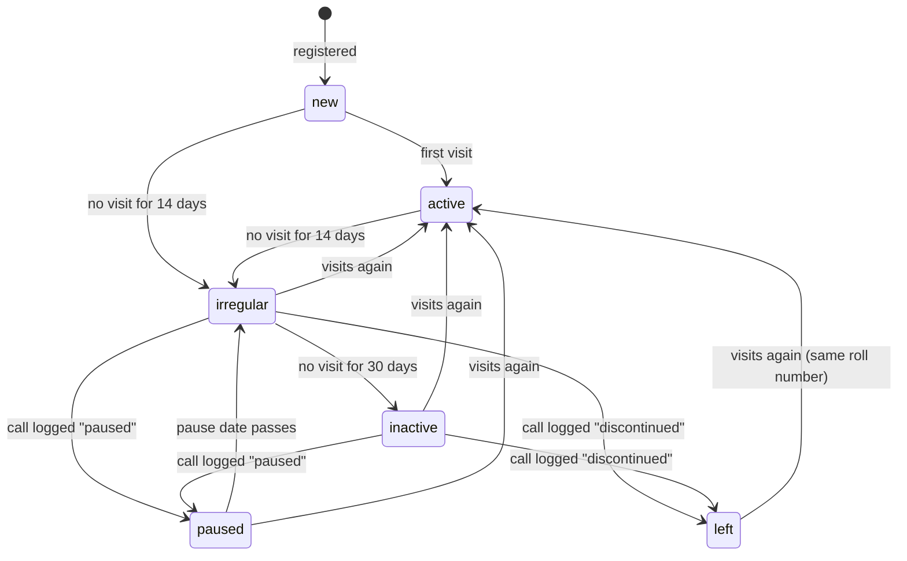

# Database

The whole schema is in [`supabase/migrations/0001_phase1.sql`](../supabase/migrations/0001_phase1.sql).
Every table and important column also carries a `COMMENT ON` description, so you can read it in
the Supabase dashboard (Table Editor → table → description).

Dummy data for a test project is in [`supabase/seed.sql`](../supabase/seed.sql): a placeholder
syllabus, 15 fictional students covering every status (some minors, with guardians and written
consent), sample visits, groups and an announcement. Never run it on the live project.

## Tables by area

| Area | Tables | Notes |
|---|---|---|
| Settings | `settings` | Day limits for follow-up, list of reasons for leaving. Change here, not in code |
| Places | `centres` | One row per class location (Abids today) with GPS point, radius and opening hours |
| People | `profiles` | One row per login: role, name, language, treasurer flag |
| Students | `students`, `guardians`, `consents`, `roll_counters` | A student record can exist without a login |
| Attendance | `visits` | One row per check-in; `check_out` empty while the student is still there |
| Follow-up | `call_logs`, `follow_up_tasks`, `status_history` | Every call and every status change is kept |
| Learning | `levels`, `syllabus_items`, `student_progress`, `level_history`, `materials` | Three levels; each has an ordered syllabus |
| Communication | `announcements`, `announcement_reads`, `groups`, `group_members` | Groups replace the WhatsApp groups |
| Audit | `audit_log` | Who changed a student, profile, call log or level, and when |

## Student status

A student's `status` follows these rules. The daily job moves students along; a logged call is the
**only** way to reach *Paused* or *Left* (enforced by a trigger — see [DECISIONS.md #4](DECISIONS.md)).

The day limits (14, 30, and 3 days to make a call) are rows in `settings`, not fixed in code.

When a student becomes *Irregular*, the daily job creates a `follow_up_tasks` row of kind `call`
for their mentor coordinator. When a call is logged as *Not reachable*, a `retry` task is created;
after `max_retries` failed tries the task is marked `escalated` so the Guru sees it.

## Roll numbers

Assigned by the trigger `students_roll_no` when a student is inserted: `MS-<year joined>-<4 digits>`,
counted per year in `roll_counters`. A roll number can never be changed (trigger
`students_guard`) and is never reused, even if the student leaves. See [DECISIONS.md #3](DECISIONS.md).

## Database functions (call these from the app)

| Function | Who may call | What it does |
|---|---|---|
| `toggle_visit(student, method, device)` | Guru, coordinator, kiosk | Check in if no open visit, else check out. A check-in sets status *Active* and closes open follow-up tasks. Returns the student's name, roll number and time |
| `scan_qr(qr_token, device)` | Guru, coordinator, kiosk | Finds the student by their QR token and calls `toggle_visit`. Returns `unknown` for an unrecognised code |
| `log_call(student, outcome, reason, comment, next_date)` | Guru, coordinator | Records a follow-up call and applies its outcome (pause, leave, new call task, retry) |

Internal functions (not called by the app): `refresh_student_statuses`, `close_open_visits`,
`handle_new_user`, `assign_roll_no`, the guard and audit triggers, and the helpers `my_role`,
`is_guru`, `is_staff`, `setting_int`, `today_ist`.

## Scheduled jobs (pg_cron, times in UTC)

| Job | Runs | Does |
|---|---|---|
| `mridanga-status-refresh` | 00:30 UTC = 06:00 IST | `refresh_student_statuses()` — ends expired pauses, moves quiet students on, creates call tasks, flags overdue ones |
| `mridanga-close-visits` | 15:30 UTC = 21:00 IST | `close_open_visits()` — closes visits left open, at the centre's closing time |

## Who can see what

| Data | Student | Coordinator | Guru |
|---|---|---|---|
| Own student record, visits, progress, level history | Read | Read / write | Read / write |
| Other students | — | Read / write | Read / write / delete |
| Guardians, consents | — | Read / write | Read / write |
| Call logs, follow-up tasks, status history | — | Read / write | Read / write |
| Materials | Approved ones up to own level | All, can suggest | All, approves |
| Announcements | Those addressed to them | All, can post | All, can post |
| Settings, levels, syllabus, centres | Read | Read | Read / write |
| Audit log | — | — | Read |

## Changing the database

1. **Never edit a migration that has been applied.** Add a new file: `0002_short_name.sql`, `0003_...`.
2. Every new table: `enable row level security`, policies for each role, and `COMMENT ON` for the
   table and its non-obvious columns.
3. Update this document and, if a rule changed, add an entry to [DECISIONS.md](DECISIONS.md).
