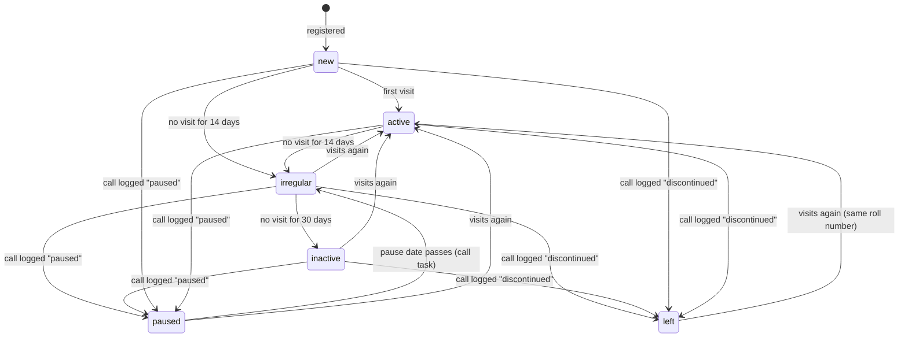

# Database

The schema is built by the migrations in [`supabase/migrations/`](../supabase/migrations/), run
in number order:

| File | Does |
|---|---|
| `0001_phase1.sql` | All Phase 1 tables, rules, functions, daily jobs and row-level security |
| `0002_login_linking.sql` | Links logins to students only after email confirmation; lets the dashboard set the first Guru; locks internal functions ([DECISIONS.md #13, #14](DECISIONS.md)) |
| `0003_register_student.sql` | `register_student` saves a student with the parent's consent in one step; a minor cannot be added, or given a new date of birth, without a current data consent (`students_minor_consent`, 0003:26-29) ([DECISIONS.md #16](DECISIONS.md)). Deleting or revoking that consent later is guarded only since 0025 (`consents_minor_recheck`, 0025:259; a withdrawal is the one exception, [#74, #75](DECISIONS.md)) |
| `0004_attendance.sql` | `mark_visit` for tap-to-mark attendance and `check_out_all` for closing time ([DECISIONS.md #18](DECISIONS.md)) |
| `0005_students_follow_up.sql` | View `student_overview` (last visit, days since); reasons for a call become codes; `log_call` checks its inputs and answers with error codes ([DECISIONS.md #19, #20](DECISIONS.md)) |
| `0006_syllabus_progress.sql` | A syllabus tick records who really ticked it and cannot be dated in the future; every tick and untick is kept in `audit_log` ([DECISIONS.md #22](DECISIONS.md)) |
| `0007_announcements.sql` | Announcements: checks on every announcement, only students and staff can read them, the author or the Guru can delete, read receipts written only by the reader, and views for "seen by N of M" ([DECISIONS.md #25](DECISIONS.md)) |
| `0008_announcement_follow_ups.sql` | Students see who posted an announcement (`staff_names`); editing marks a published announcement "Edited"; checks on groups, which only staff and members can see; private replies to announcements ([DECISIONS.md #26–#29](DECISIONS.md)) |
| `0009_home_screens.sql` | The numbers on the three home screens: `student_home`, `coordinator_dashboard` and `guru_dashboard`, and one meaning of "this week" (`week_start_ist`) ([DECISIONS.md #31](DECISIONS.md)) |
| `0010_announcement_files.sql` | Photos and PDFs on announcements: the private Storage bucket `announcement-files`, checks on `attachments`, and who may upload, open and delete a file ([DECISIONS.md #32](DECISIONS.md)) |
| `0011_push_notifications.sql` | Push notifications: `announcements.notified_at`, `push_tokens`, `register_push_token`, and the every-minute job that calls the Edge Function `notify-announcements` ([DECISIONS.md #33](DECISIONS.md)) |
| `0013_syllabus_materials.sql` | The syllabus editor and the materials library: retiring items, their order, checks on items and materials, the bucket `material-files`, own name and phone ([DECISIONS.md #44](DECISIONS.md)). Number 0012 is unused on main (it was the Phase 2 branch's, now 0016) |
| `0014_guru_admin.sql` | The facilitator's admin screens: roles, duty hours and mentees (G2), the student import (G3), checked settings and "this week" from Monday or the last 7 days (G10), audit log indexes (G11); a call task follows the mentor ([DECISIONS.md #45-#48](DECISIONS.md)) |
| `0015_inbox_reports_centres.sql` | The notifications inbox filled by the database (A2), the reports function `class_report` (C21, G8), and checks on centres with an address and the attendance area (G9) ([DECISIONS.md #49-#51](DECISIONS.md)) |
| `0016_assessments.sql` | **Phase 2** (0012 on its branch and on TEST). Assessments, releases, assignments and submissions with their rules; the private bucket `assessment-files`; the push queue `push_outbox`; the daily reminder job ([DECISIONS.md #52](DECISIONS.md)). See "Assessments (Phase 2)" |
| `0017_promotion.sql` | **Phase 2** (0014_promotion on its branch and on TEST). Nominations, coordinators' feedback, the Guru's decision; only the Guru changes a level ([DECISIONS.md #53](DECISIONS.md)). See "Promotion approval (Phase 2)" |
| `0018_practice.sql` | **Phase 2** (0016_practice on its branch and on TEST). Taals, the practice log and weekly minutes ([DECISIONS.md #54](DECISIONS.md)). See "Practice tools (Phase 2)" |
| `0019_phase2_inbox.sql` | Every notice queued in `push_outbox` (assessments, promotion) also goes into the notifications inbox (A2) ([DECISIONS.md #55](DECISIONS.md)). See "Notifications inbox" |
| `0020_media.sql` | **Phase 2 slice 4** (0017_media on its branch and on TEST). Lessons of kind `video` (a link to the team's own video file) with `materials.panes` (camera angles side by side) for mirror and zoom in the lesson player V3; the coordinator's voice note on a review (`assessment_submissions.voice_note`, C14) ([DECISIONS.md #56](DECISIONS.md)). See "Media (Phase 2)" |
| `0021_ishtagoshti.sql` | **Phase 2 slice 6.** Sloka study: `ig_slokas`, `ig_themes`, `ig_theme_slokas`, `ig_daily_pins` (sloka of the day), private `ig_notes`, `ig_memorised`; the private bucket `ishtagoshti-audio` for recitations; editors marked by `profiles.ig_editor`; a sloka is published only as the temple's own text ([DECISIONS.md #57](DECISIONS.md)). See "Ishtagoshti (Phase 2)" |
| `0022_events_polls.sql` | **Phase 2 slice 5** (0021_events_polls on its branch and on TEST). `events`, `event_rsvps`, `event_performers`, `event_attendance`, `polls`, `poll_votes`; notices and reminders through the inbox and push; the daily job `mridanga-events-polls`; anonymous polls show no choice to anyone ([DECISIONS.md #61](DECISIONS.md)). See "Events and polls (Phase 2)" |
| `0023_team_tools.sql` | **Phase 2 slice 8.** C18 material suggestions (coordinators suggest, the Guru adds or declines), C19 inventory (items, loans, condition checks), C20 duty roster (shifts, people, the evening-before reminder) ([DECISIONS.md #65](DECISIONS.md)). See "Team tools (Phase 2)" |
| `0024_attendance_location.sql` | The location check at check-in: `toggle_visit`, `scan_qr` and `mark_visit` take the marking phone's position and save the result and the distance (never the position) on the visit; outside the area or without a position the visit is saved and flagged; `class_report` counts the flags ([DECISIONS.md #70](DECISIONS.md)). See "Attendance" |
| `0025_security_round.sql` | Security round (audit fixes): NULL-safe role checks in `toggle_visit` / `scan_qr`; `profile_id`, `qr_token` and `created_by` frozen for app users (links only through the linking functions); an insert-only, commit-checked, audited consent register with the signed-form tick; `withdraw_consent`, `erase_student` and the `erasures` tombstones; anon loses every table, sequence and function right ([DECISIONS.md #72-#77](DECISIONS.md)). See "Withdrawal and erasure (0025)" |
| `0026_fund.sql` | **Phase 2 slice 9.** The class fund ledger: `fund_categories`, `fund_entries` (income and expenses in whole paise, references, optional bills in the private bucket `fund-bills`); treasurers marked by the Guru; maker-checker approval of larger expenses, nobody approves their own entry; the app records money only ([DECISIONS.md #80](DECISIONS.md)). See "Class fund (Phase 2)" |
| `0027_ishtagoshti_public.sql` | **Phase 2 slice 7.** Free public sign-up for sloka study only: `ig_subscribers` (a pending login that joined Ishtagoshti; no new role) and `ig_parent_codes` (a 6-digit code emailed to the parent of an under-18, the verifiable consent of DPDP rule 10) ([DECISIONS.md #88](DECISIONS.md)). See "Ishtagoshti subscribers (Phase 2)" |
| `0028_security_round_2.sql` | Security round 2 (audit brief 5): a `student` login without a student record counts as `pending`; materials for staff and students only; `email`, `created_at`, `centre_id` frozen for app users and `email` synced from the sign-in email; names without invisible characters and not a staff member's; phones with 7 to 15 digits; a listed file name cannot be uploaded again; a minor keeps a guardian with a phone ([DECISIONS.md #96-#98, #100](DECISIONS.md)). See "Security round 2 (0028)" |
| `0029_function_comments.sql` | Descriptions (`COMMENT ON`) for the eight functions that had none: `setting_int`, `today_ist`, `my_role`, `is_guru`, `is_staff`, `is_minor`, `audit_row`, `release_submission_files`. Comments only; safe to run before or after 0028 and to run again |
| `0030_round10_rules.sql` | Round 10 (audit brief 15): an ended pause gets a call task and restarts the Inactive clock; no duplicate tasks, only due tasks escalate; retry count starts again after a visit; settings fall back to defaults and keep Irregular before Inactive at commit; no insert straight into Paused/Left, `paused_until` only through a call; visits: only times correctable, audited; 30-second QR rescan rule (#107-#110). See "Round 10 rules (0030)" |
| `0031_push_fixes.sql` | Push fixes (audit brief 11): the per-phone queue `push_queue` with `claim_push_queue` / `finish_push` (one bad token no longer stops a batch; a failed or stopped send is retried, never sent twice), `push_status`, and the job calls only an https Supabase address with a 32+ character secret ([DECISIONS.md #112-#115](DECISIONS.md)). See "Push queue (0031)". Needs the Edge Function redeployed |
| `0032_auth_fixes.sql` | Sign-in leftovers: a new profile takes the language sent with the sign-up (D8-01); `students.request_id` + `register_student(..., p_request_id)`: a registration saved twice stores the student once (D6-08) ([DECISIONS.md #125, #126](DECISIONS.md)). See "Sign-in leftovers (0032)" |
| `0033_time_zones.sql` | International basics: `centres.time_zone` (IANA, default Asia/Kolkata) and `centres.country_code` (ISO 3166, default IN); `today_ist()` = today at the caller's centre; attendance days, closing, home screens, reports, event and duty reminders in the right centre's zone; `close_open_visits` hourly; notices dated in each person's zone; `fund_entries.currency` (ISO 4217, default INR) ([DECISIONS.md #132-#136](DECISIONS.md)). See "Time zones and currency (0033)" |
| `0034_access_log.sql` | Reads of parents' contacts, consents and call notes, and audit-log pages, go through logging functions into `access_log` (the Guru reads it; purged after 400 days); coordinators lose the direct reads; `consents.notice_version` ([DECISIONS.md #146-#151](DECISIONS.md)) |
| `0035_asset_labels.sql` | QR asset labels for every seva asset: new kinds + `category`; `asset_token` (unguessable, frozen) and a per-centre `code` (KHOL-007) on every item, backfilled; `resolve_asset`, `mark_labels_printed`; stocktake (`inventory_stocktakes`, `inventory_stocktake_items`, `start_stocktake`, `stocktake_see`, `finish_stocktake`) ([DECISIONS.md #156-#161](DECISIONS.md)). 0034 is the privacy brief's; 0035 does not depend on it. See "Asset labels and stocktake (0035)" |
| `0036_account_creation.sql` | Account creation (team MoM 05-10-2026): option lists the Guru edits (`choice_options`), `centres.city`, `profiles.gender` + `referral_code`, `students.gender`, `person_details` (About you, the desk), the sign-up's date of birth, gender and centre, `sign_up_choices()` (the one function anon may run), same-gender coordinator auto-assignment, the report `heard_about_report` ([DECISIONS.md #162-#167](DECISIONS.md)). See "Account creation and About you (0036)". Numbers 0034 and 0035 belong to the privacy and asset-label branches |
| `0037_db_backlog.sql` | Audit backlog, database + performance (dimensions 1, 5, 9): every policy calls its role helpers once per query (`(select is_staff())`), `student_overview` reads through the visits indexes, 12 lookup indexes; trigger functions and TRUNCATE closed to app roles, definer functions search `public, pg_temp`; `toggle_visit` / `scan_qr` say `not_allowed`; roll numbers past 9999 and owner-given ones; student value checks; group, announcement, call-reason, attachment, syllabus and audit fixes ([DECISIONS.md #168-#173](DECISIONS.md)). See "Backlog fixes (0037)" |
| `0039_security_backlog.sql` | Audit backlog, app security and privacy (dimensions 3, 4): the minor-consent refusal names the roll number, not the child (D4-17); push tokens of a person switched off or without a class role are deleted (D2-06); staff student search `search_students` by POST (ENT-08) ([DECISIONS.md #186-#192](DECISIONS.md)). See "Security backlog (0039)" |
| `0040_ops_backlog.sql` | Audit backlog, operations (dimensions 10, 11): pg_cron's run history kept 7 days; announcement files no post lists removed daily (through the Edge Function); `anonymise_staff` for a staff login that cannot be deleted ([DECISIONS.md #194-#196](DECISIONS.md)). See "Operations backlog (0040)" |
| `0042_app_leftovers.sql` | Audit leftovers, code quality (dimension 13): `students.roll_no` NOT NULL; the last two triggers answering with English sentences use codes (`roll_no_frozen`, `status_needs_call_log`, `role_guru_only`); comments on the helper functions and core columns ([DECISIONS.md #219-#220](DECISIONS.md)). 0041 was never used. See "App leftovers (0042)" |
| `0043_parent_notices.sql` | Check-in / check-out emails to a minor's parent: settings (off by default), per-guardian stop and language, the `parent_notices` queue filled by a trigger on `visits`, the every-minute job and the functions of the Edge Function `notify-parents`, the C8 status and switch ([DECISIONS.md #224-#231](DECISIONS.md)). See "Parent notices (0043)" |
| `0044_parent_checkout_only.sql` | Parent emails only for a check-out recorded in the app: settings `parent_notices_check_in` and `parent_notices_no_checkout` (both off), `guard_setting` with them, the visits trigger honouring each switch ([DECISIONS.md #246-#247](DECISIONS.md)). See "Parent notices (0043)" |
| `0045_qr_cards.sql` | Printed QR cards for students without a phone (Phase 3 P3-1): `reissue_qr_code(student)`, the Guru gives a student a new `qr_token` when a card is lost, so the old card scans as unknown ([DECISIONS.md #249-#252](DECISIONS.md)). The cards carry the My QR code and need no table. See "Attendance" |

The Phase 2 files were renumbered when they merged into main (#55). TEST ran some under their
branch numbers (0012, 0014_promotion, 0016_practice, 0017_media, 0021_events_polls), so it skips
those; LIVE runs every file from 0013 on in number order (OPERATIONS.md). TEST has 0028 (run 6 Oct 2026).

Every table and important column also carries a `COMMENT ON` description, so you can read it in
the Supabase dashboard (Table Editor → table → description).

Dummy data for a test project is in [`supabase/seed.sql`](../supabase/seed.sql): a placeholder
syllabus, 15 fictional students covering every status (some minors, with guardians and written
consent), sample visits, groups and an announcement. Never run it on the live project.

## Tables by area

| Area | Tables | Notes |
|---|---|---|
| Settings | `settings` | Day limits for follow-up, list of reasons for leaving, what "this week" means, promotion criteria for Phase 2. The facilitator changes them on G10 (see "Settings") |
| Places | `centres` | One row per class location (Abids today) with address, GPS point, radius and opening hours (G9, see "Centres") |
| People | `profiles` | One row per login: role, name, **email, phone**, centre, language, `active`, sign-up time, treasurer flag (0001:51-62), duty hours (G2, 0014:25), Ishtagoshti editor flag (`ig_editor`, 0021:27), **gender** and referral code (0036:142-145). Personal data: staff read every profile except public subscribers' (0027:81-82) |
| Students | `students`, `guardians`, `consents`, `roll_counters` | A student record can exist without a login |
| Attendance | `visits` | One row per check-in; `check_out` empty while the student is still there |
| Follow-up | `call_logs`, `follow_up_tasks`, `status_history` | Every call and every status change is kept |
| Learning | `levels`, `syllabus_items`, `student_progress`, `level_history`, `materials` | Three levels; each has an ordered syllabus |
| Communication | `announcements`, `announcement_reads`, `announcement_replies`, `groups`, `group_members`, `push_tokens`, `push_queue`, `push_status` | Groups replace the WhatsApp groups. Views `announcement_audience` and `announcement_seen` give "seen by", `announcement_reply_list` the replies with names, `group_summary` the member counts. `notifications` is each person's inbox (A2, see "Notifications inbox"). Photos and PDFs are files in the Storage bucket `announcement-files`, listed in `announcements.attachments` |
| Assessments (Phase 2) | `assessments`, `assessment_releases`, `assessment_assignments`, `assessment_submissions`, `push_outbox` | Views `assessment_tracker` (C13) and `assessment_summary` (counts). Files in the Storage bucket `assessment-files` |
| Promotion (Phase 2) | `promotion_nominations`, `promotion_feedback` | View `promotion_queue` (G7). See "Promotion approval (Phase 2)" |
| Practice (Phase 2) | `taals`, `practice_logs` | Taals the S5 player loops (the Guru edits them); practice minutes from the S5 timer or typed in (S6). See "Practice tools (Phase 2)" |
| Inventory (Phase 2) | `inventory_items`, `inventory_loans`, `inventory_checks`, `inventory_code_counters`, `inventory_stocktakes`, `inventory_stocktake_items` | Every seva asset with its label code and token, who holds each, every condition seen, the counts (C19). See "Team tools (Phase 2)" and "Asset labels and stocktake (0035)" |
| Duty roster (Phase 2) | `duty_shifts`, `duty_assignments` | Shifts per date and centre with the people on each (C20). Suggestions (C18) live in `materials` |
| Ishtagoshti (Phase 2) | `ig_slokas`, `ig_themes`, `ig_theme_slokas`, `ig_daily_pins`, `ig_notes`, `ig_memorised` | Sloka study (I1-I3, I11, I12): the temple's own translations, themes, the sloka of the day, private notes, memorised ticks. Recitations in the Storage bucket `ishtagoshti-audio`. See "Ishtagoshti (Phase 2)" |
| Access log | `access_log` | Who read a student's guardians, consents or call notes, or a page of the audit log, and when (0034; G11 "Reads of private details") |
| People details (0036) | `person_details`, `choice_options` | What a person tells in About you or the desk records (emergency contact, how they found the class, occupation, service areas); the option lists the Guru edits (G12). See "Account creation and About you (0036)" |
| Audit | `audit_log` | Who changed a student, profile, call log, level, syllabus item or tick, material, announcement, setting, centre, sloka or Ishtagoshti theme, corrected or deleted a visit (0030), or deleted a reply, and when (read on G11) |

## Student status

A student's `status` follows these rules. The daily job moves students along; a logged call is the
**only** way to reach *Paused* or *Left* (enforced by a trigger — see [DECISIONS.md #4](DECISIONS.md)).



`log_call` sets *Paused* or *Left* from **any** status, not only from Irregular or Inactive
(0037:832 on, the `update students set status = 'paused'` / `'left'` lines). The diagram also leaves out
staff edits: a coordinator or the Guru may set any status except *Paused* and *Left* by hand on the
record (for example *Left* → *New* or *Left* → *Inactive*); only the move into *Paused* or *Left* is
guarded (`guard_student_update`, 0001:147-152; insert guard `status_on_insert`, 0030:201-206). Every
change is kept in `status_history`.

The day limits (14, 30, and 3 days to make a call) are rows in `settings`, not fixed in code.

When a student becomes *Irregular*, the daily job creates a `follow_up_tasks` row of kind `call`
for their mentor coordinator, unless an open task exists already. A pause that ended does the same
(0030), and the days to *Inactive* then count from the day the pause ended, not from the last visit
([DECISIONS.md #107](DECISIONS.md)). When a call is logged as *Not reachable*, a `retry` task is
created; after `max_retries` failed tries in the same absence (since the last call that got through
or the last visit) the task is marked `escalated` so the Guru sees it. An Inactive student's open
tasks are escalated once they are due.

For app users the status rules also hold on insert (0030, [#109](DECISIONS.md)): a new record starts
*New* or *Active* (`status_on_insert`), and `paused_until` changes only through `log_call`
(`student_field_locked`); it is cleared when the status leaves *Paused*.

## Roll numbers

Assigned by the trigger `students_roll_no` when a student is inserted: `MS-<year joined>-<4 digits>`,
counted per year in `roll_counters`. A roll number can never be changed (trigger
`students_guard`) and is never reused, even if the student leaves. See [DECISIONS.md #3](DECISIONS.md).

## Registering a student

Coordinators and the Guru register students with `register_student` (screens C2 + C3). It saves,
all or nothing:

- the `students` row (name and date of birth required; the roll number is added by trigger);
- for a student **under 18**: a `guardians` row (name and phone required) and a `consents` row
  with `scope = 'data'`, `method = 'written'` and the type of ID the coordinator looked at, plus a
  second `consents` row with `scope = 'photo'` if the parent agreed to a photo.

Separately, the constraint trigger `students_minor_consent` runs when each transaction ends and
refuses a student under 18 who has no current `data` consent, however the row was written
([DECISIONS.md #16](DECISIONS.md)). It fires only when a student is inserted or the date of birth
changes (0003:26-29); a later delete or revoke of the consent is caught by the 0025 triggers below,
and a withdrawn record is exempt (0028:254). "Under 18" is decided by `is_minor()` on `today_ist()`
(0001:120-121), which since 0033 is today at the caller's centre.

Codes stored in text columns (the app translates them):

| Column | Codes |
|---|---|
| `guardians.relation` | `mother`, `father`, `guardian` (another adult responsible for the student) |
| `consents.id_type_checked` | `aadhaar`, `pan`, `driving_licence`, `passport`, `voter_id`, `other` — the ID number is never stored |

Errors from `register_student` are short codes the app turns into messages: `not_allowed`,
`name_required`, `dob_required`, `minor_needs_guardian`, `minor_needs_id_check`, and
`minor_needs_consent` from the trigger. New functions should follow the same pattern: raise a
short `snake_case` code, and put the explanation for people reading the dashboard in `detail`.

**Since 0032** ([DECISIONS.md #126](DECISIONS.md)): `register_student` also takes `p_request_id`, the
form's random id; saving the same form again returns the first student with `repeated: true`.

**Since 0025** ([DECISIONS.md #74](DECISIONS.md)): `register_student` takes `p_written_consent`, the
coordinator's tick that the parent signed the paper form; for a minor it must be true
(`written_consent_required`) and it is stored as `consents.signed_form` (NULL on consents written
before 0025). For app users a consent is insert-only: `verified_by` and `given_at` are set by the
server, a written one needs `signed_form = true`, nothing changes afterwards (`consent_locked`)
except that the Guru may revoke it once, and only the Guru deletes one. The deferred triggers
`consents_minor_recheck` and `guardians_minor_recheck` refuse, for everyone, a change that leaves a
minor who is still on record (and not withdrawn) without a current data consent
(`minor_needs_consent`) or a guardian (`minor_needs_guardian`). App users cannot add a student or
leave a record without a date of birth (`dob_required`). Consents and guardians are audited.

## Attendance

A visit is one row in `visits`. It is *open* (the student is here now) while `check_out` is
empty; a unique index allows only one open visit per student. There are three ways to change
visits from the app, all in database functions so that the rules sit in one place
([DECISIONS.md #18](DECISIONS.md)):

| Action in the app | Function | What happens |
|---|---|---|
| Coordinator scans a student's QR code (C5), door tablet later | `scan_qr` → `toggle_visit` | Toggles: check in if the student is out, check out if in. A scan within 30 seconds of the check-in answers `already_in` (0030: a second phone scanning a moment later does not end the visit) |
| Coordinator taps *Check in* or *Check out* next to a name (C5, C6) | `mark_visit(student, 'in' / 'out')` | Does what the button says. If the student is already in that state, nothing changes and it returns `already_in` / `already_out` |
| Coordinator taps *Check out all* (C6) | `check_out_all()` | Closes every open visit: today's end now, a visit left open from an earlier day ends at that day's closing time |

Any check-in makes the student *Active* again and closes their open follow-up tasks (inside
`toggle_visit`, which `mark_visit` calls). `mark_visit` locks the student's row while it works, so
two phones marking the same student at once are handled one after the other. Every hour (since 0033; 21:00 IST before) the
nightly job `close_open_visits` closes anything still open, at the centre's closing time.

The QR code on a student's phone holds the text `MS1:` followed by their `qr_token` in capitals
([DECISIONS.md #17](DECISIONS.md)). The app removes the prefix and sends the token to `scan_qr`.
A printed QR card (C24, for a student without a phone; 0045) holds the same text, so `scan_qr` reads
it the same way. A lost card: the Guru calls `reissue_qr_code(student)` (Guru only, `not_allowed`; `student_not_found`;
a withdrawn record is `student_withdrawn`), which gives a new `qr_token`; the old card and any old My QR then
answer `unknown`. The change is in the audit log ([DECISIONS.md #250](DECISIONS.md)).

Errors: `not_allowed`, `bad_action` and `student_not_found`. Until 0037 `toggle_visit` and `scan_qr`
said `not allowed` and `student not found` with spaces; the app (`app/src/data/attendance.ts`) understands both
spellings, so builds of either age work. Keep both until LIVE has run 0037 (DECISIONS #219). Since 0037 a visit left open from an earlier day (the hourly
close job did not run) is closed at that day's closing time before the next tap, which then checks in.

### Location check at check-in (0024)

When a coordinator or the Guru checks a student **in** (scan, or a tap on C5 or C8), the app sends
the phone's report as `p_location` to `scan_qr` / `mark_visit` (and on to `toggle_visit`):
`{status: 'fix', lat, lng, accuracy}` or `{status: 'refused' | 'no_fix' | 'no_location'}`.
`visit_location_result` (internal) compares it with the area of the visit's centre (`centres.lat`,
`lng`, `radius_m`, set on G9) and the visit stores only the result ([DECISIONS.md #70](DECISIONS.md)):

| Column | Meaning |
|---|---|
| `location_check` | `inside` (within `radius_m` + the fix's accuracy, at most 100 m of it), `outside`, `refused` (permission refused), `no_fix` (no position within 8 s, location off), `no_location` (a browser without location), `no_area` (the centre has no point: nothing to compare); empty = not checked (visits before 0024, or an app without the check) |
| `location_distance_m` | Whole metres from the centre's point, for `inside` / `outside` only |

**Flagged** = `outside`, `refused`, `no_fix`, `no_location`. The visit is saved all the same;
staff see the flag on C5's result card, C6, S9 (staff view) and the reports (`class_report` adds
`visits_flagged`, `flagged_by_reason` and `flagged` per student row). The position itself is never
stored. A check-out stores nothing. The trigger `visits_location_guard` refuses any change to the two
columns from the app (error `location_locked`); staff may still correct the times (since 0030 only
the times, see "Round 10 rules (0030)"). A malformed
report raises `bad_location`. Students can read their own visits' result through row-level
security, but their screen does not show it.

## Student overview

`student_overview` is a view: one row per student with the list columns of `students` (roll
number, name, level, status, pause date, mentor, joined) plus:

| Column | Meaning |
|---|---|
| `last_visit_at` | Check-in time of the latest visit; empty if the student has never come |
| `days_since_visit` | Whole days since that visit, counted in the student's home centre's time zone like the daily job (`local_day`, 0037:363-365 and 0033:170-176); with none, since joining or since the record was made, whichever is later (0014: an imported record with an old joining date is not Irregular at once); the same count the daily job uses for Irregular and Inactive, except that since 0030 the job counts Inactive from a pause's end when that is later |
| `here_now` | True while the student has an open visit |

The student list (C7), the profile (C8) and the follow-up queue (C10) read it. It exists because
Supabase does not let the app ask for `max(check_in)` directly (aggregate functions are off by
default in its API), and fetching every visit to the phone would grow without end.

It is created `with (security_invoker = true)`: it reads `students` and `visits` as the person
asking, so their row-level security applies — staff see every student, a student sees only their
own row, and a signed-out visitor sees nothing. Without that option a view runs as its owner and
would show every student to anyone signed in ([DECISIONS.md #20](DECISIONS.md)). Only `select` is
granted, to signed-in people.

## Follow-up calls

A coordinator records a call with `log_call(student, outcome, reason, comment, next_date)`
(screen C11). It always saves a `call_logs` row, closes the student's open follow-up tasks, and
then acts on the outcome:

| Outcome | Reason | `next_date` | What happens |
|---|---|---|---|
| `returning` (coming back) | required | required: the day they said they would come | A new `call` task for the day after that date. Their next visit closes it |
| `paused` (taking a break) | required | required: pause-until date | Status *Paused* until that date; the daily job brings them back into follow-up after it |
| `not_reachable` | none | not used | A `retry` task in `retry_days`; after `max_retries` failed tries in this absence (since the last call that got through or the last visit, 0030) it is `escalated` to the Guru |
| `discontinued` (stopped coming) | required | not used | Status *Left*. Roll number and history are kept; a visit makes them Active again |

Reasons are codes from `settings.call_reasons`: `studies`, `work_timing`, `moved`, `health`,
`family`, `lost_interest`, `joined_elsewhere`, `travel`, `other`. The app shows them translated
(`callReasons.<code>`); a code the Guru adds later without a translation is shown as written
([DECISIONS.md #19](DECISIONS.md)). `log_call` refuses a reason that is not in the list.

Errors from `log_call` (short codes the app turns into messages): `not_allowed`,
`student_not_found`, `outcome_required`, `comment_required`, `reason_required`, `reason_unknown`,
`next_date_required`, `next_date_past` (the date is before today). A `next_date` given with an
outcome that does not use one is dropped, so reports never show a stray date.

## Syllabus progress

Each level has an ordered list of `syllabus_items` (the Guru writes it, G4). When a student shows
an item in class, a coordinator ticks it for them on screen C9: one row in `student_progress`
(student, item, `done_on`, `ticked_by`, optional `remark`). Any coordinator or the Guru may tick
for any student; students can read their own ticks and change nothing.

The app writes the table directly: insert to tick, update to change the remark, delete to untick.
The trigger `student_progress_guard` ([DECISIONS.md #22](DECISIONS.md)) makes these rules hold
however the row is written:

| Rule | Error code |
|---|---|
| `ticked_by` is the signed-in person, whatever the app sent (the dashboard and `seed.sql`, with no login, keep what they give) | — |
| `done_on` is today by default and never after today (India time) | `done_on_future` |
| After the tick only `remark` may change; student, item, date and `ticked_by` are fixed | `progress_frozen` |
| The remark is trimmed; empty becomes none; at most 500 characters | `remark_too_long` |

Every insert, update and delete is copied to `audit_log` by `audit_student_progress`, with
`row_id` = `<student id>/<item id>`, because the table has no `id` column of its own. So an untick
still shows who had ticked the item, when, and who removed it.

Items of an earlier level can still be ticked after a promotion; the screen shows every level.

## Syllabus editor

Migration 0013 ([DECISIONS.md #44](DECISIONS.md)) lets the Guru keep the syllabus on screen G4
without ever losing a tick. Levels stay fixed (Beginner, Intermediate, Advanced).

| Rule | Error code |
|---|---|
| Title trimmed, 1 to 120 characters; description at most 1000, empty becomes none | `title_required`, `title_too_long`, `description_too_long` |
| A new item without `sort` goes to the end of its level (after retired ones) | — |
| `retired_at` set = retired: no longer taught, cannot be ticked, not counted in `student_home()`; the ticks stay | `item_retired` (on a tick) |
| An item with ticks cannot be deleted (not even from the dashboard, where the cascade would take the ticks) or moved to another level | `item_has_ticks` |
| An item that materials point to cannot be deleted | `item_has_materials` |

`move_syllabus_item(item, up)` (Guru) swaps an item with the next item in use above or below it;
false when it is already first or last. `syllabus_item_counts()` gives, per item, the ticks the
caller may see and the materials, so the editor knows what may be deleted without reading every
tick (the API returns at most 1000 rows). Every change to `syllabus_items` goes to `audit_log`.

## Materials

`materials` (0001, used since 0013): a YouTube link (`kind` youtube, `url`), a PDF or a photo
(`kind` pdf / image, `storage_path`, `file_name`, `file_size`), or a note from seed.sql; for a
level (`level_id`, null = every level) and optionally one syllabus item (`item_id`; the level is
then taken from the item), with an optional note in `body`. The trigger `materials_guard` checks:

| Rule | Error code |
|---|---|
| Title 1 to 120 characters; note at most 1000 | `title_required`, `title_too_long`, `note_too_long` |
| A YouTube material has one video's link (watch, shorts, live, embed, youtu.be; `youtube_link_ok`) | `youtube_link_invalid` |
| A PDF or photo has a proper path, a name and a size up to 10 MB; a new one is the signed-in person's own upload and is in Storage (the size is taken from Storage) | `material_file_invalid`, `material_file_not_yours`, `material_file_missing` |
| Kind, file, uploader and time do not change after saving | `material_frozen` |
| Audio is not offered yet | `material_kind_not_offered` |
| The signed-in person is recorded as uploader; the Guru's materials are approved at once | — |

Files are in the private bucket **material-files** (10 MB, JPEG, PNG, WebP, PDF), path
`<uploader login id>/<random id>.<ext>` as for announcements. Storage rules: open = the file is on
a material the caller may read, or staff's own upload, or the Guru; upload = the Guru into their
own folder; delete = the uploader or the Guru. The app deletes the file before the row. Every
change to `materials` goes to `audit_log`.

## Own name and phone

A person may change their own `profiles.full_name` and `phone` (A3, policy `own_update`). The
trigger `profiles_details_guard` trims them when an app user changes them: name 1 to 80
characters (`name_required`, `name_too_long`), without control or invisible characters
(`name_invalid`; zero-width joiner and non-joiner are allowed) and not the name of the Guru or a
coordinator (`name_taken`, case and repeated spaces ignored, 0028); phone with 7 to 15 digits,
spaces and an optional leading + (`phone_invalid`). `email`, `created_at` and `centre_id`
cannot be changed by any app user (`profile_field_locked`): `email` follows the sign-in email
(trigger `on_auth_user_email_changed`), the centre is set in the dashboard. The name on a
student's roll (`students.full_name`) stays the coordinators' record.

## Announcements

A coordinator or the Guru posts an announcement on screen C15: a title, the message, who it is
for, whether it is pinned, and optionally a later publish time. Students read theirs on S10. The
app writes the `announcements` table directly: insert to post, update to edit, pin or unpin,
delete.

Who it is for (`audience`):

| Audience | Goes to | Needs |
|---|---|---|
| `all` | Every student with the app | — |
| `level` | Students whose record is at that level | `audience_level` |
| `mentees` | Students whose mentor is the author | — |
| `staff` | The Guru and the coordinators only | — |
| `group` | The members of that group | `audience_group` |

Coordinators and the Guru see every announcement, whatever its audience, including scheduled
ones. A student sees an announcement only once `publish_at` has passed, and only if it is
addressed to them. A login that is still `pending`, or the door tablet, sees none
([DECISIONS.md #25](DECISIONS.md)).

The trigger `announcements_guard` makes these rules hold however the row is written:

| Rule | Error code |
|---|---|
| Title and message are trimmed; neither may be empty | `title_required`, `body_required` |
| Title at most 120 characters, message at most 4000 | `title_too_long`, `body_too_long` |
| `level` needs a level and `group` a group; for other audiences both are cleared | `level_required`, `group_required` |
| No publish time means now | — |
| The author (`created_by`) is the signed-in person, whatever the app sent, and never changes; the dashboard and `seed.sql` keep what they give | `announcement_frozen` |
| Once published, the publish time cannot be changed from the app; a scheduled one moved to a time already past is published now, not backdated (0008) | `already_published` |
| `edited_at` is set to now when the title, message, audience, level, group or files of an already published announcement change; the app cannot set it. Editing a scheduled one, and pinning, do not count (0008, files from 0010) | — |
| `notified_at` (when the push notification went out) is set only by the Edge Function; the app can neither set nor change it (0011) | — |

Only the author, while still a coordinator or the Guru, or the Guru can edit, pin, unpin or
delete an announcement; row-level security turns anyone else's attempt into "nothing changed".
Every edit and delete is copied to `audit_log`. An edit keeps the read receipts: a person who
read the first version is still counted as having seen it, and sees "Edited" with the time
([DECISIONS.md #27](DECISIONS.md)).

**Who posted it.** Students may read only their own `profiles` row, so the app gets the author's
name from `staff_names()`: the id and name of every Guru and coordinator, active or not, and
nothing else. It answers students and staff; a `pending` login or the door tablet gets nothing
([DECISIONS.md #26](DECISIONS.md)).

**Read receipts.** When a person opens an announcement, the app adds one `announcement_reads`
row. The app may send only `announcement_id`: the database fills in who (the login) and when
(now). A person can add a receipt only for an announcement they can see, only once, and cannot
change or remove it. Receipts disappear with their announcement, or with the reader's login when
that is deleted (for example by `erase_student`): both keys cascade (0001:302-303).

**Seen by N of M.** Two views, both `with (security_invoker = true)` like `student_overview`:

| View | One row per | Columns |
|---|---|---|
| `announcement_audience` | announcement and person it is addressed to who can open it in the app (active login; students for `all`, `level`, `mentees`; staff for `staff`; members for `group`; never the author) | `full_name` (from the student record for students), `roll_no`, `role`, `read_at` (empty = not seen yet) |
| `announcement_seen` | announcement | `addressed` (M), `seen` (N), `no_login`: students it is meant for who have no app login and are not *Left*, to be told in class; `replies`: how many replies the person asking may read (0008) |

The staff screen reads the counts and the not-seen list from these views, so the number is the
same on every phone and the phone never downloads everyone's receipts. A student reading the
views sees only their own row.

**Photos and PDFs** (0010, [DECISIONS.md #32](DECISIONS.md)). The files are in the private Storage
bucket `announcement-files` (at most 5 MB a file; JPEG, PNG, WebP and PDF only; Storage refuses
anything else). A file's path is `<uploader's login id>/<random id>.<jpg|png|webp|pdf>`.
`announcements.attachments` lists an announcement's files in order, each as
`{"path", "name", "kind", "size"}` (`kind` is `image` or `pdf`, `size` in bytes). The app uploads
the files when the announcement is saved, then saves the announcement with the list.

The trigger `announcements_attachments_guard` checks the list however it is written:

| Rule | Error code |
|---|---|
| A list of at most 3 files | `too_many_attachments` |
| Each entry has a proper path, a name of 1 to 120 characters (trimmed), `kind` matching the path's ending, a size up to 5 MB, and no file twice; other keys are dropped | `attachments_invalid` |
| A file an app user adds must be in their own folder… | `attachment_not_yours` |
| …and really in Storage; its size is then taken from Storage, not from the app | `attachment_missing` |
| Files already on the announcement stay as they are (the Guru can edit a coordinator's announcement without owning its files) | — |

Storage keeps one row per file in `storage.objects`; its row-level security decides:

| Action | Allowed for | Rule function |
|---|---|---|
| Open, or make a signed link | Anyone who may read an announcement that lists the file (the `audience` rule above); staff for files in their own folder; the Guru | `announcement_file_readable` |
| Upload | Coordinators and the Guru, only into their own folder, only a proper file name | `announcement_file_uploadable` |
| Delete | Coordinators and the Guru: their own uploads, any file for the Guru, and files on their own announcements | `announcement_file_deletable` |
| Replace or move | Nobody (no update policy). Delete-and-upload-again under the same path was possible until 0028; since then a name any announcement lists cannot be uploaded again (0028:210, [#98](DECISIONS.md)). Deleting a listed file is still allowed by the row above: the announcement then lists a file that is gone, unedited | `announcement_file_uploadable` |

**Deleting a row in SQL does not delete the file** in Storage; it only orphans it. So the app
removes files through the Storage API: when an announcement is deleted it removes the files
first (while the announcement still lists them), and when an edit takes a file off it removes
the file once the change is saved. A file whose removal failed stays unused; OPERATIONS.md
"Files no announcement uses" shows how to find and remove such files.

**Push notifications** (0011, [DECISIONS.md #33](DECISIONS.md)). A phone that may receive
notifications has a row in `push_tokens` (its Expo push token, the login, `android` or `ios`).
The Android app saves it after sign-in with `register_push_token` and deletes it at sign-out (0039: also when the person is switched off); a
person sees and deletes only their own. A token belongs to the login last signed in on that
phone, and a person has at most 5 phones. The app does not turn the errors of `register_push_token` into
messages (0011 lists them beside `src/lib/push.ts`, the caller): any refusal leaves the token unsaved,
silently, and the next start tries again. The app asks only for the Guru, coordinators and students, the roles
that `not_allowed` lets through.

Every minute the job `mridanga-push` runs `send_due_push()`. When an announcement is published
and `notified_at` is still empty, it calls the Edge Function `notify-announcements`
(`supabase/functions/`) through pg_net, with the secret `mridanga_push_secret` from the Vault
in a header. The Edge Function, with the service role, calls `claim_due_push()`: it sets
`notified_at` on every waiting announcement and returns one row per phone to notify (the people
in `announcement_audience`, never the author). An announcement published more than a day before
is marked but not sent. The function sends the notifications through Expo's push service,
deletes tokens Expo no longer knows, and, if not one request reached Expo, calls
`release_push_claim()` so the next minute tries again. Until push is set up (pg_net, the Vault
secrets), `send_due_push()` returns `not_set_up` and nothing is called. It cannot tell whether the
Edge Function is deployed or accepts the secret: pg_net sends the request and does not wait, so
an undeployed or misconfigured function answers 401 or 404 every minute while the announcement
stays unsent (seen on TEST 30 Sep 2026; 0011:154-177). `push_status.last_job_result = 'called'`
(0031) says only that the request went out; check `net._http_response` as OPERATIONS.md "Push
notifications" shows.
Setting `notified_at` is not copied to the audit log. Scheduled announcements are sent at their
publish time; an edit is not sent again. **Since 0031** the Edge Function no longer calls
`claim_due_push` / `release_push_claim`: due announcements go into the per-phone queue, see
"Push queue (0031)".

**Private replies** (0008, [DECISIONS.md #29](DECISIONS.md)). Under an announcement a person can
send one or more replies to its author: one `announcement_replies` row each. The app may send
only `announcement_id` and `body`; the database fills in who (`profile_id`) and when
(`created_at`).

| Rule | Error code |
|---|---|
| The reply is trimmed; it may not be empty and is at most 1000 characters | `reply_required`, `reply_too_long` |
| Only for an announcement the writer can see (a `pending` login, or a student it is not addressed to, cannot reply) | row-level security (42501) |
| Read only by the writer, the author of the announcement while still staff, and the Guru. Students never see each other's replies | — |
| Nobody can change a reply; only the Guru can delete one (moderation), and the audit log keeps a copy. Replies go with their announcement | — |

The view `announcement_reply_list` (security invoker) gives the replies with the writer's name
(from the student record for students) and roll number. Replies are one-way for Phase 1: the
author answers in person or by phone.

## Groups

A group is a set of people who get the announcements sent to it (audience `group`); groups
replace the class WhatsApp groups. Coordinators and the Guru manage them on the groups screen:
`groups` (name, purpose, active) and `group_members` (group, profile). Members are logins:
students who use the app, coordinators and the Guru. The app writes both tables directly.

The trigger `groups_guard` (0008, [DECISIONS.md #28](DECISIONS.md)):

| Rule | Error code |
|---|---|
| Name trimmed, required, at most 60 characters | `group_name_required`, `group_name_too_long` |
| Purpose trimmed, empty becomes none, at most 200 characters | `group_purpose_too_long` |
| Names are unique whatever the capitals (index `groups_name_lower_key`); runs of spaces, no-break and other wide spaces count as one space, invisible characters are dropped (0037) | 23505 |
| `created_by` is the signed-in person and never changes | — |

Only staff and the group's own members can see a group; a student needs the name of their own
groups for "Group: Sunday Harinam". A group is **switched off** (`active = false`) instead of
deleted: it is no longer offered when posting, old announcements keep it, and its members still
see them. The app offers no delete; only the Guru may delete a group (0037, before any staff could), and the database refuses to delete a group an announcement was
sent to. Only switched-on staff and students whose login has a record are put in a group (trigger
`group_members_guard`, `member_not_allowed`), and a new post cannot go to a switched-off group (`group_inactive`) (0037). The view `group_summary` (security invoker) gives each group with its number of members.

## Home screens

Each home screen gets all its numbers from one function (0009,
[DECISIONS.md #31](DECISIONS.md)), which returns one JSON object. The functions only read. They
are **security invoker**: they count with the rights of the person asking, so row-level security
still applies, as for the views. The app reads them in `app/src/data/home.ts`.

| Function | Screen | Who | Gives |
|---|---|---|---|
| `student_home()` | S1 student home | Anyone signed in; a login without a student record gets `null` | Own name, roll number, level, status, joined; `last_visit_at`, `days_since_visit`, `here_now` (as in `student_overview`); `visits_this_week`; `syllabus_done` and `syllabus_total` for the current level |
| `coordinator_dashboard()` | C1 coordinator dashboard | Coordinators and the Guru; others get `not_allowed` | `here_now` (open visits, as C6), `visits_today` (check-ins since midnight, as C5), `my_calls_due`, `new_joiner_weeks`, `new_joiner_count`, `new_joiners` (newest 50: id, name, roll number, level, joined, visits) |
| `guru_dashboard()` | G1 Guru dashboard | The Guru; others get `not_allowed` | `week_start`, `came_this_week` (students, each once), `in_class`, `new_joiner_weeks`, `new_joiners`, `by_level` (every level, students in class), `by_status` (every status, all students), `follow_ups` (per person the task is assigned to: `overdue`, `escalated`) |

Words these functions use, the same on every screen:

| Word | Meaning |
|---|---|
| This week | Monday to today at the caller's centre (India for Abids), or the last 7 days when `settings.week_starts` = `rolling7` (0014, G10): `week_start_ist()` |
| New joiner | `joined_on` within the last `settings.new_joiner_weeks` weeks (4), and not *Left* |
| In class | Status is not *Left* |
| Calls due for my students (C1) | Students with an open follow-up task due today or earlier, or escalated, that is assigned to me or whose mentor I am: the *needs the Guru* and *call due* groups of C10 for "My students" |
| Overdue (G1) | Students with an open task past its due date, not escalated. Escalated ones are counted separately. Grouped by the task's assignee (the mentor when the task was made); no assignee = the student had no mentor |

## Coordinators and roles

Screen G2 (0014, [DECISIONS.md #45](DECISIONS.md)). The Guru writes `profiles.role`, `active` and
the new `duty_hours` directly (policy `own_update` lets the Guru update any profile); the trigger
`profiles_admin_guard` checks every change an app user makes:

| Rule | Error code |
|---|---|
| Only the Guru writes duty hours; trimmed, at most 120 characters | `not_allowed`, `duty_hours_too_long` |
| Nobody changes their own role or switches themselves off | `not_own_role` |
| The Guru role is given and taken only in the dashboard | `guru_role_dashboard_only` |
| The app gives roles only to pending logins: coordinator, or student once a student record links to the login | `role_change_not_allowed`, `student_needs_record` |
| A coordinator (or the Guru) who still mentors students cannot be switched off | `has_mentees` |

The older guard `profiles_guard` (0002) still stops anyone but the Guru from changing role,
treasurer or active.

`link_student_login(profile, student)` (Guru) links a pending, active login to a student record
without a login and makes it a student, in one step; errors `not_allowed`, `profile_not_pending`,
`student_not_found`, `student_already_linked`. `reassign_mentees(students, to)` (Guru) sets the
mentor of the given students and returns how many changed.

**Mentors and call tasks.** A new mentor must be an active coordinator or the Guru (trigger
`students_mentor_guard`, error `mentor_not_staff`; app users only). When a student's mentor
changes, their open follow-up tasks that were the old mentor's, or nobody's, go to the new mentor
(trigger `students_follow_mentor`, [DECISIONS.md #48](DECISIONS.md)). 0014 also gave the open tasks
without an assignee to the student's mentor at that time.

## Importing students

Screen G3 (0014, [DECISIONS.md #46](DECISIONS.md)). The app reads the file, checks every row and
sends only the good rows to `import_students(rows)` (Guru only), which checks them again and saves
each row on its own (a refused row does not stop the others). `rows` is a JSON array of objects:
`line` (the row number in the file, given back), `full_name`, `dob`, `phone`, `email`, `area`,
`pincode`, `level_id`, `joined_on` (dates `YYYY-MM-DD`). It returns one entry per row:
`{line, id, roll_no}` or `{line, error}`.

| Rule | Row error |
|---|---|
| Name required, at most 100 characters (spaces tidied) | `name_required`, `name_too_long` |
| Date of birth required, a real date, not in the future | `dob_required`, `dob_invalid` |
| Adults only: an under-18 is registered with C2, so the parent's consent is recorded | `minor_use_form` |
| Joining date optional (today), not in the future, not before the birth or 2000 | `joined_invalid` |
| Phone: 10-13 digits after removing spaces and dashes; not already used (last 10 digits) | `phone_invalid`, `duplicate_phone` |
| Email looks like one and is not already used | `email_invalid`, `duplicate_email` |
| Pincode 6 digits; level 1-3 (default 1) | `pincode_invalid`, `level_invalid` |
| No student with the same name and date of birth | `duplicate_student` |
| Anything else the database refuses | `row_failed` |

Whole-call errors: `not_allowed`, `too_many_rows` (more than 500). The roll number comes from the
usual trigger (by the joining year), the status is *New*, and a matching confirmed login is linked
by email as for C2.

## Settings

The facilitator changes settings on G10 (0014, [DECISIONS.md #47](DECISIONS.md)) with
`save_settings(values)`: a JSON object of key and value, saved all or nothing; it refuses a key not
in the table (`setting_unknown`) and Irregular at or after Inactive (`irregular_after_inactive`).
The trigger `settings_guard` checks each value however it is written:

| Key | Value (default) | Read by |
|---|---|---|
| `irregular_days` | 3-90 (14) | daily job |
| `inactive_days` | 7-365 (30) | daily job |
| `call_due_days` | 1-14 (3) | daily job |
| `retry_days` | 1-14 (3) | `log_call` |
| `max_retries` | 1-10 (3) | `log_call` |
| `new_joiner_weeks` | 1-12 (4) | home screens |
| `week_starts` | `"monday"` or `"rolling7"` (`"monday"`) | `week_start_ist()` |
| `call_reasons` | a list of codes | C11, `log_call` (not edited in the app yet) |
| `promotion_syllabus_percent` 0-100 (100), `promotion_min_visits` 0-100 (8), `promotion_visit_weeks` 1-52 (8), `promotion_min_feedback` 1-10 (2) | whole numbers | `promotion_criteria`, `decide_promotion` (Phase 2 promotion, 0017) |
| `promotion_needs_level_up` | true / false (true) | `promotion_criteria` (Phase 2 promotion, 0017) |
| `parent_notices_enabled` true / false (false), `parent_notices_check_out` true / false (true), `parent_notices_check_in` true / false (false, 0044), `parent_notices_no_checkout` true / false (false, 0044), `parent_notice_contact` text ≤ 100 ('') | | parent emails: check-out only by default (0043, 0044, #246) |

Out-of-range values give `setting_invalid`; the app cannot add (`setting_unknown`) or delete
(`setting_required`) a setting. Every change goes to `audit_log` with the key as `row_id`
(`audit_setting`). The open window is on `centres` (`opens_at` before `closes_at`, trigger
`centres_guard`, error `window_invalid`); `close_open_visits` closes visits left open at the closing
time. Centre changes are logged too.

## Audit log

`audit_log` (0001) gets one row per change: `table_name`, `row_id`, `action` (`INSERT`, `UPDATE`,
`DELETE`), `changed_by` (the login; empty for the dashboard and the daily jobs), `changed_at`,
`old_row`, `new_row` (the whole row as JSON). Only the Guru reads it; nothing
in the app writes it except the security definer triggers. Since 0034 nobody reads the table directly:
G11 calls `get_audit_log`, which writes each page read to `access_log`. Screen G11 reads it 50 rows at a time,
newest first, filtered by table, person, action and time; 0014 adds indexes for these filters.
0025 audits `consents` and `guardians` too. After an erasure (`erase_student`) the rows about the
person keep table, action, time and who, with `old_row` and `new_row` emptied.

## Notifications inbox

Screen A2 (0015, [DECISIONS.md #49](DECISIONS.md)). `notifications` holds one row per person per
notice they were sent: `kind` (`announcement`; `assessment` and `promotion` for Phase 2's notices since 0019;
`notice` for any other screen), `title`, `body` (the first 300 characters), `url` (the app screen it opens, the same one
the push opens: `/staff/announcements/N` for staff, `/student/announcements/N` for students),
`announcement_id` (the row goes with its announcement), `visible_at` (the publish time) and
`read_at`.

- **Filled by the database, not by the push.** Trigger `announcements_inbox` calls
  `inbox_sync_announcement` on every new announcement and on a change to its title, text,
  audience or publish time: it adds the people of `announcement_audience` who have no row,
  removes the rows of people no longer addressed, and copies the title, text and time. So web and
  iPhone users, and phones that refused push, have the same inbox. The Edge Function setting
  `notified_at` changes nothing here. A student who joins a level or group later gets no earlier
  notices (S10 still lists those announcements).
- **Read.** Opening an announcement adds a read receipt (0007); trigger `announcement_reads_inbox`
  then marks its notice read. `mark_notifications_read(ids)` marks the given notices, or all
  (`null`, "Mark all read"); it does **not** add read receipts, so "seen by" on C15 still counts
  only people who opened the announcement.
- **Who sees what.** A person reads only their own rows, and only from `visible_at` (a scheduled
  announcement's notice waits). The app writes nothing directly. `inbox_unread_count()` gives the
  number on the home header's bell.
- **Housekeeping.** 0015 filled the inbox with the announcements of the last 30 days (and the
  scheduled ones), read where a receipt existed. The daily job `mridanga-inbox-cleanup` deletes
  notices older than a year.
- **Phase 2's notices** (0019, [DECISIONS.md #55](DECISIONS.md)): the trigger `push_outbox_inbox`
  (`inbox_on_push_outbox`) copies every new `push_outbox` row (assessments, promotion) into
  `notifications`, same person, title, line (300 characters) and screen, `visible_at` = when it was
  queued; `inbox_kind_for_url` gives the kind from the screen. Outbox rows are made for every
  active login, push or not, so web users get them too. 0019 also copied the outbox rows of the last
  30 days. A Phase 2 notice is marked read when it is tapped in the inbox (its screen has no read
  receipt). The app opens the same screens as the push (`isNoticeScreen` in
  `src/data/notifications.ts`, used by `src/lib/push.ts`).
- **Events and polls** (0022, [DECISIONS.md #61](DECISIONS.md)) queue their notices the same way;
  0022 adds the kinds `event` and `poll` to `notifications.kind` and to `inbox_kind_for_url`
  (`/student|staff/events/<id>`, `/student|staff/polls/<id>`).

## Reports

Screens C21 and G8 (0015, [DECISIONS.md #50](DECISIONS.md)). `class_report(from, to, mentor)`
returns one JSON object for the days `from` to `to` (India time, at most 367 days): a coordinator
always gets their mentees; the Guru gets everyone, or `mentor`'s mentees. Security invoker,
staff only. It counts like the home screens:

| Number | Counted as |
|---|---|
| Statuses, in class | Now, from `student_overview`, whatever the dates (in class = not Left; the same as G1) |
| New joiners | `joined_on` within the dates |
| Left | Students whose status became Left within the dates (`status_history`) |
| Visits, students who came, hours | Check-ins within the dates; hours from finished visits |
| Per week | Weeks from Monday, or 7-day blocks ending on the last date when `week_starts` = `rolling7` |
| Per month | Calendar months |
| Calls made | `call_logs` within the dates, by outcome |
| Calls due, with the facilitator, planned | Today: students with an open task due by today or escalated (as C1 and C10), escalated, due later |
| Progress per level | Students (not Left) at each level now; the average share of the level's items in use that they have ticked, how many have all, and ticks given within the dates |
| Student rows | One per student in scope (Left too): visits, hours and calls within the dates, last visit, days away, items ticked of the current level |

Errors: `not_allowed`, `range_invalid`, `range_too_long`. The app turns the student rows into the
CSV file.

## Centres

Screen G9 (0015, [DECISIONS.md #51](DECISIONS.md)). `centres` (0001) has a name, a GPS point
(`lat`, `lng`), the radius `radius_m` of the attendance area, the open window and `active`; 0015
adds `address`. Trigger `centres_details_guard` checks every write: a name of 1-60 characters,
unique in any case; an address of at most 300; latitude and longitude together, in range, not
0, 0, rounded to 6 decimals; a radius of 25-2000 m; the last centre in use cannot be switched off;
the app never deletes a centre (visits, people and students point to it). The window is checked
by `centres_guard` (0014). Only the Guru writes (policy `guru_write`, 0001); every change is in
the audit log. **The phones do not check the area yet:** that needs `expo-location`, a native
package, in the next planned APK. New students still get centre 1 (Abids) as home centre; a
picker comes when a second centre opens. Since 0033 each centre also has a `time_zone` (IANA) and a
`country_code` (ISO 3166), set in the SQL editor for now; see "Time zones and currency (0033)".
## Assessments (Phase 2)

Migration 0016 (0012 on the branch `phase2-assessments` and on TEST; renumbered at the Phase 2
merge, [DECISIONS.md #52 and #55](DECISIONS.md)). Screens G6, C12, C13, C14, S7 (SCREENS.md).

| Table | One row per | Written by |
|---|---|---|
| `assessments` | Assessment the Guru set: `title`, `instructions`, `kind` (`playing`, `singing`, `theory`, `other`), `level_id`, `level_up`, `rubric` (list of `{criterion, max}`), `media` (up to 3 files), `media_link`, `sent_at` (empty = draft) | The Guru, directly; trigger `assessments_guard` |
| `assessment_releases` | A coordinator's handing-out: `notes`, `due_on`, `released_by` | `release_assessment` |
| `assessment_assignments` | Student and assessment (unique): `status` `assigned` (Not seen), `seen`, `submitted`, `reviewed`, `redo`; `seen_at`, `last_reminded_at`, `reminders` | The functions below |
| `assessment_submissions` | Recording a student sent: `file` (`{path, name, kind audio\|video, size}`) and/or `link`, `note`; the review: `scores` (one per rubric line), `score`, `score_max`, `comment`, `outcome` (`accepted`, `redo`), `send_level_up`, `reviewed_by`, `reviewed_at`; `file_removed_at` | `submit_assessment`, `review_submission` |
| `push_outbox` | Notification to one person: `title`, `body` (in their app language), `url` (the screen), `sent_at` | The functions below; sent by the Edge Function. No app access at all |

The trigger `assessments_guard`:

| Rule | Error code |
|---|---|
| Title trimmed, 1 to 120 characters; instructions at most 4000 | `title_required`, `title_too_long`, `instructions_too_long` |
| Rubric of 1 to 8 lines, each a criterion of 1 to 80 characters and a whole top score 1 to 10 | `rubric_required`, `rubric_invalid` |
| At most 3 files, each a proper path in the uploader's own folder that is in Storage (size taken from Storage), kind matching the ending; the link `https://`, at most 500 characters | `too_many_media`, `file_invalid`, `file_not_yours`, `file_missing`, `link_invalid` |
| The author is the signed-in person; `sent_at` set once, by the database's clock, never cleared | `assessment_frozen`, `already_sent` |
| After the first release, type, level, level-up flag and rubric stay | `assessment_released` |

The functions (all security definer, each checks who is asking):

| Function | Who | Does | Errors |
|---|---|---|---|
| `release_assessment(assessment, students[], due_on, notes)` | Guru, coordinator | For a sent assessment: one release and one assignment per picked student who does not have it yet; a notification to each with a login. Returns `{release_id, assigned, already, no_login}` | `not_allowed`, `assessment_not_found`, `students_required`, `due_required`, `due_past`, `due_too_far`, `notes_too_long`, `nothing_to_assign` |
| `mark_assessment_seen(assignment)` | The student it belongs to | `seen_at`, Not seen → Seen | `not_allowed` |
| `submit_assessment(assignment, file, link, note)` | The student it belongs to, while Not seen, Seen or Redo | Saves the recording (own uploaded audio/video, never sent before, ≤ 50 MB) or link; status Submitted; tells the coordinator who released it | `not_allowed`, `not_open`, `recording_required`, `file_invalid`, `file_not_yours`, `file_missing`, `link_invalid`, `note_too_long` |
| `review_submission(submission, scores[], comment, outcome, send_level_up)` | Guru, coordinator | Only the latest, unreviewed recording: scores within each line's top, total; comment required for a redo; `send_level_up` only for an accepted level-up assessment; status Reviewed or Redo; tells the student | `not_allowed`, `submission_not_found`, `already_reviewed`, `outcome_required`, `scores_invalid`, `comment_required`, `comment_too_long`, `level_up_not_allowed` |
| `remind_assessment(assignments[])` | Guru, coordinator | A reminder to each still to send (Not seen, Seen, Redo), at most once in 12 hours each. Returns `{reminded, no_login, skipped}` | `not_allowed` |

Who sees what (row-level security): the Guru every assessment, drafts too; a coordinator the
sent ones, and every release, assignment and submission (any coordinator may follow up or
review); a student only the assessments, releases, assignments and submissions that are theirs
(`my_student_id()`). The views `assessment_tracker` (one row per assignment with the student's
name, roll number, login yes/no, due date and latest submission) and `assessment_summary`
(counts per status) are security invoker.

**Files.** The private bucket `assessment-files`: at most 50 MB a file; JPEG, PNG, WebP, PDF,
MP3, M4A, AAC, WAV, OGG, AMR, MP4, MOV, 3GP, WebM, MKV. A path is
`<login id>/<random id>.<ending>`; `assessment_file_kind()` reads the kind from the ending.

| Action | Allowed for | Rule function |
|---|---|---|
| Open, or make a signed link | The Guru; anyone who may read an assessment or a submission that lists the file; one's own folder | `assessment_file_readable` |
| Upload | The Guru, any kind, own folder; a student audio or video into their own folder, only while an assessment waits for them, at most 10 files in a day | `assessment_file_uploadable` |
| Delete | The Guru any; anyone else their own upload while no submission lists it | `assessment_file_deletable` |

**Keeping files.** A recording is deleted 30 days after its review (`file_removed_at` is set; the
review stays), except one sent to the Guru for a level-up. The daily job `assessment_daily` calls
the Edge Function with `{"cleanup": true}`, which takes the paths from
`claim_expired_submission_files()` and deletes them through the Storage API (a batch Storage
refuses goes back with `release_submission_files`).

**Notifications.** `push_outbox` rows are written by the functions above and the daily job, in
the person's `profiles.language`, with the screen to open: `/student/assessments/<assignment>`
or `/staff/assessments/review/<assignment>`. The every-minute job calls the Edge Function while
a row of the last day waits; `claim_push_outbox()` marks them sent and returns one row per phone;
rows older than a day are never sent. The Edge Function from the same commit must be deployed;
the one deployed for 0011 ignores the queue.

## Promotion approval (Phase 2)

Migration 0017 (0014_promotion on the branch `phase2-promotion` and on TEST; renumbered at the
Phase 2 merge, [DECISIONS.md #53](DECISIONS.md)). Screens C22, C23, G7 (SCREENS.md). A student moves up only
when the Guru approves; the app never promotes by itself.

| Table | One row per | Written by |
|---|---|---|
| `promotion_nominations` | Nomination of a student for the next level: `from_level`, `to_level`, `reason`, `criteria` (the check at the time), `submission_id` (the level-up recording), `asked` (coordinators asked), `nominated_by`; `status` `open`, `promoted`, `not_yet`, `withdrawn`; `more_asked_at` + `more_note`; `decided_by`, `decided_at`, `guidance`, `renominate_after`, `level_history_id`. At most one `open` per student | The functions below; audited |
| `promotion_feedback` | Coordinator's answer on a nomination (unique per coordinator): `rating` `ready`, `almost`, `not_yet`, `comment` | `nominate_for_promotion` (the nominating coordinator's "ready"), `give_promotion_feedback` |

**Criteria** (settings the Guru can change; defaults in brackets): `promotion_syllabus_percent`
(100: every item in use at the current level ticked), `promotion_min_visits` (8) days in class in
the last `promotion_visit_weeks` (8) weeks, `promotion_needs_level_up` (true: an accepted
submission of a level-up assessment of the current level, sent to the Guru with
`send_level_up`), and `promotion_min_feedback` (2 coordinators' answers before Promote; the
nominating coordinator's own counts). The criteria tell coordinators who is ready; a coordinator
may still nominate when one is not met, and the check is kept with the nomination for the Guru.

| Function | Who | Does | Errors |
|---|---|---|---|
| `promotion_criteria(student)` | Guru, coordinator | The check: level and next level, syllabus done/total, visits, the level-up recording found, `all_ok`, an open nomination, the "not yet" date still ahead, and `taught_by` (active coordinators who ticked, marked a visit or reviewed in those weeks, and the mentor) | `not_allowed`, `student_not_found` |
| `nominate_for_promotion(student, reason, ask[])` | Guru, coordinator | A nomination to the next level with the criteria and the level-up recording; the coordinator's own answer "ready"; a notification to each asked active coordinator | `not_allowed`, `student_not_found`, `top_level`, `already_nominated`, `too_soon`, `reason_required`, `reason_too_long` |
| `give_promotion_feedback(nomination, rating, comment)` | Coordinator | Saves or changes their answer while open; tells the Guru once enough have answered | `not_allowed`, `nomination_not_found`, `nomination_closed`, `rating_invalid`, `comment_required`, `comment_too_long` |
| `decide_promotion(nomination, decision, note, renominate_after)` | Guru | `promote`: needs enough answers and the student still at `from_level`; sets `students.level_id`, writes `level_history`; tells the student (`/student/progress`) and the nominator. `not_yet`: guidance and a date (tomorrow to a year); tells the nominator and those who answered. `more`: a note; tells active coordinators who have not answered; stays open | `not_allowed`, `nomination_not_found`, `nomination_closed`, `decision_invalid`, `feedback_needed`, `level_changed`, `note_required`, `note_too_long`, `date_required`, `date_past`, `date_too_far` |
| `withdraw_nomination(nomination)` | The nominator, the Guru | Open → withdrawn | `not_allowed`, `nomination_not_found`, `nomination_closed` |
| `promotion_ready_students()` | Guru (everyone), coordinator (their mentees) | Students meeting every criterion, not left, below the top level, no open nomination, no "not yet" date ahead | `not_allowed` |
| `promotion_home()` | Guru, coordinator | `{to_decide, collecting, to_answer, ready}` for G1 and C1 | `not_allowed` |

The view `promotion_queue` (security invoker) gives each nomination with the student's name, roll
number and current level, the answers (`answers`, `ready`, `almost`, `not_yet`,
`last_answer_at`) and `answers_needed`. Staff only; students see no nominations or answers.

**Only the Guru changes a level.** The trigger `students_level_guard` (`guard_student_level`)
refuses a change of `students.level_id` by any signed-in person but the Guru (`level_guru_only`);
before 0017 a coordinator's phone could change it through the `staff_update` policy. The
dashboard and the SQL editor are not stopped.

**Keeping level-up recordings.** A recording sent to the Guru stays while a nomination using it is
open, and is deleted 30 days after that nomination is decided (promoted, not yet or withdrawn); one
never used for a nomination goes 180 days after its review (`submission_file_expired`, used by
`claim_expired_submission_files` and `assessment_daily`, both redefined in 0017).

**Notifications** go through `push_outbox` (0016), worded by `promotion_push_line` in the
person's language, to `/staff/promotion/<nomination>` or `/student/progress`; never to the person
whose action it is. The Edge Function accepts these two screens since slice 2, so it must be
deployed again from main (TEST and LIVE, OPERATIONS.md). Each one also lands in the inbox (0019).

## Practice tools (Phase 2)

Migration 0018 (0016_practice on the branch `phase2-practice` and on TEST; renumbered at the
Phase 2 merge, [DECISIONS.md #54](DECISIONS.md)). Screens S5,
V1, S6 and the taal editor (SCREENS.md).

| Table | One row per | Written by |
|---|---|---|
| `taals` | Rhythm cycle: `name`, `bols` (one per beat: `-` rest, or 1-4 bols joined with `.`), `beats` (generated = number of bols), `divisions` (beats per vibhag, adding up to `beats`), `marks` (one per vibhag: `X` first, `2`-`9` tali, `0` khali), `level_id` (null = all levels), `placeholder`, `note`, `sort`, `active`, `updated_by` | The Guru (row-level security); checked by the trigger `taals_guard` (`guard_taal`: name 1-60, 2-32 beats, divisions and marks, bol shape, note ≤ 300; bols lower-cased); audited. Three placeholder rows seeded |
| `practice_logs` | Practice entry: `student_id`, `practised_on` (India), `minutes` 1-240, `source` `timer` (with `started_at`) or `manual`, `taal_id` (set null when the taal is deleted), `note` ≤ 200, `created_by` | Only `log_practice` / `delete_practice` |

| Function | Who | Does | Errors |
|---|---|---|---|
| `log_practice(minutes, source, practised_on, started_at, taal, note)` | Student | Timer: started within 6 hours, minutes ≤ time since start + 1, day = today. Manual: a day from 13 days ago to today. At most 12 hours a day and 20 entries in 24 hours | `not_allowed`, `minutes_invalid`, `started_invalid`, `date_invalid`, `source_invalid`, `taal_not_found`, `note_too_long`, `day_full`, `too_many` |
| `delete_practice(id)` | The student | Deletes an own entry of the last 14 days | `not_allowed`, `too_old` |
| `practice_weeks(student, weeks)` | Anyone (security invoker) | Minutes and entries per week from Monday (India), newest first, 1-26 weeks, empty weeks as 0; row-level security decides whose minutes count (a student: own; staff: anyone's) | — |

Who sees what: students read the taals switched on; staff read all; only the Guru writes. A student
reads their own practice; staff read everyone's. Anon reads nothing.

## Media (Phase 2)

Migration 0020 (`0020_media.sql`; TEST ran the same statements as 0017_media.sql on 3 Oct 2026),
on the branch `phase2-media` ([DECISIONS.md #56](DECISIONS.md)); LIVE runs it after 0019. Screens V3, G5 video files, S7 and C14 recording (SCREENS.md). "Record myself" (S5)
keeps nothing in the database.

| Change | What |
|---|---|
| `materials.kind` | Adds `video`: `url` is an https link (≤ 500) to the team's own `.mp4` / `.webm` / `.m4v` / `.mov` file (`video_link_ok`); no Storage file |
| `materials.panes` | 1-4 camera angles side by side in a video file (V2), for "tap to zoom" in V3; always 1 for other kinds (a YouTube player may not be zoomed). `guard_material` redefined: errors `video_link_invalid`, `panes_invalid` |
| `assessment_submissions.voice_note` | The reviewer's spoken comment `{path, name, kind, size}` in the bucket `assessment-files` (the size taken from Storage) |
| `review_submission(…, p_voice_note)` | Replaces 0016's five-argument version: checks the voice note (own upload, in Storage, audio or a browser's .webm); a redo needs a comment **or** a voice note |
| Storage rules | `assessment_file_uploadable`: a coordinator may upload audio (or .webm) into their own folder, at most 10 files a day. `assessment_file_readable`: a file that a submission lists as its voice note opens for whoever may read the submission. `assessment_file_deletable`: such a file stays |
| Keep time | `claim_expired_submission_files` and `assessment_daily` redefined: a submission with a file **or** a voice note expires as before (30 days after the review; level-up rules of 0017); both paths are returned, so the Edge Function deletes both unchanged |

Smoke tests: section "media (0020, Phase 2)".

## Ishtagoshti (Phase 2)

Migration 0021 (`0021_ishtagoshti.sql`, [DECISIONS.md #57](DECISIONS.md)); LIVE runs it after 0020.
Screens I1, I2, I3, I11, I12 (SCREENS.md). Readers are the signed-in roles in `ig_reader()` (Guru,
coordinator, student, and since 0027 the free public subscribers: see "Ishtagoshti subscribers"). Editors are the Guru and the active
coordinators with `profiles.ig_editor` (`is_ig_editor()`); only the Guru sets that flag, and only on a
coordinator (trigger `profiles_ig_editor_guard`, errors `not_allowed`, `ig_editor_coordinator_only`).

| Table | One row per | Written by |
|---|---|---|
| `ig_slokas` | Sloka: `ref` (e.g. BG 10.9, 1-60), `devanagari`, `transliteration` (IAST), `word_meanings` (a line per word), `translation_en/te/hi` (at least one), `purport_en/te/hi`, `translator` (credit; empty = `settings.ig_translator`), `own_text` (the editor confirms: the temple's own text, no BBT; needed to publish), `audio_path` / `audio_name` / `audio_size` (recitation), `sample`, `published`, `sort`, `updated_by` | Editors (row-level security); checked by `guard_ig_sloka` (errors `ref_invalid`, `devanagari_required`, `transliteration_required`, `text_too_long`, `translation_required`, `translator_too_long`, `own_text_needed`, `audio_invalid`, `audio_missing`); audited. Three SAMPLE rows seeded |
| `ig_themes` | Theme (series): `title` 1-80, `intro`, `questions` (a line each), `sample`, `published`, `sort` | Editors; `guard_ig_theme` (`theme_title_invalid`, `text_too_long`); audited. Two SAMPLE rows seeded |
| `ig_theme_slokas` | A sloka's place in a theme (`position`) | Only `set_theme_slokas` |
| `ig_daily_pins` | A day (India) on which a sloka is the sloka of the day | Editors; `guard_ig_pin`: today up to a year ahead, published slokas only (`pin_day_invalid`, `pin_not_published`) |
| `ig_notes` | A person's private note on a sloka (`profile_id`, ≤ 2000) | The writer only; nobody else reads it, not even the Guru |
| `ig_memorised` | A person's "I have memorised it" tick, dated today | The person (insert / delete own); staff read all (for the later report I13), except, since 0027, coordinators do not read public subscribers' ticks |

| Function | Who | Does | Errors |
|---|---|---|---|
| `ig_sloka_of_day(day)` | Anyone signed in (security invoker) | The sloka pinned to that day (India, default today), else the published slokas in turn by `sort`, `id`, counted from 1 Jan 2026; the same for everyone; null when none is published | — |
| `set_theme_slokas(theme, slokas[])` | Editors (security definer, checks inside) | Puts the slokas into the theme in that order; a repeat counts once; an empty list empties it | `not_allowed`, `theme_not_found`, `sloka_not_found`, `too_many` (100) |
| `is_ig_editor()`, `ig_reader()` | Anyone signed in | Yes or no about the caller | — |

Storage: private bucket `ishtagoshti-audio`, 10 MB a file, audio only (mp3, m4a, aac, wav, ogg,
webm), path `<login id>/<random id>.<ending>`. Editors upload into their own folder and delete any; a
file opens for whoever can see a sloka that lists it, and for editors (`ig_audio_readable`,
`ig_audio_uploadable`). Settings: `ig_translator` (text ≤ 100, G10); 0021 redefines `guard_setting`
with this key (a later redefinition must keep it). Smoke tests: section "Ishtagoshti (0021, Phase 2)".

## Ishtagoshti subscribers (Phase 2)

Migration 0027 (`0027_ishtagoshti_public.sql`, [DECISIONS.md #88](DECISIONS.md)); LIVE runs it after
0026 (the security round holds 0025, the fund 0026). Screens I14 (join, `app/join-ishtagoshti.tsx`) and I15 (Guru, `app/staff/ishtagoshti/subscribers.tsx`).
A **public subscriber** is a login whose role stays `pending` and that has a row in `ig_subscribers`.
`ig_reader()` lets it read when it is not blocked and, under 18, its parent confirmed; every other
rule still refuses it as `pending`. `is_public_subscriber(id)` = has a row and role `pending`.

| Table | One row per | Written by |
|---|---|---|
| `ig_subscribers` | Subscriber (`profile_id`): `birth_year`, `phone` (optional), `minor`, `terms_version` (the notice text agreed), `joined_at`, a minor's `parent_name` / `parent_email` / `parent_relation` and `parent_confirmed_at`, `blocked_at` / `blocked_by` / `block_reason` | Only the functions below. Read: the person's own row and the Guru |
| `ig_parent_codes` | A minor's current parent code: `code_hash` (sha256 of id + code), `sent_at`, `expires_at` (24 h), `tries` (5), `sends_day` / `sends` (3 a day) | Only the functions below; no app user reads it |

| Function | Who | Does | Errors |
|---|---|---|---|
| `ig_my_state()` | Anyone signed in | The caller's subscription: `state` none / awaiting_parent / active / blocked, and the details they gave (not the block reason) | — |
| `ig_join(birth_year, terms_version, turned_18, phone, parent_name, parent_email, parent_relation)` | A switched-on `pending` login with a confirmed email | Joins, or corrects the details while the parent has not confirmed (an old code stops counting). Under 18, or 18 this year without `turned_18`, needs the parent | `not_pending`, `email_not_confirmed`, `blocked`, `already_joined`, `age_change_not_allowed`, `birth_year_invalid` (5-120 years), `phone_invalid`, `terms_required`, `parent_name_invalid`, `parent_email_invalid`, `parent_email_own`, `parent_relation_invalid` |
| `ig_send_parent_code()` | The minor | Makes a new code and emails it to the parent through pg_net + Brevo; returns `sent` or `not_set_up` (no pg_net, or Vault secrets `mridanga_brevo_key` / `mridanga_mail_from` missing; nothing stored) | `not_awaiting_parent`, `code_too_soon` (1 a minute), `code_limit` (3 a day), `code_daily_cap` (100 a day app-wide) |
| `ig_confirm_parent(code)` | The minor | Answers `confirmed`, `wrong` (counted), `expired`, `too_many` or `no_code` | `not_awaiting_parent` |
| `ig_leave()` | A public subscriber | Deletes the row, notes, ticks and code; a blocked person keeps a row with only the block | `not_subscriber` |
| `ig_subscriber_list()` | Guru | Every subscriber with name, email, details, state, `in_class` (became a student since), counts of ticks and notes | `not_allowed` |
| `ig_subscriber_weeks(weeks)` | Guru | Joins per week (Monday, India), the last 1-104 weeks with empty ones | `not_allowed` |
| `ig_block_subscriber(profile, blocked, reason)` | Guru | Blocks (reason ≤ 200) or unblocks; unblocking a blocked person who left removes the row | `not_allowed`, `not_found`, `reason_too_long` |
| `has_class_role()`, `is_public_subscriber(id)` | Anyone signed in | Yes or no; used by the rules | — |

`ig_new_parent_code(profile)` is internal (no app role may run it). 0027 also replaces four rules of
0001: settings, centres, levels and syllabus items are read only with a class role (`has_class_role()`:
Guru, coordinator, student, kiosk), no longer by any signed-in login; and coordinators no longer read
public subscribers' profiles. Smoke tests: section "Ishtagoshti public sign-up (0027, Phase 2)", with a
sweep that runs as a subscriber over every table, view, bucket and callable function.
## Events and polls (Phase 2)

Migration 0022 (`0022_events_polls.sql`, [DECISIONS.md #61](DECISIONS.md)); LIVE runs it after 0021.
TEST ran it as `0021_events_polls.sql` on 5 Oct 2026, then a one-function patch (`poll_state`).
Screens C16, C17, S11, S12 (SCREENS.md). Who an event or poll is for uses the announcement audiences
(`all`, `level`, `mentees` of the author, `staff`, `group`), worked out by
`audience_profiles(audience, level, group, author)` (active logins; unlike announcements the author
counts when they fit) and `audience_students(...)` (student records not Left, logins or not; none for
`staff`). Staff see every event and poll; a student those for them (and events they perform at).

| Table | One row per | Written by |
|---|---|---|
| `events` | Event: `title` 1-120, `description` ≤ 4000, `starts_at`, `ends_at` (after the start, within 14 days), `centre_id` and/or `place` ≤ 200, the audience, `created_by`, `cancelled_at` + `cancel_reason` ≤ 500, `reminded_at` (day-before reminder), `last_reminded_at` (Remind) | Staff insert; the author or the Guru update / delete (row-level security). `guard_event`: errors `title_required`, `title_too_long`, `description_too_long`, `place_required`, `place_too_long`, `centre_invalid`, `starts_required`, `starts_past` (only when the start changes), `starts_too_far`, `ends_invalid`, `audience_invalid`, `level_required`, `group_required`, `audience_locked` (someone answered), `event_cancelled` (no change after cancelling), `event_over`, `reason_too_long`, `event_frozen`; delete only without answers, performers or attendance (`event_has_answers`); audited |
| `event_rsvps` | A person's answer: `going`, `maybe`, `not_going` | Only `rsvp_event`; students read their own, staff all |
| `event_performers` | A student record playing at an event, with `part` 1-60 | Only `set_event_performers` |
| `event_attendance` | A student record that came to an event | Only `mark_event_attendance` |
| `polls` | Poll: `question` 1-200, `options` (2-6 different, 1-80 each), `anonymous`, `results_when` (`after_vote` / `after_close`), `closes_at`, `closed_at` (closed early), the audience, `closing_reminded_at`, `last_reminded_at` | Staff insert; the author or the Guru update / delete. `guard_poll`: `question_required`, `question_too_long`, `options_invalid`, `closes_required`, `closes_past`, `closes_too_far`, the audience errors, `poll_has_votes` (answers, anonymous, results rule, audience after the first vote; delete only without votes), `poll_closed` (no change once closed), `poll_frozen`; audited |
| `poll_votes` | A person's vote (`choice` from 0), changed in place | Only `vote_poll`. **No grant to the app at all**: read only through the functions below |

| Function | Who | Does | Errors |
|---|---|---|---|
| `rsvp_event(event, response)` | Those the event is for, and its performers | Answers or changes the answer until the start | `not_allowed`, `event_not_found`, `event_cancelled`, `event_started`, `response_invalid` |
| `event_counts(ids[])` | Anyone signed in (events they may open) | Per event: `addressed`, `going`, `maybe`, `not_going`, `performers`, `attended`, and the caller's `my_response`, `my_part`, `i_attended`, `can_answer`. Counts only | — |
| `event_people_list(event)` | Staff | Everyone it is for (and anyone who answered) with name, roll number, role, answer | `not_allowed` |
| `event_student_list(event, everyone)` | Staff | Student records to pick from: the audience's (or all not Left), plus those picked or ticked, with answer, part, attended | `not_allowed`, `event_not_found` |
| `set_event_performers(event, [{student_id, part}])` | Staff | Replaces the performers; new ones and changed parts are told. Returns `{performers, notified, no_login}` | `not_allowed`, `event_not_found`, `event_cancelled`, `event_over`, `too_many` (40), `student_invalid`, `part_invalid` |
| `mark_event_attendance(event, students[])` | Staff | Replaces the list of who came, from the event's day (India). Returns how many | `not_allowed`, `event_not_found`, `event_cancelled`, `too_early`, `student_invalid` |
| `remind_event(event)` | Staff | Tells those who have not answered; once in 12 hours. Returns how many | `not_allowed`, `event_not_found`, `event_cancelled`, `event_started`, `too_soon` |
| `vote_poll(poll, choice)` | Those the poll is for | Votes or changes the vote while open | `not_allowed`, `poll_not_found`, `poll_closed`, `choice_invalid` |
| `poll_state(ids[])` | Anyone signed in (polls they may open) | Per poll: `addressed`, `voted`, `closed`, `can_vote`, `my_choice`, and `results` (votes per answer) when allowed: everyone once closed; staff while open only when not anonymous; others after voting when `results_when` = `after_vote` | — |
| `poll_voters(poll)` | Staff | Everyone it is for (and any voter) with `voted_at`; `choice` only when the poll is not anonymous | `not_allowed`, `poll_not_found` |
| `remind_poll(poll)` | Staff | Tells those who have not voted; once in 12 hours. Returns how many | `not_allowed`, `poll_not_found`, `poll_closed`, `too_soon` |

Notices (push + inbox) go through `push_outbox` (0016) and `queue_people_push`, worded by
`event_push_line` in the person's language: a new event (its audience, not the author), a new time or
place and a cancellation (its audience and performers, not the person changing it), your part, Remind,
the day-before reminder (going or maybe), a new poll, the poll reminders. The inbox gets kinds `event`
and `poll` (0022 widens `notifications_kind_check` and redefines `inbox_kind_for_url`). The Edge
Function sends them once redeployed (it accepts `/student|staff/events|polls/<id>`). Smoke tests:
section "events and polls (0022, Phase 2)".

## Team tools (Phase 2)

Migration 0023 (`0023_team_tools.sql`), on the branch `phase2-team-tools`
([DECISIONS.md #65](DECISIONS.md)). Screens C18, C19, C20 (SCREENS.md). Notices go into
`push_outbox` through `queue_team_push` (staff only, in each person's language), so they reach the
inbox (0019) and, once the Edge Function is redeployed, the phone.

**C18 suggestions** are rows of `materials` with `approved_by` empty:

| Change | What |
|---|---|
| `materials.suggest_reason` | The coordinator's reason, ≤ 500 characters (empty for the Guru's own) |
| `materials.decided_at`, `declined_reason` | Empty = waiting. Added: `approved_by` set. Declined: `decided_at` set, `approved_by` empty, reason ≤ 500 |
| `guard_material_suggestion` (trigger `materials_suggestion_guard`, runs after `materials_guard`) | At most 10 suggestions a day per coordinator (`too_many_suggestions`); the three columns and approval change only through `decide_material_suggestion` (`suggestion_frozen`) |
| `notify_material_suggestion` | A new suggestion tells every active Guru (screen `/staff/suggestions`) |
| `decide_material_suggestion(material, approve, reason)` | Guru only: adds it to the lessons or declines it with a reason (`reason_required`), once (`already_decided`); tells the coordinator |
| Policy `own_suggestion_delete` | A coordinator deletes their own material while it is not approved (take back, remove a declined one) |
| `material_file_uploadable` | Redefined: the Guru, or a coordinator into their own folder, at most 10 files a day |

The app lists approved materials only in G4 / S4 (`fetchMaterials`); suggestions show on C18.

**C19 inventory:**

| Table / function | What |
|---|---|
| `inventory_items` | Centre, `kind` (`clay_khol`, `fibreglass`, `fibre_skin`, `brass`, `kartals`, `other`), `label` (1-60, unique per centre ignoring case), notes (≤ 500), `condition` (`good`, `needs_care`, `damaged`, `in_repair`) with its note and time, `retired_at`. The Guru inserts, updates and deletes; the condition changes only through a check (`condition_frozen`); not retired while lent (`item_out`). Audited |
| `inventory_loans` | One lending: item, a student **or** a staff member, issued by / at, optional `due_on`, condition out and in, notes, `returned_at`. One open loan per item. Written only by the functions; an item with loans cannot be deleted (foreign key) |
| `inventory_checks` | Every condition seen: `added`, `check`, `issue`, `return`; the newest sets the item's condition (trigger); `damaged` tells the Guru (screen `/staff/inventory/<id>`) |
| `issue_inventory_item(item, student, profile, condition, note, due_on)` | Staff: lends a good or needs-care item (`item_not_lendable`) to a student not Left or an active staff member (`borrower_required`, `borrower_not_found`); `due_past`, `item_out`, `item_retired` |
| `return_inventory_item(loan, condition, note)` | Staff: takes it back once (`already_returned`) |
| `check_inventory_item(item, condition, note)` | Staff: a condition check. Every condition but `good` needs a note (`note_required`, ≤ 500) |

**Asset labels and stocktake (0035)** ([DECISIONS.md #156-#161](DECISIONS.md)):

| Table / function | What |
|---|---|
| `inventory_items` (new columns) | `kind` adds `harmonium`, `instrument`, `sound`, `cover_bag`, `book`, `furniture`, `altar`; `category` (≤ 40, `category_too_long`); `asset_token` (22 base64url characters, unique, frozen for app users: `asset_locked`); `code` (unique per centre, e.g. KHOL-007, frozen; a centre move gives a new one); `labelled_at` |
| `inventory_code_counters` | Last number per centre and prefix. No app access |
| `guard_inventory_asset` (trigger `inventory_items_asset_guard`) | Sets token and code on insert (the app cannot choose them), trims the category, freezes token and code |
| `resolve_asset(token)` | Staff: `{result: ok, id, code, label, centre, retired}`, `unknown`, or `other_centre` (a coordinator whose login has another centre). Students and anon refused |
| `mark_labels_printed(ids)` | Staff: stamps `labelled_at` on their centres' items; returns how many |
| `inventory_stocktakes` | A count: centre, started / finished by and at, note, `expected`, `seen`, `lent`, `missing`, `summary` `{lent: [...], missing: [...]}`. One open per centre. Staff read; the Guru deletes an open one. Audited |
| `inventory_stocktake_items` | Items seen in a count: `how` (scan / tap), `seen_by`, `seen_at`. Written only by `stocktake_see` |
| `start_stocktake(centre)` | Staff of that centre: opens a count or returns the open one (`centre_not_found`) |
| `stocktake_see(count, token, item)` | Marks an item seen: `seen`, `already`, `unknown`, `other_centre`, `retired` (the last three not counted); `stocktake_closed` |
| `finish_stocktake(count, note)` | Saves the summary: expected = items in use at the centre; lent = not seen but on loan (with the holder); missing = neither |

Internal: `inventory_new_token`, `inventory_next_code`, `inventory_code_prefix`, `inventory_centre_ok`. Smoke tests:
section "asset labels and stocktake (0035)".

**C20 duty roster:**

| Table / function | What |
|---|---|
| `duty_shifts` | Centre, `on_date`, `starts_at`, `ends_at` (inside the centre's `opens_at`-`closes_at`: `outside_hours`, `time_invalid`), `duty` (≤ 80). New or moved: not past, ≤ 1 year ahead |
| `duty_assignments` | Shift + person (an active coordinator or the Guru: `not_a_coordinator`), `reminded_at` |
| `save_duty_shift(id, centre, date, starts, ends, duty, people, weeks)` | Guru: a new shift (repeated weekly 1-12 times) or an edit (people replaced; a new date or start time is reminded again). Errors `people_required`, `weeks_invalid`, `shift_not_found` and the guards' |
| `duty_daily()` | pg_cron `mridanga-duty`: reminds everyone on tomorrow's shifts once (screen `/staff/duty`) |

Staff read the whole roster; students nothing. Smoke tests: section "team tools (0023, Phase 2)".

## Class fund (Phase 2)

Migration 0026_fund.sql, [DECISIONS.md #80](DECISIONS.md). The Mridanga team's own fund, recorded only
(no payments). Keepers = the Guru and treasurers (`profiles.is_treasurer`, coordinators only, switched by
the Guru: trigger `profiles_treasurer_guard`, error `treasurer_coordinator_only`). Every staff member
reads; students and anon nothing.

| Table / function | What |
|---|---|
| `fund_categories` | `direction` (`income` / `expense`), `code` (built-in ones: donation, sponsorship; instruments, prasadam, events, travel, printing, other), `name` (1-40, unique per direction ignoring case), `sort`, `retired_at`. Staff read; the Guru inserts and updates (kind and code frozen: `category_frozen`); never deleted. Audited |
| `fund_entries` | `direction`, `category_id`, `on_date`, `amount_paise` (whole paise, ≠ 0, ≤ Rs 1 crore; **negative only on a reversal**, `reverses_id`), `party` (≤ 80), `reference` (≤ 60), `note` (≤ 500), bill (`bill_path`, `bill_name`, `bill_size`), `status` (`approved` counts; `waiting`, `declined`, `withdrawn` do not), maker and decider with times, `decision_note`. Staff read; **no app writes** (grants: select only). Trigger `fund_entries_keep` refuses every delete (`fund_entry_kept`) and every change but a decision of a waiting entry (`fund_entry_frozen`), even from the dashboard. One live reversal per entry. Audited |
| `record_fund_entry(direction, category, on_date, amount_paise, party, reference, note, bill_path, bill_name)` | Keeper: saves an entry; an expense over `settings.fund_approval_rupees` (2000) is `waiting` and its approvers get a notice; an expense over `fund_bill_rupees` (500) needs a bill. Errors `not_allowed`, `category_invalid`, `amount_invalid`, `date_future`, `date_too_old` (> 366 days), `party_/reference_/note_too_long`, `bill_invalid`, `bill_not_yours`, `bill_missing`, `bill_required` |
| `decide_fund_entry(entry, approve, note)` | Approve, or decline with a reason (`reason_required`). Approvers (`fund_approvers`): the Guru; for the Guru's own entry also treasurers; **never the maker** (`own_entry`). Once (`already_decided`). Tells the maker |
| `withdraw_fund_entry(entry, note)` | The maker takes back their own waiting entry (`not_yours`) |
| `reverse_fund_entry(entry, reason)` | Keeper: a counter-entry dated today (same kind and category, amount negative) undoes an approved entry that is not itself a reversal (`cannot_reverse`, `already_reversed`); over the approval limit it waits |
| `fund_balance()` | Approved income minus approved expense in paise (security invoker: 0 for anyone who may not read) |
| Bucket `fund-bills` | Private, 10 MB, JPEG / PNG / WebP / PDF. Read: staff, for a bill an entry lists or their own file; upload: keepers into their own folder, 20 a day; delete: only an own file no entry lists (a failed save) |

Notices (`fund_push_line`, `queue_fund_push`) go through `push_outbox` to `/staff/fund/<id>`: "needs your
approval" to the approvers, "approved" / "Not approved: reason" to the maker. Smoke tests: section
"class fund (0026)". Since 0033 every entry has a `currency` (ISO 4217, default `INR`; every entry
is INR until the team decides how a fund abroad works, [I18N.md](I18N.md) P5).

## Withdrawal and erasure (0025)

Both are the Guru's (Praveen, 5 Oct 2026), run in the app as the Guru or in the Supabase SQL
editor as the owner; a coordinator gets `not_allowed`. The runbooks are in OPERATIONS.md
("Consent withdrawal", "Erasure request"). [DECISIONS.md #75, #76](DECISIONS.md).

**`withdraw_consent(student, note)`** freezes a record: `students.withdrawn_at` and
`withdrawn_note` are set, every consent of the student is revoked, an open visit and open call
tasks are closed, the login is switched off and its push tokens deleted. Returns
`{ roll_no, consents_revoked, login_switched_off }`; errors `student_not_found`,
`already_withdrawn`, `note_too_long`. Afterwards the record refuses app edits, visits, calls and
ticks (`student_withdrawn`, triggers `*_refuse_withdrawn`), and the daily job's call tasks for it
are dropped. The deferred consent check skips a withdrawn record, so this is the only way a minor
may be left without a current consent. The students and consents audit rows it writes are the
proof of the withdrawal.

**`erase_student(student, reason, request_ref)`** removes a student, in this order: push tokens;
past instrument loans (an open loan stops it: `open_loan`); the student row, with every row keyed
on it (visits, calls, tasks, status and level history, ticks, guardians, consents, practice,
assessments and submissions, event parts, nominations); the login (`auth.users`, which removes the
profile, replies, read receipts, memberships and notices; if the owner may not delete from
`auth.users`, only the profile goes and `login_deleted` is false); then every `audit_log` row whose
row id or copied values hold the student id, the login id, the QR token or an email of hers loses
`old_row` and `new_row`, keeping table, action, time and who. Last, a tombstone in **`erasures`**:
roll number, time, who erased, reason, request reference and how many audit rows were redacted
(Guru only). Returns `{ roll_no, login_deleted, audit_rows_redacted, files }`, where `files` lists
the Storage paths (photo, recordings and voice notes) that must be deleted by hand. Errors
`reason_required`, `reason_too_long`, `student_not_found`, `open_loan`.

## Security round 2 (0028)

[DECISIONS.md #96-#100](DECISIONS.md). Audit brief 5.

- **A student needs a record.** `my_role()` returns `pending` for a login whose profile says
  `student` but which no student record points at, so every rule that asks it treats that login as
  waiting. `announcement_audience` (pushes, inbox, "seen by") and `audience_profiles` (events and
  polls) count a student only with a record. When a record's `profile_id` changes (the dashboard, or
  a linking function), the old login goes back to `pending` and its push tokens are deleted
  (trigger `students_release_old_login`), unless another record points at it. A student marked
  Left keeps everything until the login is switched off (Praveen, 6 Oct 2026).
- **Materials** (policy `visible`): staff, or a student with a record, for approved materials up to
  their level. Waiting logins and the door tablet read none, and so open no material file.
- **Profiles:** see "Own name and phone". `staff_name_taken(id, name)` answers the name check (security
  definer, yes or no only).
- **Posted files:** `announcement_file_uploadable`, `material_file_uploadable` and
  `ig_audio_uploadable` refuse a name that an announcement, a material or a sloka lists, so a file
  deleted while still listed cannot come back with other content. Deleting is unchanged.
- **A minor's guardian:** the commit-time check `recheck_minor_consent` asks for a guardian with a
  phone and also runs when a guardian's phone changes (`minor_needs_guardian`).

## Round 10 rules (0030)

Audit brief 15 ([DECISIONS.md #107-#111](DECISIONS.md)). Run after 0029.

| Rule | Where | Errors |
|---|---|---|
| A pause that ended turns Irregular with a call task; Inactive counts from the pause end; no second open task; an Inactive student's tasks escalate once due | `refresh_student_statuses` | — |
| Failed tries count since the last reached call or the last visit | `log_call` | — |
| A setting that is not a whole number counts as missing; `irregular_days` 14, `inactive_days` 30, `call_due_days` 3, `retry_days` 3, `max_retries` 3, `new_joiner_weeks` 4 are the fallbacks | `setting_int` | — |
| Days to Irregular fewer than days to Inactive, checked at commit for every write | constraint trigger `settings_order` | `irregular_after_inactive` |
| App users insert New or Active only; `paused_until` only through a call, cleared outside Paused | trigger `students_status_guard` | `status_on_insert`, `student_field_locked` |
| App users may correct only a visit's times; the check-in not in the future; every visit update and delete is audited | triggers `visits_update_guard`, `audit_visits` | `visit_field_locked`, `visit_time_future` |
| A QR scan within 30 seconds of the check-in does not check out | `toggle_visit` | answers `already_in` |

The dashboard and the SQL editor (not `anon` / `authenticated`) pass the student and visit guards;
`log_call`, `toggle_visit` and the daily job pass through `app.via_call_log`. No table or column is
added. Tests: the checks named D5-01, D5-16, D5-02, D5-03, D1b-04, D12a-04, D1a-06, FR-05 and D5-11 in
`supabase/tests/smoke-test.mjs`.

## Push queue (0031)

[DECISIONS.md #112-#115](DECISIONS.md). Audit brief 11.

- **One row per phone.** `push_queue` holds every push to one phone: the announcement (`role`
  picks the staff or student screen) or the `push_outbox` notice (`url`), the token, title and
  text, `tries`, `next_try_at`, `claimed_by`, and the result: `sent_at`, or `failed` with the
  reason. No app access at all. Rows are deleted 3 days after they were queued.
- **`claim_push_queue()`** (Edge Function only) runs four steps in one transaction: deletes old
  rows; queues the due announcements (as 0011: `notified_at` set, older than a day marked only)
  and the waiting `push_outbox` rows (as 0016: `sent_at` now means "queued"), one row per phone
  of the person; gives up on waiting rows whose token was deleted or moved to another login
  (`token_gone`), that are more than a day old (`expired`) or were claimed 5 times (`gave_up`);
  then claims up to 500 waiting rows with a new claim id and a 5-minute lease (`next_try_at`).
  `for update skip locked`: two runs never take the same row.
- **`finish_push(claim, sent, retry, refused, summary)`** (Edge Function only) records each row of
  its own claim: sent; to retry after 2, 8, 18, 32 minutes (after the 5th try `gave_up`); or
  refused with a reason (`DeviceNotRegistered`, `OtherProject`, `MessageTooBig`, `bad_url`, or
  the code Expo gave). Only `DeviceNotRegistered` deletes the token. Rows another run has claimed
  since are left alone, so a late answer changes nothing.
- **Crash between claim and send:** the rows wait for their lease, then the next run sends them.
  A run that stops *after* Expo took the messages but before `finish_push` sends them once more
  after the lease: the one case of a double push (#113).
- **`push_status`** (one row): `last_job_at` / `last_job_result` (`called` or `not_set_up`, each
  call of `call_notify_function`) and `last_run_at` / `last_run` (the function's counts: messages,
  sent, retry, refused, requests, failed requests, error codes). Never a token or a text.
- **The job** (`send_due_push`) is also due when a queue row waits for its next try.
  `call_notify_function` calls only an address `https://<20 letters/digits>.supabase.co` with a
  push secret of at least 32 characters; anything else is `not_set_up`.
- `claim_due_push`, `release_push_claim`, `claim_push_outbox` and `release_push_outbox` stay, so an
  Edge Function deployed before 0031 still works; the new one does not call them.

## Sign-in leftovers (0032)

[DECISIONS.md #125, #126](DECISIONS.md). Run after 0031.

- **Language at sign-up (D8-01).** `handle_new_user` fills `profiles.language` from the sign-up's
  user metadata `language` when it is `en`, `te` or `hi`; otherwise the default `en`.
- **One student per registration (D6-08).** `students.request_id` (uuid, unique, NULL before 0032 and
  for imports) is the random id of the app's registration form. `register_student(..., p_request_id)`
  returns the student already saved with that id (`repeated: true`, nothing stored) instead of a copy;
  `repeated: false` for a new one. Errors: `request_id_used` (the id belongs to a student another
  person saved). Trigger `students_request_id_guard`: app users cannot change it
  (`student_field_locked`).

Tests: the checks named D8-01 and D6-08 in `supabase/tests/smoke-test.mjs`.

## Time zones and currency (0033)

[DECISIONS.md #132-#136](DECISIONS.md), [I18N.md](I18N.md). Run after 0032. Additive: with one
centre in India every answer is the same as before.

| Object | What |
|---|---|
| `centres.time_zone` | IANA name, default `Asia/Kolkata`. Trigger `centres_locale_guard`: a zone Postgres knows, written Area/City (`time_zone_invalid`; no `IST`, no fixed offsets) |
| `centres.country_code` | ISO 3166-1 alpha-2, default `IN` (`country_invalid`). Date style of notices; the app's region for formats |
| `centre_tz(centre)`, `centre_country(centre)` | The centre's zone / country; unknown or null = the first centre's |
| `person_centre(profile)` | A login's centre: its student record's home centre, else `profiles.centre_id` (internal) |
| `my_time_zone()`, `my_centre_locale()` | The signed-in person's zone; `{time_zone, country_code}` for the app (`lib/class-locale.ts`). No login (pg_cron, dashboard) = the first centre |
| `centre_today(centre)`, `local_day(moment, centre)` | Today at a centre; the day a moment falls on there (the attendance day of a check-in) |
| `local_stamp(moment, profile, part)` | A moment for a notice in that person's zone: `DD-MM-YYYY HH24:MI` in India, ISO `YYYY-MM-DD HH24:MI` elsewhere (internal) |
| `today_ist()` | Name kept; now today at the caller's centre |
| `fund_entries.currency` | ISO 4217, default `INR`; `amount_paise` = minor units of it. Trigger `fund_entries_currency`: a reversal takes the reversed entry's currency |

Redefined with the right zone: `student_overview` (home centre), `refresh_student_statuses` (home
centre), `close_open_visits` (visit's centre; hourly), `check_out_all` (visit's centre), the three
home screens and `class_report` (caller's midnight and range; a visit counts on its centre's day),
`mark_event_attendance`, `events_polls_daily` (event's centre), `duty_daily` (shift's centre),
`ig_subscriber_weeks`, `queue_people_push` / `event_push_line` (a 5-argument version with the
recipient). Errors: `time_zone_invalid`, `country_invalid`.

Tests: section "time zones and currency (0033)" in `supabase/tests/smoke-test.mjs`.

## Access log (0034)

[DECISIONS.md #146](DECISIONS.md) (audit D4-06, D4-09 in part). Run after 0033, on the same day as the
app update that reads through the functions (OPERATIONS.md "Releasing a change: database first",
the 0034 exception).

| Object | What |
|---|---|
| `access_log` | `id`, `at`, `actor_id` (the login that read; null = SQL editor or a job), `function_name`, `student_id` (null for audit-log pages and after the student is deleted), `row_count`. RLS: the Guru reads (`guru_read`); no client may insert, update or delete (no rights) |
| `get_guardians(p_student)` | Active staff (`is_staff()`). A student's guardians (id, full_name, phone, email, relation); one access_log row |
| `get_consents(p_student)` | Active staff. The consents, newest first (with `signed_form`, `notice_version`); one access_log row |
| `get_call_notes(p_student, p_limit)` | Active staff. The calls with notes, newest first; `p_limit` = the newest n (null = all); one access_log row |
| `get_audit_log(p_table, p_person, p_action, p_since, p_before, p_limit)` | The Guru. One page of `audit_log` (G11 filters; 1-200 rows, default 50); one access_log row |
| `call_outcomes(p_from, p_to)` | Outcomes only (no notes) of calls in a period, for `class_report` (which runs as the caller); staff, others get no rows; not logged |
| `log_access`, `purge_access_log()`, trigger `students_forget_access` | Internal: write a row; nightly delete of rows older than 400 days (job `mridanga-access-log-purge`); blank a deleted student's id |
| `consents.notice_version` | The privacy notice's version the parent was shown (`website/site.config.mjs` privacyNotice.version), sent as `register_student(p_notice_version)`; NULL before 0034. Frozen by `guard_consent`. Error `notice_version_invalid` |

Policies changed: `guardians` = Guru reads, edits, deletes; staff insert (register_student). `consents`
and `call_logs` = Guru reads (consents: staff insert, guard_consent-checked update, Guru delete as
before). `audit_log` has no read policy. `register_student` makes the guardian's id itself (no
`returning`, which would need SELECT). Errors from the reading functions: `not_allowed` (42501),
`student_required`.

Tests: section "access log (0034)" in `supabase/tests/smoke-test.mjs`.

## Account creation and About you (0036)

[DECISIONS.md #162-#167](DECISIONS.md). Run after 0035 (it needs nothing from 0034 or 0035). Additive:
the published app keeps working; a new app on a database without it hides the new parts.

| Object | What |
|---|---|
| `choice_options` | The option lists: `list` (`gender`, `source`, `occupation`, `service_area`, `relation`, `instrument`), `code` (frozen), `label_en` / `label_te` / `label_hi`, `sort`, `active`. Class roles read; the Guru writes (G12). Trigger `choice_options_guard`: `option_code_locked`, `label_invalid`, `option_in_use` (delete), `option_required` (male, female, mother, father, guardian and every `other` are never deleted). Audited |
| `option_ok(list, code, any)` | Yes or no: is the code an (active) option. Used by the guards |
| `centres.city` | 1-60 characters; the sign-up groups centres country → city → centre (G9 edits it) |
| `profiles.gender` | An option code. Trigger `profiles_people_guard`: only the Guru sets another person's, a waiting login its own (`not_allowed`); an active option (`gender_unknown`) |
| `profiles.referral_code` | Six characters (`A-H J-N P-Z 2-9`), unique, made by `give_referral_code` when someone becomes coordinator or Guru (0036 gave the staff of the day theirs); app users cannot write it (`profile_field_locked`) |
| `students.gender` | An option code (`students_gender_guard`, `gender_unknown`) |
| `person_details` | One row per person: `profile_id` (a login, before a record exists) and/or `student_id`; `dob` (sign-up, adults, until a record exists), `diksha_name` (initiated name, optional), `learn_interests` (instrument codes), `emergency_relation` / `_name` / `_phone` (E.164), `heard_via` (`referral` or a source code), `referred_by` (a staff profile), `heard_other`, `occupation`, `occupation_other`, `service_areas` (codes), `service_other`, `about_state` (`skipped`, `done`), `updated_by`. Read: the Guru directly; coordinators through the functions below. No direct writes. Audited |

**Sign-up.** `handle_new_user` (as 0032) also reads the user metadata `dob` (kept on `person_details`
only for an adult), `gender` (an active option), `centre_id` (an active centre, else the first),
`phone` (E.164, onto `profiles.phone`), `diksha_name` and `learn` (active instrument codes, both on
`person_details`); anything else is ignored. `sign_up_choices()` — granted to anon — returns `{centres: [{id, name, city,
country_code}], genders: [{code, en, te, hi}], instruments: [{code, en, te, hi}]}`, active ones only.

**Linking.** Trigger `students_attach_details` (after insert or a change of `profile_id`): the login's
row moves to the record (or fills the record's empty answers and is deleted), its `dob` is dropped,
and the login's gender fills an empty `students.gender`. A login taken off keeps no row: the row
stays with the record.

**Functions.**

| Function | Who | Does |
|---|---|---|
| `my_about()` | A waiting login or a student | Own answers, `has_record`, `minor`, `has_guardian`, `country_code` (the centre's), `referred` (true/false, never who), `about_state`, and the active option lists. Null for others |
| `save_about_me(p)` | A waiting login or a student | Saves the keys present in `p`: `gender`, `phone` (E.164, onto the profile and an empty record phone), `emergency_*`, `heard_via`, `referral_code`, `heard_other`, `occupation(_other)`, `service_areas`, `service_other`, `diksha_name`, `learn_interests`, `about_state` ("done" is not undone by a later "skipped"). Returns `my_about()` |
| `save_student_details(student, p)` | Guru, coordinator | The same keys for a record, plus `gender`, `centre` (home centre) and `referred_by` (a staff id) instead of a code |
| `get_student_details(student)` | Guru, coordinator | `{gender, details}` for C8 (no `dob`, no `profile_id`); writes 0034's access log when `log_access` exists |
| `waiting_sign_ups()` | Guru (all), coordinator (own centre) | Confirmed waiting logins of the last 180 days without a record, not Ishtagoshti subscribers, with their sign-up and About-you answers, newest first |
| `heard_about_report(from, to)` | Guru | Rows made in the dates (Guru's centre days, at most 367): `people`, `answered`, `students`, `by_source`, `by_interest`, `by_coordinator` (each with `people`; source and coordinator also `students`) |

Errors: `not_allowed`, `student_not_found`, `student_withdrawn`, `centre_unknown`, `gender_unknown`,
`relation_unknown`, `source_unknown`, `occupation_unknown`, `service_unknown`, `instrument_unknown`, `too_many_services` (20),
`name_too_long`, `name_invalid`, `phone_invalid`, `referral_code_unknown`, `text_too_long` (80),
`minor_contact_relation` (under 18: mother, father or guardian), `minor_needs_emergency_contact`
(under 18 without a guardian with a phone), `range_invalid`, `range_too_long`.

**Auto-assignment** (`assign_mentor`, triggers `students_assign_mentor` on a student's gender or home
centre and `person_details_assign_mentor` on a referral): a student without a mentor, with a gender,
not Left or withdrawn, gets the referring coordinator or Guru when the gender matches, else the active
coordinator of the home centre with that gender and the fewest students not Left; nobody → no mentor
and an inbox notice (`kind = 'notice'`, `/staff/students/<id>`) to each active Guru, at most once a day
per student. The new mentor gets an inbox notice (not when they made the change themselves). No push
(#165).

Tests: section "account creation (0036)" in `supabase/tests/smoke-test.mjs`.

## Backlog fixes (0037)

[DECISIONS.md #168-#173](DECISIONS.md). Run after 0036. Nothing the published app sends is refused;
no table or column is added.

**Policies call their helpers once per query (#168).** Every policy writes `is_staff()`, `is_guru()`,
`my_role()`, `my_student_id()`, `has_class_role()`, `is_ig_editor()`, `ig_reader()`, `today_ist()` and
`auth.uid()` as `(select ...)`. Postgres then works the answer out once per statement (an "InitPlan")
instead of once per row. On a test copy with 200 students and 150 visits each, the coordinator's
student list fell from 644 ms and 32,711 `my_role()` calls to 35 ms and 20 calls; the "visits today"
count from 548 ms to 8 ms. **A new policy must do the same**: the test net fails on a bare helper
call. A helper that takes a column (`event_visible_to(id, ...)`, `is_public_subscriber(id)`, the
Storage `*_readable(name)`) depends on the row and stays as it is.

**Speed (#169).** `student_overview` takes the last visit from `visits_student_time` and "here now"
from `visits_one_open` (same columns and answers). Indexes: `call_logs (student_id, called_at desc)`,
`consents`, `guardians`, `follow_up_tasks`, `level_history (student_id)`, `status_history (student_id,
changed_at desc)` (the daily job reads it for every student), `student_progress (item_id)`,
`materials (item_id)`, `visits (check_in)` (visits today), `announcement_reads (profile_id)`,
`group_members (profile_id)` (both in policy subqueries), `notifications (announcement_id)`.

**Rights (#170).** The six 0001 trigger functions are closed to signed-in people (the test net's
exception list is gone); anon and authenticated hold no TRUNCATE, REFERENCES or TRIGGER on any table
(TRUNCATE skips row-level security), also for future tables; every security definer function runs
with `search_path = public, pg_temp` (with `public` alone Postgres looks in the session's temporary
schema first); `refresh_student_statuses`, `close_open_visits`, `send_due_push` and
`link_login_to_student` are closed to `service_role` (pg_cron and the triggers run them as the
owner). `claim_due_push` / `release_push_claim` keep `service_role` until LIVE's Edge Function is
redeployed (brief 8).

**Roll numbers and student fields (#171).**

| Rule | Error |
|---|---|
| The 10,000th number of a year is `MS-YYYY-10000` (before: a duplicate `MS-YYYY-1000`) | — |
| A roll number given by the owner (no signed-in user: dashboard, import, restore) in the `MS-YYYY-NNNN` form is kept, and that year's counter moves up to it; an app user's is still made by the database | — |
| Trigger `students_check_values`, when the value is written or changed: `dob` 1900..today | `dob_invalid` |
| `joined_on` 1900..tomorrow (the roll number's year comes from it) | `joined_on_invalid` |
| `full_name` at most 120 characters | `name_too_long` |
| `email` like `name@domain`, at most 254 | `email_invalid` |
| `phone` at most 30 characters (formats differ by screen, so only the length) | `phone_invalid` |

**Data rules (#172).**

| Where | Rule now | Error |
|---|---|---|
| `link_login_to_student` | A switched-off waiting login is not linked on email confirmation | — |
| `guard_announcement` | An app user's new post dated in the past is published now | — |
| `guard_announcement` | A post (new, or moved to a group) goes only to a switched-on group | `group_inactive` |
| `group_members_guard` | Members: switched-on Guru / coordinators, students whose login has a record | `member_not_allowed` |
| `groups` policies | Staff insert and update; only the Guru deletes | 0 rows |
| `announcement_seen.no_login` | Also counts a student whose login is switched off | — |
| `toggle_visit`, `mark_visit` | A visit open from an earlier day is closed at that day's closing time; the tap checks in | — |
| `log_call` | A null in `settings.call_reasons` no longer lets any reason through | `reason_unknown` |
| `guard_announcement_attachments` | A file already on the post keeps its stored size; a size beyond 5 MB or any number | `attachments_invalid` |
| `guard_student_progress` | A remark of only tabs and line breaks is none | — |
| `coordinator_dashboard.my_calls_due` | Counts by each student's most urgent open task, like C10's Mine | — |
| `materials` policy `visible` | Levels compared by `levels.sort`, not by id | — |
| `syllabus_items_materials_follow` | An item moved to another level takes its materials along | — |
| `guard_syllabus_item` | An app user cannot set or rewrite a retirement time (the database stamps it) | — |
| `youtube_link_ok` | No spaces, line breaks or control characters | `youtube_link_invalid` |
| `audit_profiles` | New logins are audited; a change of only the language is not | — |

Tests: section "0037 database and performance backlog" in `supabase/tests/smoke-test.mjs`.

## Security backlog (0039)

[DECISIONS.md #186-#192](DECISIONS.md). Needs 0001-0038; safe to run twice.

- **No child's name in errors (D4-17):** `check_minor_consent` (0003) now says "Student MS-2026-0063 is
  under 18 ...": the roll number, never the name, reaches the server log.
- **Phones of people switched off (D2-06):** trigger `profiles_forget_phones` deletes a person's
  `push_tokens` when `active` turns false or the role leaves guru / coordinator / student; the rows
  kept today for such people are deleted once. An age limit waits for the retention decision.
- **`search_students(p_text, p_limit = 20, p_with_left = true)` (ENT-08):** staff only (`not_allowed`),
  runs as the caller. Students whose name holds every word of the text (any order), or whose roll
  number contains the whole text, by name; `%` and `_` are letters; fewer than 2 letters find
  nothing; 1-50 rows. Called by POST, so the letters stay out of request addresses. C5 Mark
  attendance and lending (without Left students) use it.

## Operations backlog (0040)

[DECISIONS.md #194-#196](DECISIONS.md). Run after 0039. Nothing changes for the app.

| What | How | Who may run it |
|---|---|---|
| pg_cron's run history (#194) | Job `mridanga-cron-history-purge` deletes `cron.job_run_details` rows that ended over 7 days ago | pg_cron |
| Files no announcement lists (#195) | `orphan_announcement_files()`: up to 100 files in `announcement-files`, over a day old, listed by no announcement, oldest first; nothing while `announcements` is empty. Job `mridanga-orphan-files` (`orphan_files_daily()`) asks the Edge Function to clean up when there are any; the function deletes them through the Storage API | The list: the Edge Function (service role); the job: pg_cron |
| Staff who leave (#196) | `anonymise_staff(profile, reason, request_ref)` for a switched-off coordinator or Guru login, not the caller's: deletes an idle login; otherwise sign-in email `<id>@former-staff.invalid`, profile "Former staff" without email, phone, duty hours, gender, referral code or extra roles, phones forgotten, the profile's audit rows and rows holding its email redacted; tombstone in `erasures.staff_profile`. Returns `{login_deleted, login_scrubbed, audit_rows_redacted}`. Errors `not_allowed`, `reason_required`, `reason_too_long`, `profile_not_found`, `not_staff`, `not_yourself`, `switch_off_first` | The owner in the SQL editor only (OPERATIONS "Staff who leave") |

Tests: section "0040 operations backlog" in `supabase/tests/smoke-test.mjs`.

## App leftovers (0042)

[DECISIONS.md #219-#220](DECISIONS.md). Needs 0001-0040; safe to run twice. Nothing changes for the app.

- **`students.roll_no` NOT NULL (D13-05):** `assign_roll_no` always set it; now the column says so. The
  migration stops with `roll_no_missing` (and changes nothing) if a student without a roll number exists:
  `select id, full_name, joined_on from students where roll_no is null;`
- **Codes instead of sentences (D13-02):** `guard_student_update` raises `roll_no_frozen` and
  `status_needs_call_log` (the status in `detail`), `guard_profile_update` raises `role_guru_only`.
  The smoke test fails when any function of ours raises a message with a space in it.
- **Comments (D13-06):** on the helper functions row-level security and the storage rules call, and on 29
  non-obvious columns of the core tables.

Tests: section "0042 app leftovers" in `supabase/tests/smoke-test.mjs`.

## Parent notices (0043)

[DECISIONS.md #224-#231](DECISIONS.md). Run after 0040. An email to the parent of a student under 18
when the student is checked out in the app (since 0044, [#246](DECISIONS.md): the check-in email and
the night's no-check-out email are switches, both off); nothing is sent until the Guru switches it on (G10).

| What | How |
|---|---|
| Settings | `parent_notices_enabled` true/false (**false**), `parent_notices_check_out` true/false (true: check-outs), 0044's `parent_notices_check_in` true/false (**false**: check-ins) and `parent_notices_no_checkout` true/false (**false**: the night email), `parent_notice_contact` text ≤ 100 (the class desk's phone or email, last line of the email; '') |
| Guardians | `notices_stopped_at` (the parent said stop: the desk on C8, or the email's one-click unsubscribe; one address = one choice, so a stop on any row with that email counts), `notice_language` en / te / hi (null = the child's app language, else English) |
| Queue `parent_notices` | One row per visit × kind (`in`, `out`, `no_checkout`) × guardian email: `visit_id`, `guardian_id`, `kind`, `event_at`, `tries`, `next_try_at`, `claimed_by`, `done_at`, `outcome` (`sent`, `skipped` = dry run, `switched_off`, `stopped`, `not_eligible`, `expired` = over 6 hours old, `gave_up` = 5 tries, or Brevo's refusal such as `brevo_400`). Unique (visit, guardian, kind). No location, distance, photo or text is stored (#212). Deleted after 30 days. Closed to every app role (RLS on, no grants) |
| Who gets one | `parent_notice_block(student, guardian)` is null: notices on; the student under 18 (`is_minor`), not withdrawn, with a current `data` consent; the guardian has an email and no stop. Guardians sharing one email get one email (the consenting guardian's row first) |
| Filled by | Trigger `visits_parent_notices` (after insert / update of `check_out` on `visits`), so every path counts: QR (`scan_qr`), the door tablet, C5/C8 taps (`mark_visit`), Check out all; each kind only with its switch (0044). A check-in over 10 minutes old (typed in later), a time corrected afterwards, an old day's visit closed by the next check-in: nothing. The hourly `close_open_visits` (no app user) gives `no_checkout` ("no check-out recorded", never a made-up leaving time). A repeated scan within 30 seconds (0038) writes no visit, so no second notice |
| Sent by | Job `mridanga-parent-notices` every minute: `send_parent_notices()` answers `off`, `nothing_due`, `not_set_up` (pg_net or the push Vault secrets missing) or `called` (POST to the Edge Function `notify-parents` with the push secret). The function calls `claim_parent_notices(limit)` (purges, ends rows that may no longer go, claims ≤ 100 under a daily cap of 200 sent, 5-minute lease) and `finish_parent_notices(claim, sent, skipped, retry, refused, summary)`; retries after 2, 8, 18, 32 minutes. `parent_notice_status` keeps the last job result and run counts |
| Unsubscribe | The email's `List-Unsubscribe` link (RFC 8058 one-click POST) carries the guardian id signed with an HMAC of the push secret; the function checks it and calls `stop_parent_notices(guardian)`, which stops that address for every child |
| Staff (C8) | `guardian_notice_status(student)`: per guardian `block` (null = gets them), `language`, `stopped_at`, `last_sent_at`; no name or email (those come from the logged `get_guardians`). `set_guardian_notices(guardian, on, language)`: errors `not_allowed`, `guardian_not_found`, `language_invalid`. Both staff only (checked inside) |

Who may run them: `claim_parent_notices`, `finish_parent_notices`, `stop_parent_notices`,
`parent_notice_block` the service role (Edge Function) only; `send_parent_notices` and the trigger
the owner (pg_cron); `guardian_notice_status`, `set_guardian_notices` signed-in (staff inside).
`guard_setting` now knows the three new keys (0044: five); a later migration that replaces it must keep them.
Tests: sections "0043 parent notices" and "0044 check-out emails only" in `supabase/tests/smoke-test.mjs`, and
`supabase/tests/parent-notices.test.mjs` (the email texts, the signed link, Brevo's answers, a run).
## Linking a login to a student

A student record can exist without a login (many students never install the app). When a person
creates a login, it starts as `pending`. It becomes that student's login, with role `student`,
when **both** are true:

- the login's email is **confirmed** (the person opened the link in the sign-up email), and
- a student record has the **same email** (not case-sensitive) and no login yet.

Whichever happens last makes the link: confirming the email (trigger `on_auth_user_confirmed`),
or a coordinator saving the email on the record (trigger `students_link_login`). Only `pending`
logins are linked, so a coordinator who is also on a student record keeps the coordinator role.
A login the Guru switched off is not linked (0037). Typing a waiting login's email on a record is
therefore how a coordinator gives the `student` role; every other role change goes through the Guru.
Server code holding the service key bypasses the role guard; only the Edge Function holds it.
Linking before confirmation would let anyone claim a record by typing its email
([DECISIONS.md #13](DECISIONS.md)).

Roles other than `student` are given by the Guru in the app (G2, see "Coordinators and roles"), or for the very first Guru, in the
Supabase dashboard (OPERATIONS.md). The Guru can also link a pending login to a student record
that has no login (`link_student_login`), for a student whose record carries another email or none. The trigger `profiles_guard` stops app users other than the
Guru from changing `role`, `is_treasurer` or `active`; the dashboard is not blocked.

**Since 0025** ([DECISIONS.md #73](DECISIONS.md)) no app user, the Guru included, writes
`students.profile_id`, `qr_token`, `created_by` or the withdrawal fields directly
(`students_frozen_guard`, error `student_field_locked`); the linking paths above run as the
function owner and are not stopped, and saving an email on a record without a login still links.
The Guru takes a wrong link off with `unlink_student_login` (the login goes back to `pending`), and
a deleted record's login goes back to `pending` too. A student's own record is readable only while
the login is an active student. **Since 0028** a login taken off its record in the dashboard goes
back to `pending` as well, and a confirmed change of sign-in email links a waiting login to a record
with the new email.

## Database functions (call these from the app)

Supabase lets the app's roles (`anon`, `authenticated`) run any new function through PUBLIC
unless told otherwise. So each migration revokes its functions from `public, anon`, grants
`authenticated` only the ones the app calls, and revokes internal helpers and trigger functions
from `authenticated` too ([DECISIONS.md #14](DECISIONS.md); 0025:506-526 did it for everything
older, 0037:410-413 closed 0001's six trigger functions, 0037:424-425 took the daily jobs from
`service_role`). The function sweep in
`supabase/tests/smoke-test.mjs` (lines 4077-4143) checks both roles against an allow-list. Since 0025 anon holds no right at all in `public` (no table, sequence
or function; [#77](DECISIONS.md); one exception since 0036: `sign_up_choices()`, [#163](DECISIONS.md)), and a role check never lets a NULL role through ([#72](DECISIONS.md)): a
switched-off login is refused like a stranger.

| Function | Who may call | What it does |
|---|---|---|
| `toggle_visit(student, method, device)` | Guru, coordinator, kiosk | Check in if no open visit, else check out. A check-in sets status *Active* and closes open follow-up tasks. Returns the student's name, roll number and time |
| `scan_qr(qr_token, device)` | Guru, coordinator, kiosk | Finds the student by their QR token and calls `toggle_visit`. Returns `unknown` for an unrecognised code |
| `mark_visit(student, action, device)` | Guru, coordinator | Checks the student in (`action = 'in'`) or out (`'out'`), or returns `already_in` / `already_out` and changes nothing. See "Attendance" |
| `reissue_qr_code(student)` | Guru | Gives the student a new `qr_token` (a lost printed card, 0045): the old card and old My QR codes stop scanning. Refuses a withdrawn record. See "Attendance" |
| `check_out_all(centre)` | Guru, coordinator | Closes every open visit, at one centre or all (`null`, the default). Returns how many |
| `log_call(student, outcome, reason, comment, next_date)` | Guru, coordinator | Records a follow-up call and applies its outcome (pause, leave, new call task, retry). See "Follow-up calls" |
| `get_guardians(student)`, `get_consents(student)`, `get_call_notes(student, limit)` | Guru, coordinator | A student's guardians, consents or call notes; each call writes one `access_log` row. See "Access log (0034)" |
| `get_audit_log(table, person, action, since, before, limit)` | Guru | One page of the audit log (G11); writes one `access_log` row |
| `register_student(...)` | Guru, coordinator | Saves a new student, and for a minor the guardian and consent, in one step. Returns the id, roll number and whether an existing login was linked. See "Registering a student" |
| `staff_names()` | Guru, coordinator, student (others get nothing) | Id and name of every Guru and coordinator, active or not, for "posted by". Security definer. See "Announcements" |
| `student_home()` | Anyone signed in (a student gets their own numbers) | The student home's numbers. See "Home screens" |
| `coordinator_dashboard()` | Guru, coordinator | The coordinator dashboard's numbers. See "Home screens" |
| `guru_dashboard()` | Guru | The Guru dashboard's numbers. See "Home screens" |
| `move_syllabus_item(item, up)` | Guru | Moves a syllabus item one place up or down among the items in use. See "Syllabus editor" |
| `syllabus_item_counts()` | Guru, coordinator | Ticks and materials per syllabus item. See "Syllabus editor" |
| `week_start_ist()` | Anyone signed in | First day of "this week" at the caller's centre (Monday, or 6 days ago with `week_starts` = `rolling7`); used by the functions above |
| `link_student_login(profile, student)` | Guru | Links a pending login to a student record without a login; the person becomes that student. Security definer. See "Coordinators and roles" |
| `reassign_mentees(students, to)` | Guru | Moves the students to another mentor (an active coordinator or the Guru); returns how many. See "Coordinators and roles" |
| `unlink_student_login(student)` | Guru | Takes the login off a student record; the login goes back to `pending`. Security definer. See "Linking a login to a student" |
| `withdraw_consent(student, note)` | Guru (or the owner in the SQL editor) | Records a withdrawal of consent and freezes the record. See "Withdrawal and erasure (0025)" |
| `erase_student(student, reason, request_ref)` | Guru (or the owner in the SQL editor) | Erases the student, the login and the audit copies; leaves a tombstone. See "Withdrawal and erasure (0025)" |
| `import_students(rows)` | Guru | Saves up to 500 adult students, each row on its own; returns the roll number or the error per row. See "Importing students" |
| `save_settings(values)` | Guru | Saves several settings at once, all or nothing. See "Settings" |
| `mark_notifications_read(ids)` | Guru, coordinator, student | Marks the person's own due notices read (the given ids, or all with `null`); returns how many. Security definer. See "Notifications inbox" |
| `inbox_unread_count()` | Anyone signed in | The person's unread notices that are due. See "Notifications inbox" |
| `class_report(from, to, mentor)` | Guru, coordinator (own mentees) | The reports C21 and G8 as one JSON object. See "Reports" |
| `sign_up_choices()` | Anyone, **anon too** (#163) | The sign-up's active centres and gender options. See "Account creation and About you (0036)" |
| `my_about()`, `save_about_me(p)` | A waiting login or a student | About you. See "Account creation and About you (0036)" |
| `save_student_details`, `get_student_details`, `waiting_sign_ups`, `heard_about_report` | Staff (the report: Guru) | The desk, C8, G13. See "Account creation and About you (0036)" |
| `register_push_token(token, platform)` | Guru, coordinator, student | Saves this phone's Expo push token for the signed-in person, taking it over from another login on the same phone; at most 5 phones each. Security definer. Errors `not_allowed`, `bad_token`, `bad_platform`. See "Announcements" → "Push notifications" |
| `claim_due_push()`, `release_push_claim(ids)` | Only the Edge Function (service role) | Mark waiting announcements notified and return the phones to notify; put them back when nothing could be sent |
| `release_assessment`, `mark_assessment_seen`, `submit_assessment`, `review_submission`, `remind_assessment` | See "Assessments (Phase 2)" | Phase 2 (0016) |
| `claim_push_outbox()`, `release_push_outbox(ids)`, `claim_expired_submission_files()`, `release_submission_files(ids)` | Only the Edge Function (service role) | Send the queued assessment and promotion notifications; delete expired recordings (0016) |
| `claim_push_queue()`, `finish_push(claim, sent, retry, refused, summary)` | Only the Edge Function (service role) | Queue due pushes per phone and claim them; record each one sent, to retry or refused (0031). See "Push queue (0031)" |
| `review_submission(…, p_voice_note)` | See "Media (Phase 2)" | Phase 2 (0020) replaces 0016's version |
| `next_level`, `promotion_criteria`, `nominate_for_promotion`, `give_promotion_feedback`, `decide_promotion`, `withdraw_nomination`, `promotion_ready_students`, `promotion_home` | See "Promotion approval (Phase 2)" | Phase 2 (0017) |
| `decide_material_suggestion`, `issue_inventory_item`, `return_inventory_item`, `check_inventory_item`, `save_duty_shift` | See "Team tools (Phase 2)" | Phase 2 slice 8 (0023) |
| `record_fund_entry`, `decide_fund_entry`, `withdraw_fund_entry`, `reverse_fund_entry`, `fund_balance`, `is_treasurer`, `is_fund_keeper` | See "Class fund (Phase 2)" (0026) |
| `ig_sloka_of_day`, `set_theme_slokas`, `is_ig_editor`, `ig_reader` | See "Ishtagoshti (Phase 2)" | Phase 2 (0021) |
| `ig_my_state`, `ig_join`, `ig_send_parent_code`, `ig_confirm_parent`, `ig_leave`, `ig_subscriber_list`, `ig_subscriber_weeks`, `ig_block_subscriber` | See "Ishtagoshti subscribers (Phase 2)" | Phase 2 slice 7 (0027) |
| `rsvp_event`, `event_counts`, `event_people_list`, `event_student_list`, `set_event_performers`, `mark_event_attendance`, `remind_event`, `vote_poll`, `poll_state`, `poll_voters`, `remind_poll` | See "Events and polls (Phase 2)" | Phase 2 (0022) |

The Storage rules `announcement_file_readable`, `announcement_file_uploadable`,
`announcement_file_deletable` and `announcement_file_path_ok` are run by row-level security as
the person asking, so signed-in people may execute them; each answers only yes or no about that
person's own access. The same holds for `material_file_readable`, `material_file_uploadable`,
`material_file_deletable` and `youtube_link_ok` (0013), `video_link_ok` (0020), and `ig_audio_readable`, `ig_audio_uploadable` and `ig_audio_path_ok` (0021), and `audience_profiles`, `clean_audience`, `event_visible_to` and `poll_is_closed` (0022).

Internal functions (not called by the app, and not allowed to): `refresh_student_statuses`,
`close_open_visits`, `send_due_push`, `call_notify_function`, `handle_new_user`, `handle_user_confirmed`,
`link_login_to_student`, `link_student_email`, `assign_roll_no`, `check_minor_consent`, the guard
and audit triggers (including `guard_student_progress`, `audit_student_progress`,
`guard_announcement`, `guard_announcement_attachments`, `guard_announcement_notified`,
`guard_group`, `guard_announcement_reply`, `guard_syllabus_item`, `protect_syllabus_item`,
`guard_progress_item_in_use`, `guard_material`, `guard_profile_details`, `guard_profile_admin`, `guard_student_mentor`,
`follow_mentor_tasks`, `guard_setting`, `audit_setting`, `guard_centre`, `guard_centre_details`,
`inbox_on_announcement`, `inbox_on_read`, `guard_student_level`, `guard_taal`, `inbox_on_push_outbox`, `guard_profile_ig_editor`, `guard_ig_sloka`, `guard_ig_theme` and `guard_ig_pin`), `inbox_kind_for_url` (0019),
`inbox_sync_announcement`, `inbox_cleanup`, the promotion helpers `promotion_push_line`,
`queue_staff_push`, `promotion_tell_guru`, `queue_student_promoted`, `submission_file_expired` (0017),
the events and polls helpers `audience_students`, `event_people`, `guard_event`, `guard_event_delete`, `guard_poll`,
`guard_poll_delete`, `event_push_line`, `queue_people_push`, `event_notify`, `poll_notify`, `events_polls_daily` (0022),
the team-tools helpers `team_push_line`, `queue_team_push`, `guru_ids`, `inventory_note`, `duty_daily`
and the triggers `guard_material_suggestion`, `notify_material_suggestion`, `guard_inventory_item`,
`inventory_item_added`, `inventory_check_recorded`, `guard_duty_shift`, `guard_duty_assignment` (0023),
the security-round triggers `guard_student_frozen`, `note_level_change`, `release_student_login`,
`guard_consent`, `recheck_minor_consent`, `refuse_withdrawn` and the check `privacy_caller_ok` (0025),
`orphan_files_daily` and the owner-only `anonymise_staff` (0040),
and the helpers `my_role`, `is_guru`, `is_staff`,
`setting_int`, `today_ist`.

## Scheduled jobs (pg_cron, times in UTC)

| Job | Runs | Does |
|---|---|---|
| `mridanga-status-refresh` | 00:30 UTC = 06:00 IST | `refresh_student_statuses()` — ends expired pauses (with a call task), moves quiet students to Irregular (with a call task) or Inactive, and escalates the due open tasks of Inactive students (0033:147-192); escalation after too many failed calls is `log_call`'s, not the job's |
| `mridanga-close-visits` | Every hour at :30 (since 0033; was 15:30 UTC = 21:00 IST) | `close_open_visits()` — closes visits left open at their centre's closing time, once that centre has been closed an hour (21:00 IST for Abids) |
| `mridanga-push` | Every minute | `send_due_push()` — calls the Edge Function `notify-announcements` when a published announcement waits for its push notification; does nothing while push is not set up (0011); since 0016 also when an assessment or promotion notification of the last day waits in `push_outbox`; since 0031 also when a `push_queue` row waits for its next try |
| `mridanga-inbox-cleanup` | 01:00 UTC = 06:30 IST | `inbox_cleanup()` — deletes inbox notices older than a year (0015) |
| `mridanga-access-log-purge` | 01:45 UTC = 07:15 IST | `purge_access_log()` — deletes access-log rows older than 400 days (0034) |
| `mridanga-assessments` | 03:30 UTC = 09:00 IST | `assessment_daily()` — reminders for assessments due today or tomorrow that are not sent yet; asks the Edge Function (`{"cleanup": true}`) to delete recordings 30 days past their review (0016); level-up ones 30 days after the promotion decision (0017) |
| `mridanga-duty` | 12:30 UTC = 18:00 IST | `duty_daily()` — reminds everyone on tomorrow's duty shifts, once (0023) |
| `mridanga-events-polls` | 03:30 UTC = 09:00 IST | `events_polls_daily()` — reminds those going or maybe of an event tomorrow, and those who have not voted on a poll closing within 24 hours; each once (0022) |
| `mridanga-orphan-files` | 02:00 UTC = 07:30 IST | `orphan_files_daily()` — asks the Edge Function (`{"cleanup": true}`) to delete announcement files no announcement lists (0040) |
| `mridanga-cron-history-purge` | 02:15 UTC = 07:45 IST | Deletes pg_cron's run details older than 7 days (0040) |
| `mridanga-parent-notices` | Every minute | `send_parent_notices()` — calls the Edge Function `notify-parents` when a parent email waits; nothing while switched off (0043) |

## Who can see what

| Data | Student | Coordinator | Guru |
|---|---|---|---|
| Own student record, visits, progress | Read (while the login is an active student) | Read / write | Read / write |
| Level history (`level_history`) | Own (read) | Read (0001:558-559) | Read / write (`guru_write`, 0001:560; 0037:254-256) |
| Other students | — | Read / write | Read / write / delete |
| Guardians | — | Read through `get_guardians` (logged); add when registering (0034) | Read (through `get_guardians` in the app, logged) / write (a minor keeps one) |
| Consents | — | Read through `get_consents` (logged); add (verified by themselves, now) | Read (in the app through `get_consents`, logged); add; revoke or delete (a minor keeps a current one, unless withdrawn) |
| Erasure tombstones (`erasures`) | — | — | Read |
| Call logs | — | Read through `get_call_notes` (logged); write through `log_call` | Read (in the app through `get_call_notes`, logged); write through `log_call` |
| Follow-up tasks, status history | — | Read / write | Read / write |
| Materials | Approved ones up to own level (needs a student record) | All; suggest (C18); take back or remove own suggestion | All; add, edit, delete; add or decline suggestions |
| Material files (Storage) | Those on materials they can read | All on materials, and own uploads; upload for a suggestion (10 a day) | All; upload; delete any |
| Own name and phone | Read / write (not a staff member's name) | Read / write (same) | Read / write (same) |
| Other logins' profiles (name, role, email, phone, centre, gender) | — | Read, except public Ishtagoshti subscribers (0027:81-82, 0037:298-299) | Read all; write role, `active`, duty hours, gender (G2) |
| Own email, sign-up time, centre | Read (email follows the sign-in email) | Read | Read (changed only in the dashboard) |
| Announcements | Published ones addressed to them | All, can post; edit, pin or delete own | All, can post; edit, pin or delete any |
| Read receipts | Own; can add | All (for "seen by"); add own | All; add own |
| Replies to announcements | Own; can add | Own, and all replies to their own announcements; can add | All; can add; can delete |
| Photos and PDFs on announcements (Storage) | Those on announcements they can read | All on announcements, and own uploads; upload; delete own uploads and files on own announcements | All; upload; delete any |
| Push tokens | Own; delete own | Own; delete own | Own; delete own |
| Notifications inbox | Own, once due; mark own read | Same | Same |
| Reports (`class_report`) | — | Own mentees | Everyone, or one coordinator's mentees |
| Groups | Name of the groups they are in | All; create, rename, switch off, add or remove members | Same as coordinator |
| Staff names (`staff_names`) | Guru and coordinators' names only | Same | Same |
| Settings, levels, syllabus, centres | Read | Read | Read / write (settings through `save_settings`, checked) |
| Roles, switching a login off, duty hours of others | — | — | Write (not their own role; Guru role only in the dashboard) |
| Audit log | — | — | Read through `get_audit_log` (each page logged) |
| Access log (`access_log`) | — | — | Read |
| Own About-you answers (`person_details`, 0036) | Read / write own (through `my_about`, `save_about_me`) | Read through `get_student_details`, `waiting_sign_ups` (own centre); write through `save_student_details` | Read all; write through `save_student_details`; G13 report |
| Option lists (`choice_options`, 0036) | Read | Read | Read / write (G12) |
| Assessments (Phase 2) | Those given to them, with the release notes and files | Sent ones; create none | All, drafts too; create, send, delete unreleased |
| Assessment assignments, submissions, tracker | Own; submit through `submit_assessment` | All; release, remind, review through the functions | Same as coordinator |
| Assessment files (Storage) | Files of their assessments and their own recordings; upload audio or video while one is open (10 a day) | All on sent assessments and all recordings | All; upload; delete any |
| Promotion nominations and answers (Phase 2) | — (a push when promoted) | All; nominate, answer, withdraw own, through the functions | All; nominate, decide, withdraw any |
| A student's level | Read | Read (changed only by the Guru) | Read / write; Promote |
| Inventory items, loans (Phase 2) | Items they hold now and their own loans | All, with history; lend, take back, check through the functions | Same; add, edit, retire, delete one never lent |
| Duty roster (Phase 2) | — | All shifts and who is on them | All; plan, change, delete |
| Ishtagoshti slokas, themes, pins (Phase 2) | Published ones | Published ones; editors (marked by the Guru) all, and write | All; write; marks editors |
| Ishtagoshti notes, memorised ticks | Own only | Own notes; students' ticks (not public subscribers') | Own notes; all ticks |
| Ishtagoshti subscribers (Phase 2) | — | — (not even their profiles) | All; block, unblock |
| Recitations (Storage) | Those on published slokas | Same; editors all, upload, delete | All; upload; delete |
| Events (Phase 2) | Those for them, or where they perform | All; create; edit, cancel, delete own | All; create; edit, cancel, delete any |
| Event answers, performers, attendance | Own answer (through `rsvp_event`), own part and attendance; counts only | All by name; performers, attendance, Remind through the functions | Same as coordinator |
| Polls (Phase 2) | Those for them; vote through `vote_poll`; results when the poll allows | All; create; edit, close, delete own; who voted, and what unless anonymous | All; same for any poll |
| Poll votes | Own choice (through `poll_state`) | Never read directly | Never read directly |
| Class fund (Phase 2) | Nothing (no money is shown to students or parents) | All entries, bills, the balance; read only (a treasurer records, reverses, and approves the Guru's own) | All; record, approve or decline, reverse; treasurers and categories |

A **public Ishtagoshti subscriber** (0027) reads only published slokas, themes, pins and their
recitations, and its own profile, subscription row, notes and ticks. A login still waiting for a role
(`pending`) reads only its own profile (and writes its name, phone and About you), and so does a
`student` login without a student record (0028); the grant sweep checks this table by table
(`supabase/tests/smoke-test.mjs:3007-3020`). The door tablet (`kiosk`, Phase 2) reads no student
row; it only runs `toggle_visit` / `scan_qr`, which answer with the student's name and roll number.

## Changing the database

1. **Never edit a migration that has been applied.** Add a new file: `0003_short_name.sql`, `0004_...`.
2. Every new table: `enable row level security`, policies for each role, and `COMMENT ON` for the
   table and its non-obvious columns.
3. Every new function: `revoke execute ... from public, anon, authenticated`, then `grant` it only
   to the role that should run it.
4. Run the smoke test (below) and add a check for the new rule.
5. Update this document and, if a rule changed, add an entry to [DECISIONS.md](DECISIONS.md).

## Testing a migration before it goes live

`supabase/tests/smoke-test.mjs` runs every migration and `seed.sql` on an in-memory Postgres
([PGlite](https://pglite.dev)) on your own computer, then checks the rules that protect student
data: login linking, the profile guard, registration and consent, attendance marking, the
student overview, follow-up calls, syllabus ticks, announcements with their read receipts,
edits, staff names and private replies, groups, the home-screen numbers, photos and PDFs (who
may upload, open and delete a file), push tokens and the push queue, the inbox, the reports and the centre checks,
assessments (Phase 2: drafts, releases, submitting, reviews, reminders, the push queue, keeping files),
promotion approval (criteria, nominate, answers, Promote / Not yet / More feedback, only the Guru changes
a level), practice tools (taals, the practice log), Phase 2 notices in the inbox, who may run each function,
and row-level security. It needs only Node.js, no database server and no Supabase account.
`npm test` also runs `push-messages.test.mjs`, which checks how the Edge Function words and
batches the notifications and how it sorts Expo's answers (send.ts, Expo imitated; Node 23.6 or later reads its
TypeScript directly). The smoke test runs send.ts against the real push queue SQL (0031).

```bash
cd supabase/tests
npm ci
npm test
```

Node 22.18 or newer (`engines` in its package.json; `.nvmrc` says 24). The run ends with
`All N/N checks passed`; it fails when any check fails or when the number of checks is not
`EXPECTED_CHECKS`, so a skipped block cannot pass unseen. After the per-migration sections, the
**test net** (audit brief 12, [DECISIONS.md #139](DECISIONS.md)) walks the whole schema. Adding a
function the app calls? Put it on `SIGNED_IN_MAY_RUN` there in the same change. Adding a table
with a `student_id` or `profile_id` column? The isolation loop covers it by itself. Every refusal
check names its exact error ([#138](DECISIONS.md)). CI runs the same `npm test` on every pull
request.

It imitates Supabase's `auth` schema, roles, `storage.objects` and the service role, which is
close but not exact: the bucket's size and type limits, pg_net and the Vault are not imitated.
After it passes, still run a new migration on a test project before the live one.

`npm test` ends with `live-replay.mjs` (also `npm run replay`): the live project's path, 0001-0011 with
rows, then every later file in order, each run twice, compared with a fresh build
([GO_LIVE_CHECKLIST.md](GO_LIVE_CHECKLIST.md), [DECISIONS.md #233](DECISIONS.md)). A new migration must be
added to the checklist's table first.
