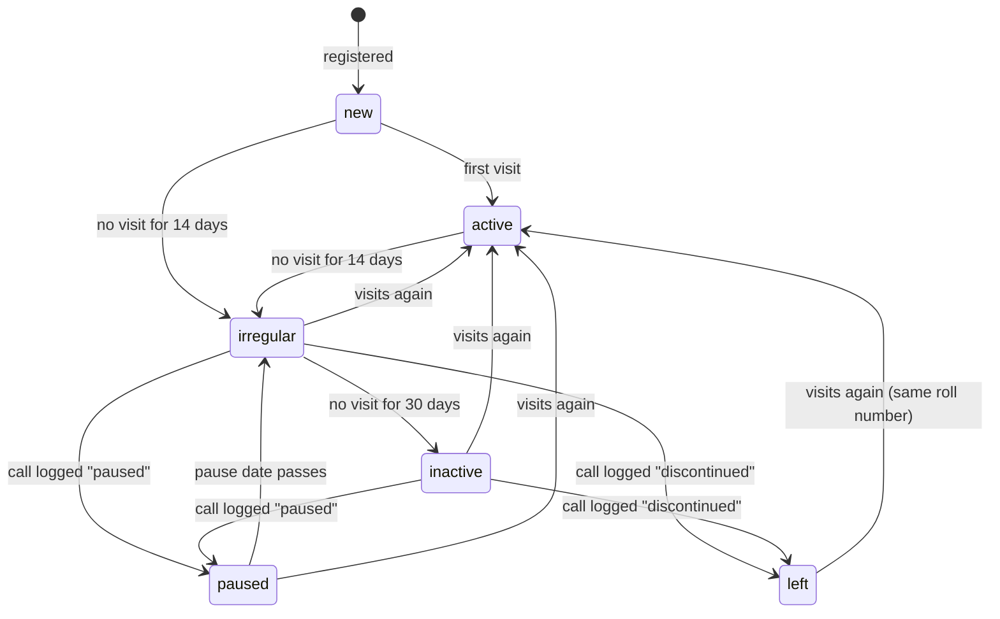

# Database

The schema is built by the migrations in [`supabase/migrations/`](../supabase/migrations/), run
in number order:

| File | Does |
|---|---|
| `0001_phase1.sql` | All Phase 1 tables, rules, functions, daily jobs and row-level security |
| `0002_login_linking.sql` | Links logins to students only after email confirmation; lets the dashboard set the first Guru; locks internal functions ([DECISIONS.md #13, #14](DECISIONS.md)) |
| `0003_register_student.sql` | `register_student` saves a student with the parent's consent in one step; no minor can be kept without consent ([DECISIONS.md #16](DECISIONS.md)) |
| `0004_attendance.sql` | `mark_visit` for tap-to-mark attendance and `check_out_all` for closing time ([DECISIONS.md #18](DECISIONS.md)) |
| `0005_students_follow_up.sql` | View `student_overview` (last visit, days since); reasons for a call become codes; `log_call` checks its inputs and answers with error codes ([DECISIONS.md #19, #20](DECISIONS.md)) |
| `0006_syllabus_progress.sql` | A syllabus tick records who really ticked it and cannot be dated in the future; every tick and untick is kept in `audit_log` ([DECISIONS.md #22](DECISIONS.md)) |
| `0007_announcements.sql` | Announcements: checks on every announcement, only students and staff can read them, the author or the Guru can delete, read receipts written only by the reader, and views for "seen by N of M" ([DECISIONS.md #25](DECISIONS.md)) |
| `0008_announcement_follow_ups.sql` | Students see who posted an announcement (`staff_names`); editing marks a published announcement "Edited"; checks on groups, which only staff and members can see; private replies to announcements ([DECISIONS.md #26–#29](DECISIONS.md)) |
| `0009_home_screens.sql` | The numbers on the three home screens: `student_home`, `coordinator_dashboard` and `guru_dashboard`, and one meaning of "this week" (`week_start_ist`) ([DECISIONS.md #31](DECISIONS.md)) |
| `0010_announcement_files.sql` | Photos and PDFs on announcements: the private Storage bucket `announcement-files`, checks on `attachments`, and who may upload, open and delete a file ([DECISIONS.md #32](DECISIONS.md)) |
| `0011_push_notifications.sql` | Push notifications: `announcements.notified_at`, `push_tokens`, `register_push_token`, and the every-minute job that calls the Edge Function `notify-announcements` ([DECISIONS.md #33](DECISIONS.md)) |
| `0013_syllabus_materials.sql` | The syllabus editor and the materials library: retiring items, their order, checks on items and materials, the bucket `material-files`, own name and phone ([DECISIONS.md #44](DECISIONS.md)). Number 0012 belongs to the Phase 2 branch `phase2-assessments` |
| `0014_guru_admin.sql` | The facilitator's admin screens: roles, duty hours and mentees (G2), the student import (G3), checked settings and "this week" from Monday or the last 7 days (G10), audit log indexes (G11); a call task follows the mentor ([DECISIONS.md #45-#48](DECISIONS.md)) |

Every table and important column also carries a `COMMENT ON` description, so you can read it in
the Supabase dashboard (Table Editor → table → description).

Dummy data for a test project is in [`supabase/seed.sql`](../supabase/seed.sql): a placeholder
syllabus, 15 fictional students covering every status (some minors, with guardians and written
consent), sample visits, groups and an announcement. Never run it on the live project.

## Tables by area

| Area | Tables | Notes |
|---|---|---|
| Settings | `settings` | Day limits for follow-up, list of reasons for leaving, what "this week" means, promotion criteria for Phase 2. The facilitator changes them on G10 (see "Settings") |
| Places | `centres` | One row per class location (Abids today) with GPS point, radius and opening hours |
| People | `profiles` | One row per login: role, name, language, treasurer flag, duty hours (G2) |
| Students | `students`, `guardians`, `consents`, `roll_counters` | A student record can exist without a login |
| Attendance | `visits` | One row per check-in; `check_out` empty while the student is still there |
| Follow-up | `call_logs`, `follow_up_tasks`, `status_history` | Every call and every status change is kept |
| Learning | `levels`, `syllabus_items`, `student_progress`, `level_history`, `materials` | Three levels; each has an ordered syllabus |
| Communication | `announcements`, `announcement_reads`, `announcement_replies`, `groups`, `group_members`, `push_tokens` | Groups replace the WhatsApp groups. Views `announcement_audience` and `announcement_seen` give "seen by", `announcement_reply_list` the replies with names, `group_summary` the member counts. Photos and PDFs are files in the Storage bucket `announcement-files`, listed in `announcements.attachments` |
| Audit | `audit_log` | Who changed a student, profile, call log, level, syllabus item or tick, material, announcement, setting or centre, or deleted a reply, and when (read on G11) |

## Student status

A student's `status` follows these rules. The daily job moves students along; a logged call is the
**only** way to reach *Paused* or *Left* (enforced by a trigger — see [DECISIONS.md #4](DECISIONS.md)).



The day limits (14, 30, and 3 days to make a call) are rows in `settings`, not fixed in code.

When a student becomes *Irregular*, the daily job creates a `follow_up_tasks` row of kind `call`
for their mentor coordinator. When a call is logged as *Not reachable*, a `retry` task is created;
after `max_retries` failed tries the task is marked `escalated` so the Guru sees it.

## Roll numbers

Assigned by the trigger `students_roll_no` when a student is inserted: `MS-<year joined>-<4 digits>`,
counted per year in `roll_counters`. A roll number can never be changed (trigger
`students_guard`) and is never reused, even if the student leaves. See [DECISIONS.md #3](DECISIONS.md).

## Registering a student

Coordinators and the Guru register students with `register_student` (screens C2 + C3). It saves,
all or nothing:

- the `students` row (name and date of birth required; the roll number is added by trigger);
- for a student **under 18**: a `guardians` row (name and phone required) and a `consents` row
  with `scope = 'data'`, `method = 'written'` and the type of ID the coordinator looked at, plus a
  second `consents` row with `scope = 'photo'` if the parent agreed to a photo.

Separately, the constraint trigger `students_minor_consent` runs when each transaction ends and
refuses a student under 18 who has no current `data` consent, however the row was written
([DECISIONS.md #16](DECISIONS.md)). "Under 18" is decided by `is_minor()` on today's date in India.

Codes stored in text columns (the app translates them):

| Column | Codes |
|---|---|
| `guardians.relation` | `mother`, `father`, `guardian` (another adult responsible for the student) |
| `consents.id_type_checked` | `aadhaar`, `pan`, `driving_licence`, `passport`, `voter_id`, `other` — the ID number is never stored |

Errors from `register_student` are short codes the app turns into messages: `not_allowed`,
`name_required`, `dob_required`, `minor_needs_guardian`, `minor_needs_id_check`, and
`minor_needs_consent` from the trigger. New functions should follow the same pattern: raise a
short `snake_case` code, and put the explanation for people reading the dashboard in `detail`.

## Attendance

A visit is one row in `visits`. It is *open* (the student is here now) while `check_out` is
empty; a unique index allows only one open visit per student. There are three ways to change
visits from the app, all in database functions so that the rules sit in one place
([DECISIONS.md #18](DECISIONS.md)):

| Action in the app | Function | What happens |
|---|---|---|
| Coordinator scans a student's QR code (C5), door tablet later | `scan_qr` → `toggle_visit` | Toggles: check in if the student is out, check out if in |
| Coordinator taps *Check in* or *Check out* next to a name (C5, C6) | `mark_visit(student, 'in' / 'out')` | Does what the button says. If the student is already in that state, nothing changes and it returns `already_in` / `already_out` |
| Coordinator taps *Check out all* (C6) | `check_out_all()` | Closes every open visit: today's end now, a visit left open from an earlier day ends at that day's closing time |

Any check-in makes the student *Active* again and closes their open follow-up tasks (inside
`toggle_visit`, which `mark_visit` calls). `mark_visit` locks the student's row while it works, so
two phones marking the same student at once are handled one after the other. At 21:00 IST the
nightly job `close_open_visits` closes anything still open, at the centre's closing time.

The QR code on a student's phone holds the text `MS1:` followed by their `qr_token` in capitals
([DECISIONS.md #17](DECISIONS.md)). The app removes the prefix and sends the token to `scan_qr`.

Errors: `toggle_visit` and `scan_qr` (0001) raise `not allowed` and `student not found`, with
spaces; `mark_visit` and `check_out_all` raise `not_allowed`, `bad_action` and
`student_not_found`. The app (`app/src/data/attendance.ts`) understands both spellings.

## Student overview

`student_overview` is a view: one row per student with the list columns of `students` (roll
number, name, level, status, pause date, mentor, joined) plus:

| Column | Meaning |
|---|---|
| `last_visit_at` | Check-in time of the latest visit; empty if the student has never come |
| `days_since_visit` | Whole days (India time) since that visit; with none, since joining or since the record was made, whichever is later (0014: an imported record with an old joining date is not Irregular at once); the same count the daily job uses for Irregular and Inactive |
| `here_now` | True while the student has an open visit |

The student list (C7), the profile (C8) and the follow-up queue (C10) read it. It exists because
Supabase does not let the app ask for `max(check_in)` directly (aggregate functions are off by
default in its API), and fetching every visit to the phone would grow without end.

It is created `with (security_invoker = true)`: it reads `students` and `visits` as the person
asking, so their row-level security applies — staff see every student, a student sees only their
own row, and a signed-out visitor sees nothing. Without that option a view runs as its owner and
would show every student to anyone signed in ([DECISIONS.md #20](DECISIONS.md)). Only `select` is
granted, to signed-in people.

## Follow-up calls

A coordinator records a call with `log_call(student, outcome, reason, comment, next_date)`
(screen C11). It always saves a `call_logs` row, closes the student's open follow-up tasks, and
then acts on the outcome:

| Outcome | Reason | `next_date` | What happens |
|---|---|---|---|
| `returning` (coming back) | required | required: the day they said they would come | A new `call` task for the day after that date. Their next visit closes it |
| `paused` (taking a break) | required | required: pause-until date | Status *Paused* until that date; the daily job brings them back into follow-up after it |
| `not_reachable` | none | not used | A `retry` task in `retry_days`; after `max_retries` failed tries in a row it is `escalated` to the Guru |
| `discontinued` (stopped coming) | required | not used | Status *Left*. Roll number and history are kept; a visit makes them Active again |

Reasons are codes from `settings.call_reasons`: `studies`, `work_timing`, `moved`, `health`,
`family`, `lost_interest`, `joined_elsewhere`, `travel`, `other`. The app shows them translated
(`callReasons.<code>`); a code the Guru adds later without a translation is shown as written
([DECISIONS.md #19](DECISIONS.md)). `log_call` refuses a reason that is not in the list.

Errors from `log_call` (short codes the app turns into messages): `not_allowed`,
`student_not_found`, `outcome_required`, `comment_required`, `reason_required`, `reason_unknown`,
`next_date_required`, `next_date_past` (the date is before today). A `next_date` given with an
outcome that does not use one is dropped, so reports never show a stray date.

## Syllabus progress

Each level has an ordered list of `syllabus_items` (the Guru writes it, G4). When a student shows
an item in class, a coordinator ticks it for them on screen C9: one row in `student_progress`
(student, item, `done_on`, `ticked_by`, optional `remark`). Any coordinator or the Guru may tick
for any student; students can read their own ticks and change nothing.

The app writes the table directly: insert to tick, update to change the remark, delete to untick.
The trigger `student_progress_guard` ([DECISIONS.md #22](DECISIONS.md)) makes these rules hold
however the row is written:

| Rule | Error code |
|---|---|
| `ticked_by` is the signed-in person, whatever the app sent (the dashboard and `seed.sql`, with no login, keep what they give) | — |
| `done_on` is today by default and never after today (India time) | `done_on_future` |
| After the tick only `remark` may change; student, item, date and `ticked_by` are fixed | `progress_frozen` |
| The remark is trimmed; empty becomes none; at most 500 characters | `remark_too_long` |

Every insert, update and delete is copied to `audit_log` by `audit_student_progress`, with
`row_id` = `<student id>/<item id>`, because the table has no `id` column of its own. So an untick
still shows who had ticked the item, when, and who removed it.

Items of an earlier level can still be ticked after a promotion; the screen shows every level.

## Syllabus editor

Migration 0013 ([DECISIONS.md #44](DECISIONS.md)) lets the Guru keep the syllabus on screen G4
without ever losing a tick. Levels stay fixed (Beginner, Intermediate, Advanced).

| Rule | Error code |
|---|---|
| Title trimmed, 1 to 120 characters; description at most 1000, empty becomes none | `title_required`, `title_too_long`, `description_too_long` |
| A new item without `sort` goes to the end of its level (after retired ones) | — |
| `retired_at` set = retired: no longer taught, cannot be ticked, not counted in `student_home()`; the ticks stay | `item_retired` (on a tick) |
| An item with ticks cannot be deleted (not even from the dashboard, where the cascade would take the ticks) or moved to another level | `item_has_ticks` |
| An item that materials point to cannot be deleted | `item_has_materials` |

`move_syllabus_item(item, up)` (Guru) swaps an item with the next item in use above or below it;
false when it is already first or last. `syllabus_item_counts()` gives, per item, the ticks the
caller may see and the materials, so the editor knows what may be deleted without reading every
tick (the API returns at most 1000 rows). Every change to `syllabus_items` goes to `audit_log`.

## Materials

`materials` (0001, used since 0013): a YouTube link (`kind` youtube, `url`), a PDF or a photo
(`kind` pdf / image, `storage_path`, `file_name`, `file_size`), or a note from seed.sql; for a
level (`level_id`, null = every level) and optionally one syllabus item (`item_id`; the level is
then taken from the item), with an optional note in `body`. The trigger `materials_guard` checks:

| Rule | Error code |
|---|---|
| Title 1 to 120 characters; note at most 1000 | `title_required`, `title_too_long`, `note_too_long` |
| A YouTube material has one video's link (watch, shorts, live, embed, youtu.be; `youtube_link_ok`) | `youtube_link_invalid` |
| A PDF or photo has a proper path, a name and a size up to 10 MB; a new one is the signed-in person's own upload and is in Storage (the size is taken from Storage) | `material_file_invalid`, `material_file_not_yours`, `material_file_missing` |
| Kind, file, uploader and time do not change after saving | `material_frozen` |
| Audio is not offered yet | `material_kind_not_offered` |
| The signed-in person is recorded as uploader; the Guru's materials are approved at once | — |

Files are in the private bucket **material-files** (10 MB, JPEG, PNG, WebP, PDF), path
`<uploader login id>/<random id>.<ext>` as for announcements. Storage rules: open = the file is on
a material the caller may read, or staff's own upload, or the Guru; upload = the Guru into their
own folder; delete = the uploader or the Guru. The app deletes the file before the row. Every
change to `materials` goes to `audit_log`.

## Own name and phone

A person may change their own `profiles.full_name` and `phone` (A3, policy `own_update`). The
trigger `profiles_details_guard` trims them when an app user changes them: name 1 to 80
characters (`name_required`, `name_too_long`), phone 7 to 20 digits or spaces with an optional
leading + (`phone_invalid`). The name on a student's roll (`students.full_name`) stays the
coordinators' record.

## Announcements

A coordinator or the Guru posts an announcement on screen C15: a title, the message, who it is
for, whether it is pinned, and optionally a later publish time. Students read theirs on S10. The
app writes the `announcements` table directly: insert to post, update to edit, pin or unpin,
delete.

Who it is for (`audience`):

| Audience | Goes to | Needs |
|---|---|---|
| `all` | Every student with the app | — |
| `level` | Students whose record is at that level | `audience_level` |
| `mentees` | Students whose mentor is the author | — |
| `staff` | The Guru and the coordinators only | — |
| `group` | The members of that group | `audience_group` |

Coordinators and the Guru see every announcement, whatever its audience, including scheduled
ones. A student sees an announcement only once `publish_at` has passed, and only if it is
addressed to them. A login that is still `pending`, or the door tablet, sees none
([DECISIONS.md #25](DECISIONS.md)).

The trigger `announcements_guard` makes these rules hold however the row is written:

| Rule | Error code |
|---|---|
| Title and message are trimmed; neither may be empty | `title_required`, `body_required` |
| Title at most 120 characters, message at most 4000 | `title_too_long`, `body_too_long` |
| `level` needs a level and `group` a group; for other audiences both are cleared | `level_required`, `group_required` |
| No publish time means now | — |
| The author (`created_by`) is the signed-in person, whatever the app sent, and never changes; the dashboard and `seed.sql` keep what they give | `announcement_frozen` |
| Once published, the publish time cannot be changed from the app; a scheduled one moved to a time already past is published now, not backdated (0008) | `already_published` |
| `edited_at` is set to now when the title, message, audience, level, group or files of an already published announcement change; the app cannot set it. Editing a scheduled one, and pinning, do not count (0008, files from 0010) | — |
| `notified_at` (when the push notification went out) is set only by the Edge Function; the app can neither set nor change it (0011) | — |

Only the author, while still a coordinator or the Guru, or the Guru can edit, pin, unpin or
delete an announcement; row-level security turns anyone else's attempt into "nothing changed".
Every edit and delete is copied to `audit_log`. An edit keeps the read receipts: a person who
read the first version is still counted as having seen it, and sees "Edited" with the time
([DECISIONS.md #27](DECISIONS.md)).

**Who posted it.** Students may read only their own `profiles` row, so the app gets the author's
name from `staff_names()`: the id and name of every Guru and coordinator, active or not, and
nothing else. It answers students and staff; a `pending` login or the door tablet gets nothing
([DECISIONS.md #26](DECISIONS.md)).

**Read receipts.** When a person opens an announcement, the app adds one `announcement_reads`
row. The app may send only `announcement_id`: the database fills in who (the login) and when
(now). A person can add a receipt only for an announcement they can see, only once, and cannot
change or remove it. Receipts disappear only with their announcement.

**Seen by N of M.** Two views, both `with (security_invoker = true)` like `student_overview`:

| View | One row per | Columns |
|---|---|---|
| `announcement_audience` | announcement and person it is addressed to who can open it in the app (active login; students for `all`, `level`, `mentees`; staff for `staff`; members for `group`; never the author) | `full_name` (from the student record for students), `roll_no`, `role`, `read_at` (empty = not seen yet) |
| `announcement_seen` | announcement | `addressed` (M), `seen` (N), `no_login`: students it is meant for who have no app login and are not *Left*, to be told in class; `replies`: how many replies the person asking may read (0008) |

The staff screen reads the counts and the not-seen list from these views, so the number is the
same on every phone and the phone never downloads everyone's receipts. A student reading the
views sees only their own row.

**Photos and PDFs** (0010, [DECISIONS.md #32](DECISIONS.md)). The files are in the private Storage
bucket `announcement-files` (at most 5 MB a file; JPEG, PNG, WebP and PDF only; Storage refuses
anything else). A file's path is `<uploader's login id>/<random id>.<jpg|png|webp|pdf>`.
`announcements.attachments` lists an announcement's files in order, each as
`{"path", "name", "kind", "size"}` (`kind` is `image` or `pdf`, `size` in bytes). The app uploads
the files when the announcement is saved, then saves the announcement with the list.

The trigger `announcements_attachments_guard` checks the list however it is written:

| Rule | Error code |
|---|---|
| A list of at most 3 files | `too_many_attachments` |
| Each entry has a proper path, a name of 1 to 120 characters (trimmed), `kind` matching the path's ending, a size up to 5 MB, and no file twice; other keys are dropped | `attachments_invalid` |
| A file an app user adds must be in their own folder… | `attachment_not_yours` |
| …and really in Storage; its size is then taken from Storage, not from the app | `attachment_missing` |
| Files already on the announcement stay as they are (the Guru can edit a coordinator's announcement without owning its files) | — |

Storage keeps one row per file in `storage.objects`; its row-level security decides:

| Action | Allowed for | Rule function |
|---|---|---|
| Open, or make a signed link | Anyone who may read an announcement that lists the file (the `audience` rule above); staff for files in their own folder; the Guru | `announcement_file_readable` |
| Upload | Coordinators and the Guru, only into their own folder, only a proper file name | `announcement_file_uploadable` |
| Delete | Coordinators and the Guru: their own uploads, any file for the Guru, and files on their own announcements | `announcement_file_deletable` |
| Replace or move | Nobody (no update policy) | — |

**Deleting a row in SQL does not delete the file** in Storage; it only orphans it. So the app
removes files through the Storage API: when an announcement is deleted it removes the files
first (while the announcement still lists them), and when an edit takes a file off it removes
the file once the change is saved. A file whose removal failed stays unused; OPERATIONS.md
"Files no announcement uses" shows how to find and remove such files.

**Push notifications** (0011, [DECISIONS.md #33](DECISIONS.md)). A phone that may receive
notifications has a row in `push_tokens` (its Expo push token, the login, `android` or `ios`).
The Android app saves it after sign-in with `register_push_token` and deletes it at sign-out; a
person sees and deletes only their own. A token belongs to the login last signed in on that
phone, and a person has at most 5 phones.

Every minute the job `mridanga-push` runs `send_due_push()`. When an announcement is published
and `notified_at` is still empty, it calls the Edge Function `notify-announcements`
(`supabase/functions/`) through pg_net, with the secret `mridanga_push_secret` from the Vault
in a header. The Edge Function, with the service role, calls `claim_due_push()`: it sets
`notified_at` on every waiting announcement and returns one row per phone to notify (the people
in `announcement_audience`, never the author). An announcement published more than a day before
is marked but not sent. The function sends the notifications through Expo's push service,
deletes tokens Expo no longer knows, and, if not one request reached Expo, calls
`release_push_claim()` so the next minute tries again. Until push is set up (pg_net, the Vault
secrets, the deployed function), `send_due_push()` returns `not_set_up` and nothing happens.
Setting `notified_at` is not copied to the audit log. Scheduled announcements are sent at their
publish time; an edit is not sent again.

**Private replies** (0008, [DECISIONS.md #29](DECISIONS.md)). Under an announcement a person can
send one or more replies to its author: one `announcement_replies` row each. The app may send
only `announcement_id` and `body`; the database fills in who (`profile_id`) and when
(`created_at`).

| Rule | Error code |
|---|---|
| The reply is trimmed; it may not be empty and is at most 1000 characters | `reply_required`, `reply_too_long` |
| Only for an announcement the writer can see (a `pending` login, or a student it is not addressed to, cannot reply) | row-level security (42501) |
| Read only by the writer, the author of the announcement while still staff, and the Guru. Students never see each other's replies | — |
| Nobody can change a reply; only the Guru can delete one (moderation), and the audit log keeps a copy. Replies go with their announcement | — |

The view `announcement_reply_list` (security invoker) gives the replies with the writer's name
(from the student record for students) and roll number. Replies are one-way for Phase 1: the
author answers in person or by phone.

## Groups

A group is a set of people who get the announcements sent to it (audience `group`); groups
replace the class WhatsApp groups. Coordinators and the Guru manage them on the groups screen:
`groups` (name, purpose, active) and `group_members` (group, profile). Members are logins:
students who use the app, coordinators and the Guru. The app writes both tables directly.

The trigger `groups_guard` (0008, [DECISIONS.md #28](DECISIONS.md)):

| Rule | Error code |
|---|---|
| Name trimmed, required, at most 60 characters | `group_name_required`, `group_name_too_long` |
| Purpose trimmed, empty becomes none, at most 200 characters | `group_purpose_too_long` |
| Names are unique whatever the capitals (index `groups_name_lower_key`) | 23505 |
| `created_by` is the signed-in person and never changes | — |

Only staff and the group's own members can see a group; a student needs the name of their own
groups for "Group: Sunday Harinam". A group is **switched off** (`active = false`) instead of
deleted: it is no longer offered when posting, old announcements keep it, and its members still
see them. The app offers no delete; the database refuses to delete a group an announcement was
sent to. The view `group_summary` (security invoker) gives each group with its number of members.

## Home screens

Each home screen gets all its numbers from one function (0009,
[DECISIONS.md #31](DECISIONS.md)), which returns one JSON object. The functions only read. They
are **security invoker**: they count with the rights of the person asking, so row-level security
still applies, as for the views. The app reads them in `app/src/data/home.ts`.

| Function | Screen | Who | Gives |
|---|---|---|---|
| `student_home()` | S1 student home | Anyone signed in; a login without a student record gets `null` | Own name, roll number, level, status, joined; `last_visit_at`, `days_since_visit`, `here_now` (as in `student_overview`); `visits_this_week`; `syllabus_done` and `syllabus_total` for the current level |
| `coordinator_dashboard()` | C1 coordinator dashboard | Coordinators and the Guru; others get `not_allowed` | `here_now` (open visits, as C6), `visits_today` (check-ins since midnight, as C5), `my_calls_due`, `new_joiner_weeks`, `new_joiner_count`, `new_joiners` (newest 50: id, name, roll number, level, joined, visits) |
| `guru_dashboard()` | G1 Guru dashboard | The Guru; others get `not_allowed` | `week_start`, `came_this_week` (students, each once), `in_class`, `new_joiner_weeks`, `new_joiners`, `by_level` (every level, students in class), `by_status` (every status, all students), `follow_ups` (per person the task is assigned to: `overdue`, `escalated`) |

Words these functions use, the same on every screen:

| Word | Meaning |
|---|---|
| This week | Monday to today, India time, or the last 7 days when `settings.week_starts` = `rolling7` (0014, G10): `week_start_ist()` |
| New joiner | `joined_on` within the last `settings.new_joiner_weeks` weeks (4), and not *Left* |
| In class | Status is not *Left* |
| Calls due for my students (C1) | Students with an open follow-up task due today or earlier, or escalated, that is assigned to me or whose mentor I am: the *needs the Guru* and *call due* groups of C10 for "My students" |
| Overdue (G1) | Students with an open task past its due date, not escalated. Escalated ones are counted separately. Grouped by the task's assignee (the mentor when the task was made); no assignee = the student had no mentor |

## Coordinators and roles

Screen G2 (0014, [DECISIONS.md #45](DECISIONS.md)). The Guru writes `profiles.role`, `active` and
the new `duty_hours` directly (policy `own_update` lets the Guru update any profile); the trigger
`profiles_admin_guard` checks every change an app user makes:

| Rule | Error code |
|---|---|
| Only the Guru writes duty hours; trimmed, at most 120 characters | `not_allowed`, `duty_hours_too_long` |
| Nobody changes their own role or switches themselves off | `not_own_role` |
| The Guru role is given and taken only in the dashboard | `guru_role_dashboard_only` |
| The app gives roles only to pending logins: coordinator, or student once a student record links to the login | `role_change_not_allowed`, `student_needs_record` |
| A coordinator (or the Guru) who still mentors students cannot be switched off | `has_mentees` |

The older guard `profiles_guard` (0002) still stops anyone but the Guru from changing role,
treasurer or active.

`link_student_login(profile, student)` (Guru) links a pending, active login to a student record
without a login and makes it a student, in one step; errors `not_allowed`, `profile_not_pending`,
`student_not_found`, `student_already_linked`. `reassign_mentees(students, to)` (Guru) sets the
mentor of the given students and returns how many changed.

**Mentors and call tasks.** A new mentor must be an active coordinator or the Guru (trigger
`students_mentor_guard`, error `mentor_not_staff`; app users only). When a student's mentor
changes, their open follow-up tasks that were the old mentor's, or nobody's, go to the new mentor
(trigger `students_follow_mentor`, [DECISIONS.md #48](DECISIONS.md)). 0014 also gave the open tasks
without an assignee to the student's mentor at that time.

## Importing students

Screen G3 (0014, [DECISIONS.md #46](DECISIONS.md)). The app reads the file, checks every row and
sends only the good rows to `import_students(rows)` (Guru only), which checks them again and saves
each row on its own (a refused row does not stop the others). `rows` is a JSON array of objects:
`line` (the row number in the file, given back), `full_name`, `dob`, `phone`, `email`, `area`,
`pincode`, `level_id`, `joined_on` (dates `YYYY-MM-DD`). It returns one entry per row:
`{line, id, roll_no}` or `{line, error}`.

| Rule | Row error |
|---|---|
| Name required, at most 100 characters (spaces tidied) | `name_required`, `name_too_long` |
| Date of birth required, a real date, not in the future | `dob_required`, `dob_invalid` |
| Adults only: an under-18 is registered with C2, so the parent's consent is recorded | `minor_use_form` |
| Joining date optional (today), not in the future, not before the birth or 2000 | `joined_invalid` |
| Phone: 10-13 digits after removing spaces and dashes; not already used (last 10 digits) | `phone_invalid`, `duplicate_phone` |
| Email looks like one and is not already used | `email_invalid`, `duplicate_email` |
| Pincode 6 digits; level 1-3 (default 1) | `pincode_invalid`, `level_invalid` |
| No student with the same name and date of birth | `duplicate_student` |
| Anything else the database refuses | `row_failed` |

Whole-call errors: `not_allowed`, `too_many_rows` (more than 500). The roll number comes from the
usual trigger (by the joining year), the status is *New*, and a matching confirmed login is linked
by email as for C2.

## Settings

The facilitator changes settings on G10 (0014, [DECISIONS.md #47](DECISIONS.md)) with
`save_settings(values)`: a JSON object of key and value, saved all or nothing; it refuses a key not
in the table (`setting_unknown`) and Irregular at or after Inactive (`irregular_after_inactive`).
The trigger `settings_guard` checks each value however it is written:

| Key | Value (default) | Read by |
|---|---|---|
| `irregular_days` | 3-90 (14) | daily job |
| `inactive_days` | 7-365 (30) | daily job |
| `call_due_days` | 1-14 (3) | daily job |
| `retry_days` | 1-14 (3) | `log_call` |
| `max_retries` | 1-10 (3) | `log_call` |
| `new_joiner_weeks` | 1-12 (4) | home screens |
| `week_starts` | `"monday"` or `"rolling7"` (`"monday"`) | `week_start_ist()` |
| `call_reasons` | a list of codes | C11, `log_call` (not edited in the app yet) |
| `promotion_syllabus_percent` 0-100 (100), `promotion_min_visits` 0-100 (8), `promotion_visit_weeks` 1-52 (8), `promotion_min_feedback` 1-10 (2) | whole numbers | nothing on main yet (Phase 2 promotion, same keys as the branch phase2-promotion) |
| `promotion_needs_level_up` | true / false (true) | nothing on main yet (Phase 2 promotion) |

Out-of-range values give `setting_invalid`; the app cannot add (`setting_unknown`) or delete
(`setting_required`) a setting. Every change goes to `audit_log` with the key as `row_id`
(`audit_setting`). The open window is on `centres` (`opens_at` before `closes_at`, trigger
`centres_guard`, error `window_invalid`); `close_open_visits` closes visits left open at the closing
time. Centre changes are logged too.

## Audit log

`audit_log` (0001) gets one row per change: `table_name`, `row_id`, `action` (`INSERT`, `UPDATE`,
`DELETE`), `changed_by` (the login; empty for the dashboard and the daily jobs), `changed_at`,
`old_row`, `new_row` (the whole row as JSON). Only the Guru reads it (policy `guru_read`); nothing
in the app writes it except the security definer triggers. Screen G11 reads it 50 rows at a time,
newest first, filtered by table, person, action and time; 0014 adds indexes for these filters.

## Linking a login to a student

A student record can exist without a login (many students never install the app). When a person
creates a login, it starts as `pending`. It becomes that student's login, with role `student`,
when **both** are true:

- the login's email is **confirmed** (the person opened the link in the sign-up email), and
- a student record has the **same email** (not case-sensitive) and no login yet.

Whichever happens last makes the link: confirming the email (trigger `on_auth_user_confirmed`),
or a coordinator saving the email on the record (trigger `students_link_login`). Only `pending`
logins are linked, so a coordinator who is also on a student record keeps the coordinator role.
Linking before confirmation would let anyone claim a record by typing its email
([DECISIONS.md #13](DECISIONS.md)).

Roles other than `student` are given by the Guru in the app (G2, see "Coordinators and roles"), or for the very first Guru, in the
Supabase dashboard (OPERATIONS.md). The Guru can also link a pending login to a student record
that has no login (`link_student_login`), for a student whose record carries another email or none. The trigger `profiles_guard` stops app users other than the
Guru from changing `role`, `is_treasurer` or `active`; the dashboard is not blocked.

## Database functions (call these from the app)

Supabase lets the app's roles (`anon`, `authenticated`) run any function unless told otherwise,
so every function is revoked from them and granted only where needed
([DECISIONS.md #14](DECISIONS.md)).

| Function | Who may call | What it does |
|---|---|---|
| `toggle_visit(student, method, device)` | Guru, coordinator, kiosk | Check in if no open visit, else check out. A check-in sets status *Active* and closes open follow-up tasks. Returns the student's name, roll number and time |
| `scan_qr(qr_token, device)` | Guru, coordinator, kiosk | Finds the student by their QR token and calls `toggle_visit`. Returns `unknown` for an unrecognised code |
| `mark_visit(student, action, device)` | Guru, coordinator | Checks the student in (`action = 'in'`) or out (`'out'`), or returns `already_in` / `already_out` and changes nothing. See "Attendance" |
| `check_out_all(centre)` | Guru, coordinator | Closes every open visit, at one centre or all (`null`, the default). Returns how many |
| `log_call(student, outcome, reason, comment, next_date)` | Guru, coordinator | Records a follow-up call and applies its outcome (pause, leave, new call task, retry). See "Follow-up calls" |
| `register_student(...)` | Guru, coordinator | Saves a new student, and for a minor the guardian and consent, in one step. Returns the id, roll number and whether an existing login was linked. See "Registering a student" |
| `staff_names()` | Guru, coordinator, student (others get nothing) | Id and name of every Guru and coordinator, active or not, for "posted by". Security definer. See "Announcements" |
| `student_home()` | Anyone signed in (a student gets their own numbers) | The student home's numbers. See "Home screens" |
| `coordinator_dashboard()` | Guru, coordinator | The coordinator dashboard's numbers. See "Home screens" |
| `guru_dashboard()` | Guru | The Guru dashboard's numbers. See "Home screens" |
| `move_syllabus_item(item, up)` | Guru | Moves a syllabus item one place up or down among the items in use. See "Syllabus editor" |
| `syllabus_item_counts()` | Guru, coordinator | Ticks and materials per syllabus item. See "Syllabus editor" |
| `week_start_ist()` | Anyone signed in | First day of "this week" in India (Monday, or 6 days ago with `week_starts` = `rolling7`); used by the functions above |
| `link_student_login(profile, student)` | Guru | Links a pending login to a student record without a login; the person becomes that student. Security definer. See "Coordinators and roles" |
| `reassign_mentees(students, to)` | Guru | Moves the students to another mentor (an active coordinator or the Guru); returns how many. See "Coordinators and roles" |
| `import_students(rows)` | Guru | Saves up to 500 adult students, each row on its own; returns the roll number or the error per row. See "Importing students" |
| `save_settings(values)` | Guru | Saves several settings at once, all or nothing. See "Settings" |
| `register_push_token(token, platform)` | Guru, coordinator, student | Saves this phone's Expo push token for the signed-in person, taking it over from another login on the same phone; at most 5 phones each. Security definer. Errors `not_allowed`, `bad_token`, `bad_platform`. See "Announcements" → "Push notifications" |
| `claim_due_push()`, `release_push_claim(ids)` | Only the Edge Function (service role) | Mark waiting announcements notified and return the phones to notify; put them back when nothing could be sent |

The Storage rules `announcement_file_readable`, `announcement_file_uploadable`,
`announcement_file_deletable` and `announcement_file_path_ok` are run by row-level security as
the person asking, so signed-in people may execute them; each answers only yes or no about that
person's own access. The same holds for `material_file_readable`, `material_file_uploadable`,
`material_file_deletable` and `youtube_link_ok` (0013).

Internal functions (not called by the app, and not allowed to): `refresh_student_statuses`,
`close_open_visits`, `send_due_push`, `handle_new_user`, `handle_user_confirmed`,
`link_login_to_student`, `link_student_email`, `assign_roll_no`, `check_minor_consent`, the guard
and audit triggers (including `guard_student_progress`, `audit_student_progress`,
`guard_announcement`, `guard_announcement_attachments`, `guard_announcement_notified`,
`guard_group`, `guard_announcement_reply`, `guard_syllabus_item`, `protect_syllabus_item`,
`guard_progress_item_in_use`, `guard_material`, `guard_profile_details`, `guard_profile_admin`, `guard_student_mentor`,
`follow_mentor_tasks`, `guard_setting`, `audit_setting` and `guard_centre`), and the helpers `my_role`, `is_guru`, `is_staff`,
`setting_int`, `today_ist`.

## Scheduled jobs (pg_cron, times in UTC)

| Job | Runs | Does |
|---|---|---|
| `mridanga-status-refresh` | 00:30 UTC = 06:00 IST | `refresh_student_statuses()` — ends expired pauses, moves quiet students on, creates call tasks, flags overdue ones |
| `mridanga-close-visits` | 15:30 UTC = 21:00 IST | `close_open_visits()` — closes visits left open, at the centre's closing time |
| `mridanga-push` | Every minute | `send_due_push()` — calls the Edge Function `notify-announcements` when a published announcement waits for its push notification; does nothing while push is not set up (0011) |

## Who can see what

| Data | Student | Coordinator | Guru |
|---|---|---|---|
| Own student record, visits, progress, level history | Read | Read / write | Read / write |
| Other students | — | Read / write | Read / write / delete |
| Guardians, consents | — | Read / write | Read / write |
| Call logs, follow-up tasks, status history | — | Read / write | Read / write |
| Materials | Approved ones up to own level | All (suggesting = Phase 2) | All; add, edit, delete |
| Material files (Storage) | Those on materials they can read | All on materials, and own uploads | All; upload; delete any |
| Own name and phone | Read / write | Read / write | Read / write |
| Announcements | Published ones addressed to them | All, can post; edit, pin or delete own | All, can post; edit, pin or delete any |
| Read receipts | Own; can add | All (for "seen by"); add own | All; add own |
| Replies to announcements | Own; can add | Own, and all replies to their own announcements; can add | All; can add; can delete |
| Photos and PDFs on announcements (Storage) | Those on announcements they can read | All on announcements, and own uploads; upload; delete own uploads and files on own announcements | All; upload; delete any |
| Push tokens | Own; delete own | Own; delete own | Own; delete own |
| Groups | Name of the groups they are in | All; create, rename, switch off, add or remove members | Same as coordinator |
| Staff names (`staff_names`) | Guru and coordinators' names only | Same | Same |
| Settings, levels, syllabus, centres | Read | Read | Read / write (settings through `save_settings`, checked) |
| Roles, switching a login off, duty hours of others | — | — | Write (not their own role; Guru role only in the dashboard) |
| Audit log | — | — | Read |

## Changing the database

1. **Never edit a migration that has been applied.** Add a new file: `0003_short_name.sql`, `0004_...`.
2. Every new table: `enable row level security`, policies for each role, and `COMMENT ON` for the
   table and its non-obvious columns.
3. Every new function: `revoke execute ... from public, anon, authenticated`, then `grant` it only
   to the role that should run it.
4. Run the smoke test (below) and add a check for the new rule.
5. Update this document and, if a rule changed, add an entry to [DECISIONS.md](DECISIONS.md).

## Testing a migration before it goes live

`supabase/tests/smoke-test.mjs` runs every migration and `seed.sql` on an in-memory Postgres
([PGlite](https://pglite.dev)) on your own computer, then checks the rules that protect student
data: login linking, the profile guard, registration and consent, attendance marking, the
student overview, follow-up calls, syllabus ticks, announcements with their read receipts,
edits, staff names and private replies, groups, the home-screen numbers, photos and PDFs (who
may upload, open and delete a file), push tokens and the push queue, who may run each function,
and row-level security. It needs only Node.js, no database server and no Supabase account.
`npm test` also runs `push-messages.test.mjs`, which checks how the Edge Function words and
batches the notifications (Node 23.6 or later reads its TypeScript directly).

```bash
cd supabase/tests
npm install
npm test
```

It imitates Supabase's `auth` schema, roles, `storage.objects` and the service role, which is
close but not exact: the bucket's size and type limits, pg_net and the Vault are not imitated.
After it passes, still run a new migration on a test project before the live one.
