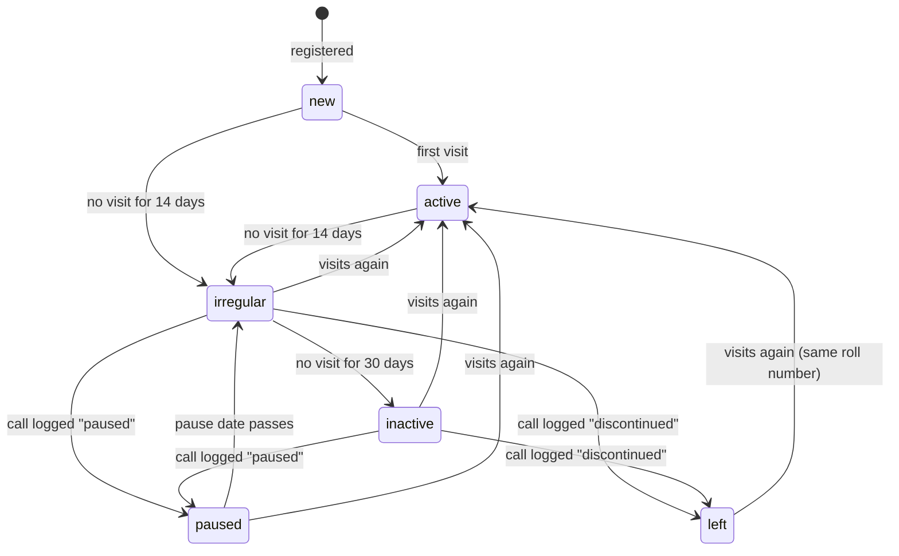

# Database

The schema is built by the migrations in [`supabase/migrations/`](../supabase/migrations/), run
in number order:

| File | Does |
|---|---|
| `0001_phase1.sql` | All Phase 1 tables, rules, functions, daily jobs and row-level security |
| `0002_login_linking.sql` | Links logins to students only after email confirmation; lets the dashboard set the first Guru; locks internal functions ([DECISIONS.md #13, #14](DECISIONS.md)) |
| `0003_register_student.sql` | `register_student` saves a student with the parent's consent in one step; no minor can be kept without consent ([DECISIONS.md #16](DECISIONS.md)) |
| `0004_attendance.sql` | `mark_visit` for tap-to-mark attendance and `check_out_all` for closing time ([DECISIONS.md #18](DECISIONS.md)) |
| `0005_students_follow_up.sql` | View `student_overview` (last visit, days since); reasons for a call become codes; `log_call` checks its inputs and answers with error codes ([DECISIONS.md #19, #20](DECISIONS.md)) |
| `0006_syllabus_progress.sql` | A syllabus tick records who really ticked it and cannot be dated in the future; every tick and untick is kept in `audit_log` ([DECISIONS.md #22](DECISIONS.md)) |

Every table and important column also carries a `COMMENT ON` description, so you can read it in
the Supabase dashboard (Table Editor → table → description).

Dummy data for a test project is in [`supabase/seed.sql`](../supabase/seed.sql): a placeholder
syllabus, 15 fictional students covering every status (some minors, with guardians and written
consent), sample visits, groups and an announcement. Never run it on the live project.

## Tables by area

| Area | Tables | Notes |
|---|---|---|
| Settings | `settings` | Day limits for follow-up, list of reasons for leaving. Change here, not in code |
| Places | `centres` | One row per class location (Abids today) with GPS point, radius and opening hours |
| People | `profiles` | One row per login: role, name, language, treasurer flag |
| Students | `students`, `guardians`, `consents`, `roll_counters` | A student record can exist without a login |
| Attendance | `visits` | One row per check-in; `check_out` empty while the student is still there |
| Follow-up | `call_logs`, `follow_up_tasks`, `status_history` | Every call and every status change is kept |
| Learning | `levels`, `syllabus_items`, `student_progress`, `level_history`, `materials` | Three levels; each has an ordered syllabus |
| Communication | `announcements`, `announcement_reads`, `groups`, `group_members` | Groups replace the WhatsApp groups |
| Audit | `audit_log` | Who changed a student, profile, call log, level or syllabus tick, and when |

## Student status

A student's `status` follows these rules. The daily job moves students along; a logged call is the
**only** way to reach *Paused* or *Left* (enforced by a trigger — see [DECISIONS.md #4](DECISIONS.md)).



The day limits (14, 30, and 3 days to make a call) are rows in `settings`, not fixed in code.

When a student becomes *Irregular*, the daily job creates a `follow_up_tasks` row of kind `call`
for their mentor coordinator. When a call is logged as *Not reachable*, a `retry` task is created;
after `max_retries` failed tries the task is marked `escalated` so the Guru sees it.

## Roll numbers

Assigned by the trigger `students_roll_no` when a student is inserted: `MS-<year joined>-<4 digits>`,
counted per year in `roll_counters`. A roll number can never be changed (trigger
`students_guard`) and is never reused, even if the student leaves. See [DECISIONS.md #3](DECISIONS.md).

## Registering a student

Coordinators and the Guru register students with `register_student` (screens C2 + C3). It saves,
all or nothing:

- the `students` row (name and date of birth required; the roll number is added by trigger);
- for a student **under 18**: a `guardians` row (name and phone required) and a `consents` row
  with `scope = 'data'`, `method = 'written'` and the type of ID the coordinator looked at, plus a
  second `consents` row with `scope = 'photo'` if the parent agreed to a photo.

Separately, the constraint trigger `students_minor_consent` runs when each transaction ends and
refuses a student under 18 who has no current `data` consent, however the row was written
([DECISIONS.md #16](DECISIONS.md)). "Under 18" is decided by `is_minor()` on today's date in India.

Codes stored in text columns (the app translates them):

| Column | Codes |
|---|---|
| `guardians.relation` | `mother`, `father`, `guardian` (another adult responsible for the student) |
| `consents.id_type_checked` | `aadhaar`, `pan`, `driving_licence`, `passport`, `voter_id`, `other` — the ID number is never stored |

Errors from `register_student` are short codes the app turns into messages: `not_allowed`,
`name_required`, `dob_required`, `minor_needs_guardian`, `minor_needs_id_check`, and
`minor_needs_consent` from the trigger. New functions should follow the same pattern: raise a
short `snake_case` code, and put the explanation for people reading the dashboard in `detail`.

## Attendance

A visit is one row in `visits`. It is *open* (the student is here now) while `check_out` is
empty; a unique index allows only one open visit per student. There are three ways to change
visits from the app, all in database functions so that the rules sit in one place
([DECISIONS.md #18](DECISIONS.md)):

| Action in the app | Function | What happens |
|---|---|---|
| Coordinator scans a student's QR code (C5), door tablet later | `scan_qr` → `toggle_visit` | Toggles: check in if the student is out, check out if in |
| Coordinator taps *Check in* or *Check out* next to a name (C5, C6) | `mark_visit(student, 'in' / 'out')` | Does what the button says. If the student is already in that state, nothing changes and it returns `already_in` / `already_out` |
| Coordinator taps *Check out all* (C6) | `check_out_all()` | Closes every open visit: today's end now, a visit left open from an earlier day ends at that day's closing time |

Any check-in makes the student *Active* again and closes their open follow-up tasks (inside
`toggle_visit`, which `mark_visit` calls). `mark_visit` locks the student's row while it works, so
two phones marking the same student at once are handled one after the other. At 21:00 IST the
nightly job `close_open_visits` closes anything still open, at the centre's closing time.

The QR code on a student's phone holds the text `MS1:` followed by their `qr_token` in capitals
([DECISIONS.md #17](DECISIONS.md)). The app removes the prefix and sends the token to `scan_qr`.

Errors: `toggle_visit` and `scan_qr` (0001) raise `not allowed` and `student not found`, with
spaces; `mark_visit` and `check_out_all` raise `not_allowed`, `bad_action` and
`student_not_found`. The app (`app/src/data/attendance.ts`) understands both spellings.

## Student overview

`student_overview` is a view: one row per student with the list columns of `students` (roll
number, name, level, status, pause date, mentor, joined) plus:

| Column | Meaning |
|---|---|
| `last_visit_at` | Check-in time of the latest visit; empty if the student has never come |
| `days_since_visit` | Whole days (India time) since that visit, or since joining when there is none, the same count the daily job uses for Irregular and Inactive |
| `here_now` | True while the student has an open visit |

The student list (C7), the profile (C8) and the follow-up queue (C10) read it. It exists because
Supabase does not let the app ask for `max(check_in)` directly (aggregate functions are off by
default in its API), and fetching every visit to the phone would grow without end.

It is created `with (security_invoker = true)`: it reads `students` and `visits` as the person
asking, so their row-level security applies — staff see every student, a student sees only their
own row, and a signed-out visitor sees nothing. Without that option a view runs as its owner and
would show every student to anyone signed in ([DECISIONS.md #20](DECISIONS.md)). Only `select` is
granted, to signed-in people.

## Follow-up calls

A coordinator records a call with `log_call(student, outcome, reason, comment, next_date)`
(screen C11). It always saves a `call_logs` row, closes the student's open follow-up tasks, and
then acts on the outcome:

| Outcome | Reason | `next_date` | What happens |
|---|---|---|---|
| `returning` (coming back) | required | required: the day they said they would come | A new `call` task for the day after that date. Their next visit closes it |
| `paused` (taking a break) | required | required: pause-until date | Status *Paused* until that date; the daily job brings them back into follow-up after it |
| `not_reachable` | none | not used | A `retry` task in `retry_days`; after `max_retries` failed tries in a row it is `escalated` to the Guru |
| `discontinued` (stopped coming) | required | not used | Status *Left*. Roll number and history are kept; a visit makes them Active again |

Reasons are codes from `settings.call_reasons`: `studies`, `work_timing`, `moved`, `health`,
`family`, `lost_interest`, `joined_elsewhere`, `travel`, `other`. The app shows them translated
(`callReasons.<code>`); a code the Guru adds later without a translation is shown as written
([DECISIONS.md #19](DECISIONS.md)). `log_call` refuses a reason that is not in the list.

Errors from `log_call` (short codes the app turns into messages): `not_allowed`,
`student_not_found`, `outcome_required`, `comment_required`, `reason_required`, `reason_unknown`,
`next_date_required`, `next_date_past` (the date is before today). A `next_date` given with an
outcome that does not use one is dropped, so reports never show a stray date.

## Syllabus progress

Each level has an ordered list of `syllabus_items` (the Guru writes it, G4). When a student shows
an item in class, a coordinator ticks it for them on screen C9: one row in `student_progress`
(student, item, `done_on`, `ticked_by`, optional `remark`). Any coordinator or the Guru may tick
for any student; students can read their own ticks and change nothing.

The app writes the table directly: insert to tick, update to change the remark, delete to untick.
The trigger `student_progress_guard` ([DECISIONS.md #22](DECISIONS.md)) makes these rules hold
however the row is written:

| Rule | Error code |
|---|---|
| `ticked_by` is the signed-in person, whatever the app sent (the dashboard and `seed.sql`, with no login, keep what they give) | — |
| `done_on` is today by default and never after today (India time) | `done_on_future` |
| After the tick only `remark` may change; student, item, date and `ticked_by` are fixed | `progress_frozen` |
| The remark is trimmed; empty becomes none; at most 500 characters | `remark_too_long` |

Every insert, update and delete is copied to `audit_log` by `audit_student_progress`, with
`row_id` = `<student id>/<item id>`, because the table has no `id` column of its own. So an untick
still shows who had ticked the item, when, and who removed it.

Items of an earlier level can still be ticked after a promotion; the screen shows every level.

## Linking a login to a student

A student record can exist without a login (many students never install the app). When a person
creates a login, it starts as `pending`. It becomes that student's login, with role `student`,
when **both** are true:

- the login's email is **confirmed** (the person opened the link in the sign-up email), and
- a student record has the **same email** (not case-sensitive) and no login yet.

Whichever happens last makes the link: confirming the email (trigger `on_auth_user_confirmed`),
or a coordinator saving the email on the record (trigger `students_link_login`). Only `pending`
logins are linked, so a coordinator who is also on a student record keeps the coordinator role.
Linking before confirmation would let anyone claim a record by typing its email
([DECISIONS.md #13](DECISIONS.md)).

Roles other than `student` are given by the Guru in the app, or for the very first Guru, in the
Supabase dashboard (OPERATIONS.md). The trigger `profiles_guard` stops app users other than the
Guru from changing `role`, `is_treasurer` or `active`; the dashboard is not blocked.

## Database functions (call these from the app)

Supabase lets the app's roles (`anon`, `authenticated`) run any function unless told otherwise,
so every function is revoked from them and granted only where needed
([DECISIONS.md #14](DECISIONS.md)).

| Function | Who may call | What it does |
|---|---|---|
| `toggle_visit(student, method, device)` | Guru, coordinator, kiosk | Check in if no open visit, else check out. A check-in sets status *Active* and closes open follow-up tasks. Returns the student's name, roll number and time |
| `scan_qr(qr_token, device)` | Guru, coordinator, kiosk | Finds the student by their QR token and calls `toggle_visit`. Returns `unknown` for an unrecognised code |
| `mark_visit(student, action, device)` | Guru, coordinator | Checks the student in (`action = 'in'`) or out (`'out'`), or returns `already_in` / `already_out` and changes nothing. See "Attendance" |
| `check_out_all(centre)` | Guru, coordinator | Closes every open visit, at one centre or all (`null`, the default). Returns how many |
| `log_call(student, outcome, reason, comment, next_date)` | Guru, coordinator | Records a follow-up call and applies its outcome (pause, leave, new call task, retry). See "Follow-up calls" |
| `register_student(...)` | Guru, coordinator | Saves a new student, and for a minor the guardian and consent, in one step. Returns the id, roll number and whether an existing login was linked. See "Registering a student" |

Internal functions (not called by the app, and not allowed to): `refresh_student_statuses`,
`close_open_visits`, `handle_new_user`, `handle_user_confirmed`, `link_login_to_student`,
`link_student_email`, `assign_roll_no`, `check_minor_consent`, the guard and audit triggers
(including `guard_student_progress` and `audit_student_progress`), and the helpers `my_role`,
`is_guru`, `is_staff`, `setting_int`, `today_ist`.

## Scheduled jobs (pg_cron, times in UTC)

| Job | Runs | Does |
|---|---|---|
| `mridanga-status-refresh` | 00:30 UTC = 06:00 IST | `refresh_student_statuses()` — ends expired pauses, moves quiet students on, creates call tasks, flags overdue ones |
| `mridanga-close-visits` | 15:30 UTC = 21:00 IST | `close_open_visits()` — closes visits left open, at the centre's closing time |

## Who can see what

| Data | Student | Coordinator | Guru |
|---|---|---|---|
| Own student record, visits, progress, level history | Read | Read / write | Read / write |
| Other students | — | Read / write | Read / write / delete |
| Guardians, consents | — | Read / write | Read / write |
| Call logs, follow-up tasks, status history | — | Read / write | Read / write |
| Materials | Approved ones up to own level | All, can suggest | All, approves |
| Announcements | Those addressed to them | All, can post | All, can post |
| Settings, levels, syllabus, centres | Read | Read | Read / write |
| Audit log | — | — | Read |

## Changing the database

1. **Never edit a migration that has been applied.** Add a new file: `0003_short_name.sql`, `0004_...`.
2. Every new table: `enable row level security`, policies for each role, and `COMMENT ON` for the
   table and its non-obvious columns.
3. Every new function: `revoke execute ... from public, anon, authenticated`, then `grant` it only
   to the role that should run it.
4. Run the smoke test (below) and add a check for the new rule.
5. Update this document and, if a rule changed, add an entry to [DECISIONS.md](DECISIONS.md).

## Testing a migration before it goes live

`supabase/tests/smoke-test.mjs` runs every migration and `seed.sql` on an in-memory Postgres
([PGlite](https://pglite.dev)) on your own computer, then checks the rules that protect student
data: login linking, the profile guard, registration and consent, attendance marking, the
student overview, follow-up calls, syllabus ticks, who may run each function, and row-level security. It
needs only Node.js, no database server and no Supabase account.

```bash
cd supabase/tests
npm install
npm test
```

It imitates Supabase's `auth` schema and roles, which is close but not exact. After it passes, still
run a new migration on a test project before the live one.
