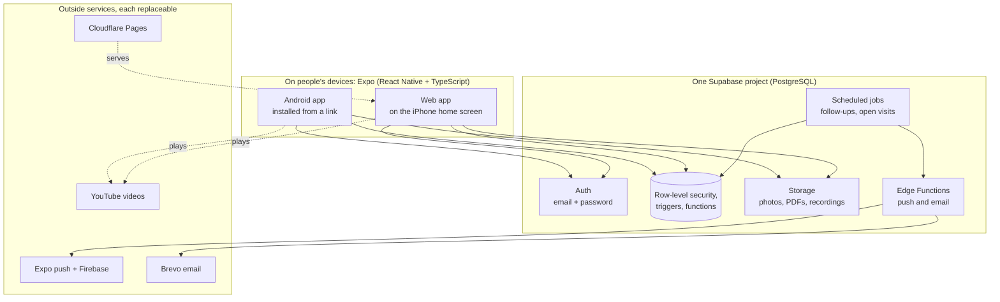

# Why Expo, Supabase and PostgreSQL

A drop-in class of about 200 students, many of them children, run by volunteers with no budget.
These choices follow from that. The full reasoning is in [DECISIONS.md](DECISIONS.md) #1, #5 and #6;
the pieces are described in [ARCHITECTURE.md](ARCHITECTURE.md).

- **One code base.** The Android app, the iPhone web app and desktop web come from the same TypeScript code.
- **Rules in the database.** Who may see a child's record is decided by PostgreSQL itself, so no screen or
  old app version can get round it.
- **Nothing to pay in Phase 1.** Every service runs on a free plan. Paying later is a choice, not a rewrite.

## What the stack had to handle

| Need | What it means |
|---|---|
| Children's data | Date of birth, parents' phones, consent and attendance for students under 18. India's DPDP Act applies. |
| Most members use iPhones | An App Store listing costs US$99 a year, which Phase 1 cannot spend. |
| Zero budget | The team decided Phase 1 must cost nothing. |
| Few volunteer maintainers | The code must be in common languages, with the rules written down in one place. |
| Drop-in, not batches | Students come any time between 14:30 and 20:00. Attendance is a visit with check-in and check-out times, by QR code or name. |
| Three languages, more centres | English, Telugu and Hindi now; more centres later, possibly abroad, each with its own time zone. |

## What we built

Every read and write from a phone goes through the database's rules. EAS (Expo's build service) builds
the Android app and sends app updates.

## Our stack against the usual alternatives

Each row is a way this app could have been built. The ratings are for **this class's situation**, not a
judgement of the technology in general.

**Good** = fits our need · **Partly** = works with extra effort or cost · **Weak** = a real problem for us

| Option | Phase 1 cost | iPhone users | Protecting children's data | Fits a drop-in class | Volunteers can maintain it | Leaving later |
|---|---|---|---|---|---|---|
| **Expo + Supabase** (what we use) | **Good**: all free plans | **Good**: web app from the same code; a real iOS app later from the same code too | **Good**: row-level security and triggers in PostgreSQL; the rules are tested | **Good**: visits, follow-up calls and reports are plain SQL | **Partly**: TypeScript is common; the rules need SQL skills | **Good**: standard PostgreSQL dump; Supabase can be self-hosted |
| Flutter + Firebase (our first draft) | **Partly**: file storage and server functions need the pay-as-you-go plan with a card (new projects since Oct 2024) | **Partly**: Flutter web works but is heavy; a native iOS app needs the US$99 fee | **Partly**: security rules exist, but multi-step rules need server functions, which need the paid plan | **Partly**: a document database; attendance percentages and reports need extra code | **Partly**: Dart is less common among volunteers | **Weak**: data and rules are Firebase-specific |
| Native apps (Kotlin + Swift + own server) | **Weak**: US$99 a year for iOS, plus a server to host | **Partly**: best iPhone app, but needs a Mac and the store fee | **Partly**: depends on the server we would write | **Partly**: everything built twice, once per phone type | **Weak**: two languages, two code bases, plus the backend | **Partly**: our own code, but three things to keep alive |
| PHP or Node + MySQL (rented hosting) | **Partly**: cheap hosting, but not free; someone pays monthly | **Partly**: a website works on iPhone; no app without more work | **Weak**: MySQL has no row-level security, so every rule lives in our server code, which we must secure and patch | **Good**: a relational database fits the records well | **Partly**: common skills, but login, file storage, jobs and push are all ours to build | **Good**: fully our own |
| No-code (Google Sheets + AppSheet or Glide) | **Partly**: free to start; paid per user as the class grows | **Good**: works in any browser | **Weak**: children's data sits in a spreadsheet anyone with edit access can read or change | **Partly**: simple check-ins yes; rules like "roll numbers are never reused" are hard | **Good**: easy for non-programmers | **Partly**: data exports; the app logic does not |
| Music-school software (ready-made subscription) | **Weak**: usually a monthly fee per teacher or student | **Good**: usually has apps | **Partly**: their rules, often hosted abroad; consent for minors is not built around DPDP | **Weak**: built for booked, paid lessons, not drop-in seva, Ishtagoshti or Telugu and Hindi | **Good**: nothing to maintain | **Partly**: depends on the vendor's export |
| WhatsApp + Excel (how the class runs today) | **Good**: free | **Good**: everyone already has it | **Weak**: every member sees every phone number in the group; no consent record | **Weak**: no attendance history at 200 students; follow-ups get lost in chat | **Good**: nothing to maintain | **Good**: nothing to leave |

## Why PostgreSQL and not MySQL?

Both are good relational databases. The deciding point is where the rules live.

- **Row-level security.** PostgreSQL can refuse a row to a user by itself: a student sees only their own
  record, a coordinator sees staff data. MySQL has no equivalent, so we would need our own server in between.
- **Checks at commit.** "A child on record must have a parent's consent" is checked when a change is saved,
  even across several steps. MySQL has no deferrable checks.
- **Jobs inside the database.** Daily follow-ups and closing forgotten check-ins run on a schedule inside
  PostgreSQL.
- **A free service around it.** Supabase adds logins, file storage and an API to PostgreSQL on a free plan.
  Free managed MySQL with those parts barely exists any more.

## Why Expo?

Expo is React Native with TypeScript, plus services for building and updating the app.

- **One code base** gives the Android app, the iPhone web app and, when the budget allows, a real iOS app.
- **Cloud builds.** The APK is built on Expo's servers, so nobody needs a Mac or a full Android setup.
- **Updates without reinstalling.** Fixes and new screens reach installed phones in minutes.
- **Ready parts** for push notifications, the camera for QR codes, audio for practice tools and location
  for the check-in.
- **Common skills.** TypeScript and React are widely known, which matters with few maintainers.

## What these choices cost us, and how we handle it

| Cost | How we handle it |
|---|---|
| The free database pauses after 7 days without use. | Daily class use keeps it awake; in holidays the maintainer opens it every Monday with the weekly backup, and Supabase emails a warning before any pause. |
| The free plan has no automatic backups. | A weekly three-part backup (structure, data, logins), kept encrypted, with a written restore drill ([OPERATIONS.md](OPERATIONS.md#backups)). |
| Free limits: 500 MB of data, 1 GB of files. | Videos stay on YouTube; uploaded recordings are deleted after review. Supabase's paid plan (about US$25 a month) is the next step, with no code changes. |
| iPhone users get a web app, not an App Store app. | The same code builds an iOS app once the class decides the US$99 a year is worth it. |
| We depend on the Expo and Supabase accounts. | Written runbooks for a leaked key, a compromised account and a lost staff phone, and a pinned build-tool version. Both run on open, standard code, so a move elsewhere stays possible. |
| The rules are written in SQL. | Each database change is one numbered file with its reason recorded; automated tests on GitHub check the rules on every change. |

## Short answers, for when someone asks

**Isn't a free plan risky for real data?**
The risk is in losing data or a pause, not in security: the free plan has the same database rules as the
paid one. We back up weekly and can move to the paid plan in a day.

**What if Supabase shuts down or changes its prices?**
The data is ordinary PostgreSQL. A dump restores on any PostgreSQL host, and Supabase itself is open source
and can be run on our own server.

**Why not just keep WhatsApp?**
WhatsApp shows every parent's number to every member and keeps no attendance history. The app replaces the
record-keeping; WhatsApp can stay for chat.

**Why not Firebase? It is popular.**
It was our first draft. For new projects, its file storage and server functions now need a paid plan with a
card on file, and its document database makes attendance reports harder than SQL does.

**Will it work at more centres, or abroad?**
Yes. Centres are data, not code: each has its own location and time zone, and the app already shows dates
and amounts in each centre's local format.

---

Prices and free-plan limits as of October 2026; check them before quoting.
