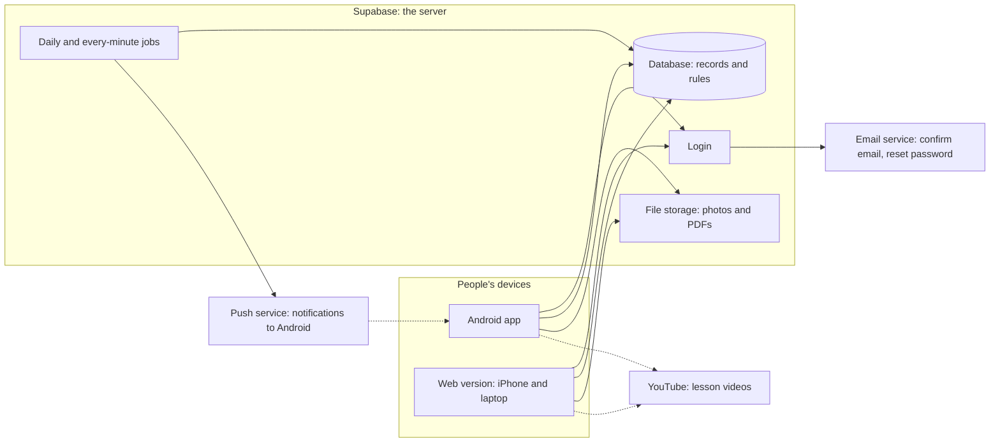
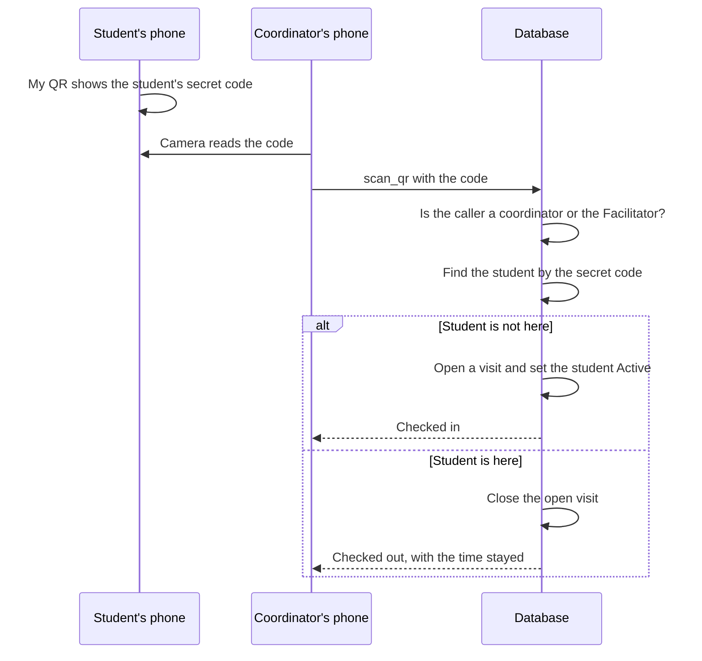
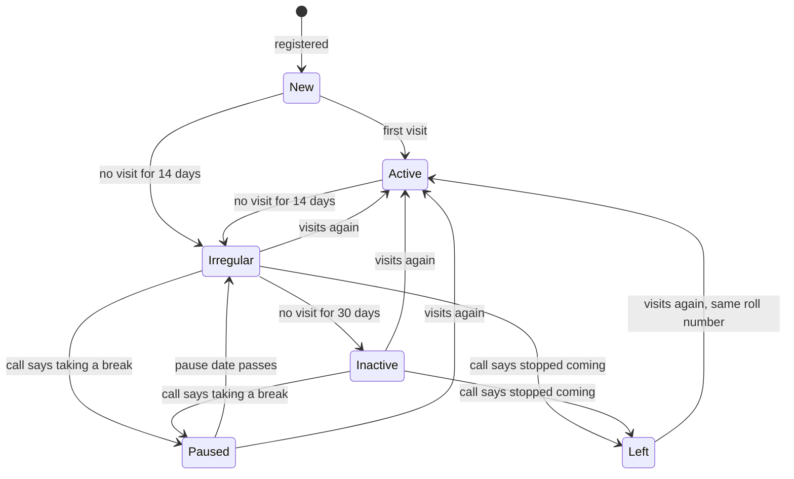
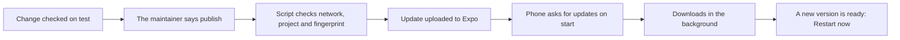

# 6. How the app works, in plain language

This page is for someone who has never written code. It explains what the app is made of, where
the class records live, how they are protected, and how a new version reaches the phones. Every
technical word is explained the first time it appears; the [glossary](../GLOSSARY.md) has them all.

For the detailed, technical version, see [ARCHITECTURE.md](../ARCHITECTURE.md) and
[DATABASE.md](../DATABASE.md).

[← Back to the guide](README.md) · Previous: [5. Phones, install and updates](05-phones-and-updates.md) · Next: [7. How it was built →](07-how-it-was-built.md)

---

**Contents**

1. [Three ideas first: app, web site, database](#three-ideas-first-app-web-site-database)
2. [The big picture](#the-big-picture)
3. [One code, three kinds of device](#one-code-three-kinds-of-device)
4. [Supabase: where the records live](#supabase-where-the-records-live)
5. [The rules live in the database](#the-rules-live-in-the-database)
6. [Keys: what is public and what is secret](#keys-what-is-public-and-what-is-secret)
7. [What happens when a QR code is scanned](#what-happens-when-a-qr-code-is-scanned)
8. [Jobs that run by themselves](#jobs-that-run-by-themselves)
9. [Test and live](#test-and-live)
10. [How an update reaches phones](#how-an-update-reaches-phones)
11. [Working without internet](#working-without-internet)
12. [Three languages](#three-languages)
13. [What it costs](#what-it-costs)

## Three ideas first: app, web site, database

- A **phone app** is a program installed on a phone. It draws the screens, reacts to taps, and
  talks to a server over the internet.
- A **web site** (or **web version**) is the same kind of program, but it runs inside a browser
  such as Safari or Chrome. Nothing is installed; the browser downloads it when you open the address.
- A **server** is a computer on the internet that is always on. Our app's server is run by a
  service called Supabase.
- A **database** is where the records are kept on the server: students, visits, calls, ticks,
  announcements. Think of it as a very strict set of registers. Each kind of record is a **table**
  (like one sheet in Excel), and each record is a **row**.

The app on your phone keeps almost nothing of its own. It shows you what is in the database and
sends your changes to it. So every coordinator sees the same records, on any phone.

## The big picture

Read it like this: phones and browsers talk to Supabase. Supabase checks who you are (login), keeps
the records (database) and files (storage), and runs jobs on a timetable. Videos stay on YouTube.
Notifications go to Android phones through a push service. Emails for sign-up and passwords go out
through an email service.

## One code, three kinds of device

The app is written once, in a language called **TypeScript**, using **React Native** and **Expo**:

- **React Native** is a way to write a phone app with web-style code, so that the same code runs on
  Android and on iPhone.
- **Expo** is a set of tools around React Native. It also turns the same code into a **web
  version**, builds the Android app in the cloud, and sends updates to phones.

So one set of code gives the Android app, the web version for iPhones, and the web version for
laptops ([DECISIONS.md #1](../DECISIONS.md)). A fix made once reaches everyone. In the future the
same code can go to the Google Play Store and Apple's App Store.

Why the web for iPhones? Putting an app on Apple's App Store costs a yearly fee and needs a
registered organisation. Phase 1 must cost nothing, so iPhone users add the web version to their
home screen instead ([DECISIONS.md #6, #15](../DECISIONS.md)).

## Supabase: where the records live

**Supabase** is a service that provides, in one place:

| Part | What it does for the class |
|---|---|
| **Database** (Postgres) | Keeps every record, and the rules about them |
| **Login** (Auth) | Email and password sign-up and sign-in, email confirmation, password reset |
| **File storage** | Photos and PDFs on announcements and lessons, in private folders |
| **Scheduled jobs** | Run by themselves: every morning (statuses, calls), every night (closing open visits), every minute (notifications) |
| **Edge Function** | A small program on the server that sends notifications to Android phones, through Expo's push service and Google's Firebase |

The free plan is enough for a class of about 200 people.

## The rules live in the database

This is the most important idea in the app.

A screen can hide a button, but a screen is not a lock. Someone could use an old version of the
app, or type a web address directly. So **every rule that protects people or records is enforced
by the database itself**, not only by the screens ([DECISIONS.md #5](../DECISIONS.md)). Whatever
screen, phone or app version sends a request, the database checks it and refuses it if it breaks a
rule.

Three tools do this:

- **Row-level security (RLS).** For every table, the database has written policies saying who may
  read or change which rows. A student asking for "all students" gets back only their own row. It is
  switched on for every table.
- **Guards** (in database language, *triggers* and *constraints*). Small checks that run whenever a
  row is saved, and refuse the save if it breaks a rule.
- **Database functions.** Actions that change several things at once, such as checking a student
  in or logging a call, run as one function on the server. They either fully happen or not at all,
  and each one checks who is asking ([DECISIONS.md #14](../DECISIONS.md)).

Real examples from this app:

| Rule | How the database enforces it |
|---|---|
| **A minor needs a parent's consent** | When a student under 18 is saved, a guard checks that a current consent record exists. If not, the whole save is refused, whether it came from the form, the import or the dashboard ([DECISIONS.md #16](../DECISIONS.md)) |
| **Roll numbers are frozen** | The database gives the roll number (`MS-2026-0001`, `MS-2026-0002`…). A guard refuses any change to it, and the counter never goes back, so a number is never reused, even after a student leaves ([DECISIONS.md #3](../DECISIONS.md)) |
| **Paused and Left only through a logged call** | A guard refuses setting a student's status to Paused or Left directly. Only the call-logging function can do it, and it needs an outcome, a reason and a comment ([DECISIONS.md #4](../DECISIONS.md)) |
| **Who may see which student** | A student can read only their own record, visits and progress. Coordinators and the Facilitator can read all students. Parents' details are for staff only. Someone waiting for access sees nothing ([DATABASE.md "Who can see what"](../DATABASE.md#who-can-see-what)) |
| **A tick says who really ticked it** | The database writes the name of the person signed in on the tick, whatever the app sends, and refuses a date in the future. Unticking leaves a copy in the audit log ([DECISIONS.md #22](../DECISIONS.md)) |
| **Replies are private** | A reply to an announcement can be read only by its writer, the author of the announcement and the Facilitator ([DECISIONS.md #29](../DECISIONS.md)) |
| **Files follow the announcement** | A photo or PDF opens only for people allowed to read its announcement, through a link that works for one hour ([DECISIONS.md #32](../DECISIONS.md)) |
| **Nobody gives themselves a role** | A guard stops anyone changing their own role. Only the Facilitator gives roles, and the Facilitator role itself is set only in the Supabase dashboard ([DECISIONS.md #45](../DECISIONS.md)) |
| **Anonymous polls stay anonymous** | Votes are read only through database functions, which in an anonymous poll never show anyone in the app, the Facilitator included, what a person chose; staff see only who has voted, and the counts only after it closes ([DECISIONS.md #61](../DECISIONS.md)) |
| **Private notes are private** | A student's notes on a sloka can be read only by that student ([DECISIONS.md #57](../DECISIONS.md)) |
| **Only the Facilitator promotes** | A guard refuses any change of a student's level except the Facilitator's promotion decision, which is written in the level history ([DECISIONS.md #53](../DECISIONS.md)) |
| **Every change is recorded** | Changes to students, logins, calls, ticks, lessons, announcements and settings are written to an audit log by the database, which the Facilitator can read |

These rules are tested automatically on every change: see
[How it was built](07-how-it-was-built.md#how-each-change-is-checked).

## Keys: what is public and what is secret

To talk to Supabase, the app needs two values: the project's web address and a **public key**.
These are inside every copy of the app, so anyone could read them, and that is fine: the public
key only opens the front door, and row-level security decides everything after that.

Supabase also has a **secret key** (called *service_role*) that skips every rule. It is never put in
the app or in the code. The app even refuses to start if someone puts it there by mistake. Only the
notification program inside Supabase uses it ([ARCHITECTURE.md "Security model"](../ARCHITECTURE.md#security-model)).

## What happens when a QR code is scanned

The code holds `MS1:` and a secret token, not the roll number, so nobody can make another
student's code by guessing ([DECISIONS.md #17](../DECISIONS.md)).

## Jobs that run by themselves

Some work is done by the database on a timetable, with nobody pressing a button:

- **Every morning:** students with no visit for 14 days become **Irregular**, and their mentor gets
  a call to make; after 30 days, **Inactive**. A paused student whose date has passed comes back
  into follow-up as **Irregular**, with a call for the mentor, and the 30 days count from the end
  of the pause.
- **Every night at 21:00 (India time):** any visit still open is closed at the closing time.
- **Every minute:** announcements that have reached their time are sent as notifications to
  Android phones.

A student's status follows these steps:

## Test and live

There are two separate Supabase projects, each with its own database:

| | Test | Live |
|---|---|---|
| Holds | Made-up students (the "seed" data: 15 fictional students covering every status) | The class's real records, from the pilot on |
| Used by | Builders, volunteers testing, demos | The class |
| Web site | `mridanga-seva-test.pages.dev` | `mridanga-seva.pages.dev` |
| Android app | The "preview" app | The "production" app |

Every change is tried on **test** first. Real records are never used for testing, and made-up
students never go into live. Scripts check, before anything is published, that a test version
talks only to the test project and a live version only to the live one
([OPERATIONS.md "Updating the Android app"](../OPERATIONS.md#updating-the-android-app)).

## How an update reaches phones

An Android app has two layers:

- The **native layer**: the part built into the APK itself, such as the camera, notifications,
  the icon and the app's permissions. Changing it means building and installing a new APK.
- The **JavaScript layer**: the screens, words, colours and logic. This can be replaced over the
  internet.

Expo's **EAS Update** service sends new JavaScript layers to installed apps
([DECISIONS.md #35](../DECISIONS.md)):

**The fingerprint.** An update must fit the APK it lands on. Expo computes a **fingerprint** (a
short code, like a seal) from everything native. An update reaches only the APKs with the same
fingerprint. If a change touches the native layer (for example, a new audio feature, as Phase 2
brought on 3 Oct 2026), the fingerprint changes; the update would not fit the old APKs, so a new APK must be built and
installed. The publish script checks this and stops if no installed APK matches.

That is why builders group native changes together for one new APK, and publish waiting screen
updates *before* a native change goes in.

The web version is simpler: a new version is uploaded to the web host, and everyone gets it the
next time they open the site.

## Working without internet

- **My QR card** is drawn on the phone from a copy saved there, so it works with no connection
  ([DECISIONS.md #21](../DECISIONS.md)).
- The app keeps a copy of the signed-in person's own profile, so it opens on their home screen at
  once, even offline, while it reconnects in the background ([DECISIONS.md #37, #42](../DECISIONS.md)).
- Saving anything (a visit, a call, a tick) needs the connection, because the rules are checked on
  the server.

## Three languages

Every word the app shows is kept in three files, one per language: English, Telugu and Hindi.
Screens never contain the words themselves; they ask for a word by its name, such as
`signIn.title`. A check run before every release fails if Telugu or Hindi is missing a word that
English has, so a student never sees a gap ([TRANSLATIONS.md](../TRANSLATIONS.md),
[DECISIONS.md #12](../DECISIONS.md)).

Values stored in the database, such as a level or a reason for a call, are stored as codes
(`studies`, `health`) and turned into words on the screen, so the same record reads correctly in
every language.

## What it costs

Phase 1 costs nothing ([DECISIONS.md #6](../DECISIONS.md)):

| Service | Used for | Plan |
|---|---|---|
| Supabase | Database, login, files, jobs, notification program | Free |
| Brevo | Sign-up and password emails | Free (300 emails a day) |
| Expo | Building the Android app and sending updates | Free |
| Firebase (Google) | Delivering notifications to Android phones | Free |
| Cloudflare Pages | Hosting the web version | Free |
| GitHub | Keeping the code, open to all | Free |
| YouTube | Lesson videos | Free |

The limits of the free plans and what to do when they are reached are in
[OPERATIONS.md](../OPERATIONS.md#accounts-the-system-depends-on).

---

[← Back to the guide](README.md) · Previous: [5. Phones, install and updates](05-phones-and-updates.md) · Next: [7. How it was built →](07-how-it-was-built.md)
