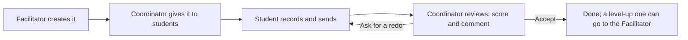
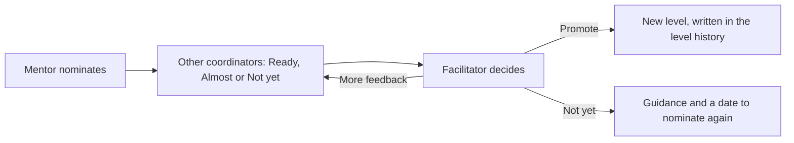

# 9. Learning and community (Phase 2)

Hare Krishna. Phase 2 adds the tools for learning and for the class as a community: assessments,
moving up a level, practice tools, lesson videos, events, polls, sloka study and the team's own
tools. This page explains each one for every role. Words in **bold** are the words the app shows
in English.

[← Back to the guide](README.md) · Previous: [8. For a new helper](08-new-helper.md) · Next: [Glossary →](../GLOSSARY.md)

---

**Contents**

1. [Where to find them](#where-to-find-them)
2. [Which app version has them](#which-app-version-has-them)
3. [Assessments](#assessments)
4. [Moving up a level (promotion)](#moving-up-a-level-promotion)
5. [Practice tools: metronome, taal player, both heads](#practice-tools-metronome-taal-player-both-heads)
6. [Practice timer and practice log](#practice-timer-and-practice-log)
7. [Lesson videos: speed, repeat, mirror](#lesson-videos-speed-repeat-mirror)
8. [Record myself](#record-myself)
9. [Events](#events)
10. [Polls](#polls)
11. [Slokas (Ishtagoshti)](#slokas-ishtagoshti)
12. [Team tools: instruments, duty roster, suggestions](#team-tools-instruments-duty-roster-suggestions)
13. [Location check at check-in](#location-check-at-check-in)
14. [Still to come](#still-to-come)

## Where to find them

| Module | Student | Coordinator | Facilitator |
|---|---|---|---|
| Assessments | **Assessments** in the ring | **Assessments** in the ring | **Assessments** in the ring (**Create assessment**) |
| Promotion | A notice when promoted; the new level shows on Home and in **My progress** | **Promotions** card on the home; **Promotion** block on a student's profile | **Level-up queue** card on the home |
| Practice tools | **Practice** in the ring | **Practice tools** button under the ring | Same, plus **Edit taals** |
| Practice log | **My practice log** (from Practice and My progress) | A student's profile shows their practice | Same |
| Lesson videos | **Watch** on a lesson in **My progress** | **Watch** in **Syllabus and lessons** | Same; adds lessons |
| Events and polls | **Events & polls** in the ring | **Events & polls** in the ring | Same |
| Slokas | **Slokas** tab | **Slokas** tab on a laptop; **Ishtagoshti** button under the ring on a phone | Same |
| Instruments | Items you hold, on **My profile** | **Instruments** in the ring | Same; adds items |
| Duty roster | — | **Duty roster** under the ring | Same; plans shifts |
| Material suggestions | — | **Material suggestions** under the ring | Same; reviews them |

The student's home also shows the next event and **Polls waiting for your vote: N**.

## Which app version has them

- **Android:** Phase 2 needs new native parts (sound, microphone, location, the video player), so it
  comes with the **new Android app** built on 3 Oct 2026. An older app gets no more updates: install
  the new one once from the link the class shares ([how](05-phones-and-updates.md#android-install-from-a-link)).
  After that, updates arrive as usual, with **Restart now**.
- **iPhone and laptop:** the web version has Phase 2 from its next upload. Sound, recording and the
  video player work in the browser too.
- **Test first.** Everything here is tried on the test app with made-up students. The plan is for
  Phase 2 to go live for the class on **1 March 2027**; the team decides when each part starts
  ([phases](07-how-it-was-built.md#phases-and-dates)).

## Assessments

An assessment is a piece the Facilitator asks students to play or sing and record, for example a
taal at a set tempo. It replaces sending recordings on WhatsApp ([DECISIONS.md #52](../DECISIONS.md)).

**Facilitator: create one.** Open **Assessments**, tap **Create assessment**.

1. **Title**, **Instructions** (what to play or sing, and how to record it), **Type** (**Playing**,
   **Singing with the drum**, **Theory**, **Other**) and **Level**.
2. Tick **Level-up assessment** if an accepted recording can support moving the student up a level.
3. **Rubric**: what is scored, one line each (for example *Rhythm (taal)*, *Clarity of the bols*,
   *Posture and hand position*), each with a **Top score** from 1 to 10.
4. **Files and link** (optional): up to 3 files, such as a notation photo or PDF or a demonstration
   recording (at most 50 MB each), and a link such as an unlisted YouTube video.
5. **Send to coordinators**, or **Save as draft** to finish later. Before anyone has it, the title,
   instructions and files can be edited; after it is given to students only those can change.

**Coordinator: give it to students.** Open **Assessments**, open one, tap **Give to students**.

1. **Notes** (optional) for the students, and a **Due date** (**In 3 days**, **In 7 days**,
   **In 14 days**, or a typed date).
2. Pick the students: filter by level, search by name, or **Select all shown**.
3. Tap **Give to the picked students**. They get a notice.

**Coordinator: follow up.** The assessment's **Students** list shows each student as **Not seen**,
**Seen**, **Submitted**, **Reviewed** or **Redo**, and **Late** after the due date. Filters: **Not
sent**, **To review**, **Reviewed**. **Remind everyone who has not sent it** sends a notice (once in
12 hours per student); the app also reminds them by itself at 09:00 on the day before and on the due
day. Students without the app are marked *No app login: tell them in class*.

**Student: send a recording.** Open **Assessments** in the ring (the ones to do come first, by due
date). Open one to read the instructions, files, the coordinator's note and the rubric. Under
**Send your recording**:

- **Record here** in the app (up to 20 minutes), listen, then **Use for this assessment**; or
- **Add audio or video**: a file recorded with the phone's recorder or camera (at most 50 MB); or
- a **link**, such as an unlisted YouTube video or a Google Drive file.

Add a **Note for the coordinator** if you like, and tap **Send**. You see **Sent. Waiting for the
review.**

**Coordinator: review.** Tap a student in the list. Play **The recording**, give a score for every
rubric line, write a **Comment** (what went well and what to practise), and add a **Voice note**
(up to 5 minutes) if speaking is easier. Choose **Accept** or **Ask for a redo**, then **Save
review**. A redo needs a comment or a voice note. On a level-up assessment, **Send level-up to the
facilitator** passes the accepted recording on for promotion.

**Student: the result.** The review shows the score per line, the total, the comment and the voice
note. After **Please record it again**, record and send again.

**Privacy and space.** A student can upload at most 10 files a day, and only while an assessment
waits for them. Recordings are deleted 30 days after the review (level-up recordings are kept until
30 days after the promotion decision), so the free storage is not filled with old files.

## Moving up a level (promotion)

A student moves up a level **only when the Facilitator approves**. The app never promotes by itself
([DECISIONS.md #53](../DECISIONS.md)).

**The criteria.** The Facilitator sets them in **Settings** under **Promotion criteria**. Out of the
box: the whole syllabus of the level ticked, 8 visits in the last 8 weeks, and an accepted level-up
assessment. They advise; the Facilitator decides.

**Coordinator: nominate.** On the home, the **Promotions** card shows **Your feedback asked** and
**Your students ready** (students who meet every criterion). On a student's profile, the
**Promotion** block shows the criteria check and **Nominate for promotion**.

1. Check the **Criteria**. If not every one is met, you can still nominate; say why.
2. Write the **Reason**: what the student plays well now.
3. Under **Ask for feedback**, pick the coordinators to ask. Those who taught the student lately are
   ticked first. At least 2 answers (a setting) are needed before the Facilitator can promote.
4. Tap **Nominate and ask N for feedback**.

**Coordinator: give feedback.** Open a nomination from **Your feedback is asked**. You see the reason,
the criteria, the level-up recording and the other answers. Choose **Ready**, **Almost** or **Not
yet**, write a **Comment** (what you saw in class), and **Save feedback**. You can change it while
the nomination is open.

**Facilitator: decide.** The **Level-up queue** lists **Waiting for your decision**, **Collecting
feedback**, **Ready to nominate** and **Decided lately**. Open a nomination and choose:

- **Promote to …**: the app asks once more. The level changes now and is written in the level
  history. The student and the nominator are told.
- **Not yet**: write **Guidance** (what to practise) and **Nominate again after** a date.
- **Ask for more feedback**: write what to look at; the coordinators who have not answered are told.

A nomination can also be **withdrawn**; the answers stay on record.

## Practice tools: metronome, taal player, both heads

Open **Practice** (students, in the ring) or **Practice tools** (staff, under the ring). Under
**Tool**, choose **Metronome** or **Taal player**. Tap **Start** and **Stop**.

**Metronome.** Beat 1 is accented. Set the tempo from 30 to 240 beats a minute with −5, −1, +1, +5,
or **Tap tempo** (tap 3 or 4 times in time). Choose the **Beats in a bar** (2 to 8). Dots show the beat.

**Taal player.** Plays the bols of a taal in a loop.

- Choose the **Taal** and the tempo. **Speed** 50 %, 75 % or 100 % slows it down to learn it.
- **Beats of …** shows the grid of beats with each bol, and the vibhag marks: **X** sam (the first
  beat), **2**, **3** tali (an open baya stroke), **0** khali.
- A taal marked **Placeholder** is a stand-in until the Facilitator enters the real one.

**Both heads.** Under the taal player, **Both heads** draws the drum as you see it when you play:
**Baya · left hand** on the left, **Dayan · right hand** on the right. With each bol the ring that is
struck lights up (**Kinar**, **Maidan**, **Edge of the syahi**, **Syahi** or **Whole head**), with
the fingers used and whether the stroke **rings** or is **damped**. This answers a real problem: a
student watching the teacher can never see both heads at once ([DECISIONS.md #54](../DECISIONS.md)).

**Offline.** The taals are saved on the phone, so the tools work without internet.

**Facilitator: the taals.** **Edit taals** on the Practice tools screen. **Add a taal**: **Name**,
**Bols, one beat per word** (`-` for a rest; bols in one beat joined with a dot, such as `te.re`),
**Vibhags: beats in each** (for example `4 4 4 4`), **Vibhag marks**, **Level**, **Placeholder**,
**Students can play it**, a note and the order. A **Preview** grid shows it as you type. Coordinators
can read the taals; only the Facilitator changes them.

## Practice timer and practice log

**For students.** On **Practice**, the **Practice timer** starts by itself when you press **Start**.
When you finish, tap **Stop and save**: 1 minute or more goes into your practice log. (A timer left
running more than 6 hours is not saved; add the time by hand.)

**My practice log** shows your practice **By week** for the last 8 weeks (from Monday) and each
entry, marked **Timer** or **Typed in**. **Add practice** for a day of the last week (1 to 240
minutes, with a note). Entries of the last 14 days can be deleted.

Your weekly practice also shows in **My progress**. Coordinators see it on your profile, to know how
to help you. Staff use the tools without the timer.

## Lesson videos: speed, repeat, mirror

Tap **Watch** on a video lesson. The **Lesson video** player has:

- **Play** / **Pause**, **− 5 s** and **+ 5 s**.
- **Speed** 0.5x, 0.75x or 1x (those the video offers).
- **Repeat a part (A-B loop)**: while it plays, tap **Start here (A)** where the part begins and
  **End here (B)** where it ends. The part repeats until you tap **Clear**.
- On the team's own video files: **Mirror and zoom**. **Picture**: **As filmed** or **Mirrored**
  (mirrored, the teacher's right hand is on your right, as when you play). **Camera angle**: when a
  video shows several angles side by side, choose **Angle 1-4** to see one large, or **All**.

YouTube's rules do not allow the app to mirror or zoom a YouTube video; speed and the A-B loop work,
and **Open in YouTube** is there too.

**Facilitator:** a lesson can now also be a **Video file**: a web link to the team's own video, with
the number of **Camera angles side by side** (1 to 4) ([DECISIONS.md #56](../DECISIONS.md)).

## Record myself

On **Practice**, **Record myself** records your playing so you can listen to it beside the beat.

1. Tick **Play the sound while I record** to record with the metronome or taal you chose. With
   headphones the recording catches only your drum.
2. **Record**, then **Stop** (up to 10 minutes).
3. Your recordings are listed with the date, length and what played. **Play**, **Play with the
   sound** (the same taal and tempo again, together), or **Delete**.
4. Students: **Send for an assessment** attaches a recording to an assessment waiting for you.

Recordings stay **on this phone only**, never sent unless you send one for an assessment. The newest
30 are kept. In a browser they last only until the page is closed.

## Events

Festivals, yatras and programmes where the class plays ([DECISIONS.md #61](../DECISIONS.md)). Open
**Events & polls**; it has an **Events** tab and a **Polls** tab.

**Coordinator or Facilitator: create an event.** Tap **New event**.

1. **Title** (for example *Janmashtami kirtan at the temple*).
2. **When**: the day, **Starts at**, and **Ends at** (optional, same day).
3. **Where**: a **Centre** or **Elsewhere**, and the **Place or address**.
4. **Who is it for?** As for announcements: all students, one level, your mentees, staff only, or a
   group. Once someone has answered, this stays fixed.
5. **Description** (optional): what to bring, what to wear, whom to call.
6. **Create event**. Everyone it is for gets a notice.

**On an event** (staff): the answers with names, **Remind those who have not answered** (once in 12
hours), **Performers** (pick students, also those without the app, with a part such as
**Mridanga**, **Kartal**, **Lead singer**, **Harmonium**; new performers are told), and **Who came**
(from the event's day, tick each student who came). **Edit** sends a new time or place to everyone.
**Cancel the event** (with a reason) tells everyone. **Delete the event** works only while nobody has
answered. The author or the Facilitator may edit, cancel or delete.

**Student.** The list shows **Coming up** and **Past (last 60 days)**. Open an event to see when,
where and who it is for, and answer **Going**, **Maybe** or **Not going**; you can change it until the
event starts. You see the counts, not the names. A performer sees **Your part**; afterwards, **You
came to this event. Thank you!** **Add to calendar** gives a calendar file or **Open in Google
Calendar**.

## Polls

Quick questions to the class, such as *Which day suits the extra practice?*

**Coordinator or Facilitator: create a poll.** On the **Polls** tab, tap **New poll**.

1. **Question**, and 2 to 6 **Answers** (each person chooses one).
2. **Closes**: the day and time.
3. **Who is it for?** As for events.
4. **Privacy and results**: tick **Anonymous poll** so nobody, the Facilitator included, sees what a
   person chose (staff see only who has voted). Choose when people see the results: **After they
   vote** or **Only after the poll closes**.
5. **Create poll**. Everyone it is for gets a notice; on the closing day those who have not voted are
   reminded.

Once someone has voted, only the wording and the closing time can change. On a poll, staff see
**Results**, **Not voted yet**, and (if not anonymous) who chose what; **Remind those who have not
voted**, **Close the poll now**, and **Delete the poll** while nobody has voted.

**Student.** The tab says **Polls (N to vote)**. Open one, choose an answer: it is saved at once, and
you can change it until the poll closes. Results show as bars when the poll allows. Students never
see names.

## Slokas (Ishtagoshti)

Ishtagoshti is the class's study of the scriptures, theme by theme. The **Slokas** tab holds the
sloka of the day, themes, the verse with word meanings, translation and purport in your language, a
recitation to play, your private notes and **I have memorised this sloka** ([DECISIONS.md #57](../DECISIONS.md)).
Translations are the temple's own, never copied from copyrighted books.

Step by step: [students](02-student-guide.md#slokas-ishtagoshti),
[coordinators and editors](03-coordinator-guide.md#slokas-ishtagoshti),
[the Facilitator](04-facilitator-guide.md#slokas-ishtagoshti).

## Team tools: instruments, duty roster, suggestions

For the people who run the class ([DECISIONS.md #65](../DECISIONS.md)):

- **Instruments**: the temple's mridangas, kartals and other items, their condition, and who has
  each one, with lending, taking back and condition checks.
- **Duty roster**: who is on duty when; a reminder the evening before a shift.
- **Material suggestions**: coordinators suggest a lesson; the Facilitator adds it or declines it.

Step by step: [coordinators](03-coordinator-guide.md#team-tools-instruments-duty-roster-suggesting-a-lesson),
[the Facilitator](04-facilitator-guide.md#team-tools-suggestions-instruments-duty-roster).

## Location check at check-in

When a coordinator checks a student in, the app compares the coordinator's phone position with the
centre's attendance area. Outside it, or without a position, the visit is **still saved** but
**flagged for the facilitator**, who sees the flags in the reports ([DECISIONS.md #70](../DECISIONS.md)).
Details: [coordinator guide](03-coordinator-guide.md#mark-attendance) and
[Facilitator guide](04-facilitator-guide.md#reports).

## Still to come

These parts of the approved plan are **not built yet**:

- **Fund records**: a transparent record of donations and sponsorships, where the person who records
  is not the person who approves. The app will record money only; donors pay the temple directly.
- **Door tablet**: a temple tablet at the door where students check themselves in.
- **More Ishtagoshti**: a memorise mode, discussion with moderation, sessions, recitation review,
  and a free public sign-up for sloka study only.
- **Face attendance** (Phase 3): only with consent, after the consent flow for it exists.

---

[← Back to the guide](README.md) · Previous: [8. For a new helper](08-new-helper.md) · Next: [Glossary →](../GLOSSARY.md)
